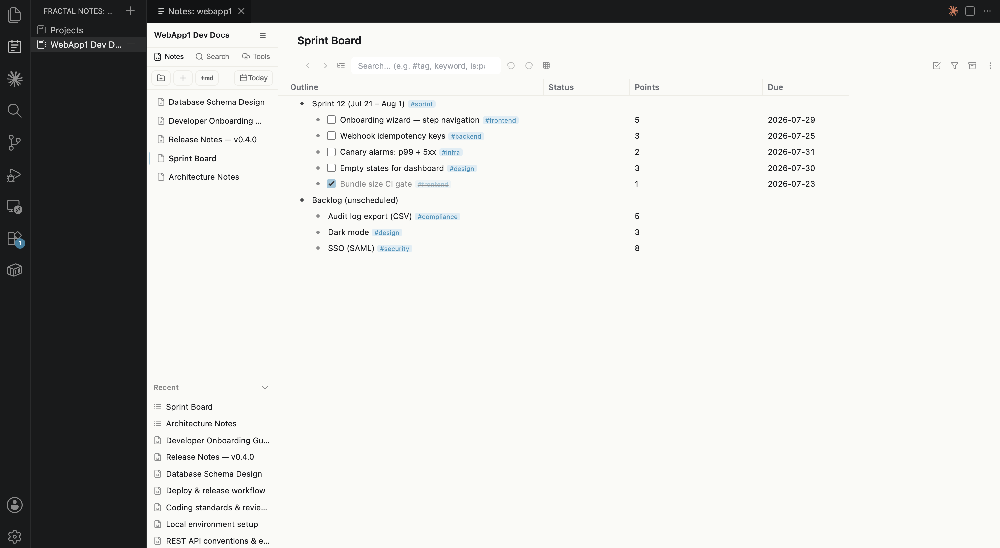

 Fractal Note — VS Code のための Markdown & アウトライナー（データベース&マインドマップ）
=

**VS Code の中で完結するノートテイキング環境。** Fractal Note は **Notion ライクな WYSIWYG マークダウンエディタ** と **Dynalist ライクなアウトライナー( データベース / マインドマップ モードもあり) **をひとつのワークスペースに統合。**Note** 単位で整理し、すべてを横断検索でき、S3 に同期でき、そして **AI コーディングアシスタントとの共同作業** を前提に設計されています。


---

## Fractal Note を選ぶ理由

- ✍️ **WYSIWYG Markdown** — 編集と閲覧を同時に。分割プレビューも生のマークダウン記法も不要。テーブル（Excel ライク編集・**セル結合にも対応**）、コードブロック、Mermaid、数式、draw.io — すべてリアルタイムにレンダリング。
- 🌲 **本格的なアウトライナー** — Dynalist / Workflowy スタイルのツリー編集。タグ管理、スムーズな絞り込み、そして **アウトライナー / データベース / マインドマップ** の3つのビュー。
- 📄 **サブページ** — アウトラインのノードやマークダウンページの子として、マークダウンページを埋め込み。Notion のデータベースのような階層的ドキュメントを構築できます。
- 🤖 **AI フレンドリーな設計** — 外部からのファイル変更を **リアルタイム** に画面へ反映。Claude Code、Cursor、Kiro にノートを編集させながら、自分の作業を続けられます。カーソル位置や編集中の内容は保持されます。
- 🗂 **Notes** — フォルダ（"note"）単位で情報を管理。ファイル自体はフラットに保存しつつ、表示上は仮想的なフォルダ/ファイルツリーで構造的に整理 — **任意のファイル添付**（PDF、Excel など）も含めて。横断フルテキスト検索、タブ・履歴管理、Daily Notes も。
- ☁️ **S3 バックアップ & リストア** — 自分の AWS S3 バケットへワンクリックでバックアップ、そこからのリストアも可能。
- 🧩 **エディタの外へ** — Web ページを取り込む Chrome 拡張、Amazon Translate 連携、そして AI エージェントが Fractal Note のノートを読み書きできる **AI スキル** を公開（Fractal Note を Obsidian の代わりに）。

`.md` と `.out` は単体（standalone）でも動作しますが、真価を発揮するのはすべてが繋がる **Notes マネージャ** です。

---

## キービジュアル

### マークダウンエディタ
Notionのような心地よい入力ができるMarkdown エディター。基本的なMarkdown要素は全て使え、さらに codeブロック、数式ブロック、mermaidブロック、drawio埋め込みブロック、文字色変更など拡張的な機能も存在。あらゆる人のMarkdownニーズに対応。
さらに、Notion的な Subpage も対応(Linkとは区別)。階層的に Markdown を管理することが可能。


### アウトライナーエディタ
Dynalist クラスのアウトライナー。フォルダ、タグ、そしてアウトラインノードとマークダウン本文の横断フルテキスト検索。


---

## ✨ コアコンセプト

**Notion のように、Markdown・Outliner・Database・Mindmap をひとつの場所で管理する。** Fractal Note では 4 つのコンテンツが別々のツールではなく、同じ note の中で繋がります — アウトラインのノードにマークダウンページをぶら下げ、同じアウトラインをデータベースやマインドマップとして眺め、すべてを横断検索する。しかもデータはプレーンな `.md` と JSON のままです。

| コンテンツ | 実体 | 概要 |
| --- | --- | --- |
| **Markdown** | `.md` | Notion ライクな WYSIWYG エディタ。ひとつのビューで編集と閲覧を同時に。サブページで階層化 |
| **Outliner** | `.out` | Dynalist ライクなツリー編集。タグ・タスク・検索 |
| **Database** | `.out`（ビュー） | 同じアウトラインを Notion ライクなテーブルとして表示。テキスト / タグ / 日付列 |
| **Mindmap** | `.out`（ビュー） | 同じアウトラインを SVG マインドマップとして表示・編集 |

これらを束ねるのが **Notes** — フォルダ単位のワークスペース（仮想ツリー、横断検索、タブ、Daily Notes、S3 同期）です。マークダウンページはマークダウンエディタからもアウトライナーからも開けます。サブページはデフォルトで **サイドパネル** に、または **新しいタブ** で独立ドキュメントとして開きます。

**あらゆるファイルを一箇所で、簡単に管理。** `.md` や `.out` だけでなく、任意のファイル（PDF、Excel、画像など）を note に添付でき、**note ツリー・アウトライナーのノード・マークダウンドキュメントの間を D&D やコピー/カット/ペーストのショートカットで自由に移動**できます。所有権は移動に合わせて自動で切り替わり、リンクは切れず、note を跨ぐ移動ではアセットも自動で複製 — 手作業のファイル管理は不要です。

---

## 📝 マークダウンエディタ (.md)
Notion スタイルの WYSIWYG エディタ。見えているものがそのままファイルの中身です。


### 編集
- **シームレスなライブプレビュー** — マークダウンを書くと即座にレンダリング。いつでも **ソースモード** に切り替え可能（`Cmd+.`）
- **見出し、リスト、タスクリスト、引用、水平線** — 標準的なマークダウンをすべてキーボードファーストで
- **テーブル** — Excel ライクなセル選択: クリックでセルを選択、矢印で移動、Shift+矢印 / ドラッグ / Shift+クリックで範囲選択。cmd+c/x/v は表計算ソフトと相互運用（TSV + HTML の双方向）。Enter やタイプでセル編集、Tab で右へ（最終セルの Tab で行追加）。ツールバーからセルの結合/解除（マーカーコメント付きの GFM 互換マークダウンで永続化）、検索ボックスで行の絞り込み（表示のみ）、セル端ドラッグで列幅変更、ヘッダー行の ON/OFF 切り替え — すべて他のビューアと互換のマークダウンのまま
- **リスト内ブロック** — リスト項目の継続行（Shift+Enter）の中に引用ブロックやコードブロックを作成可能。`> ` / ``` ``` ``` の自動変換、パレット、ショートカットから作れて、マークダウンの往復でも保持されます
- **コードブロック** — 24以上の言語のシンタックスハイライト、VS Code のエディタタブへの展開
- **インライン書式** — 太字、斜体、取り消し線、インラインコード、スマートリンク作成
- **アクションパレット**（`Cmd+/`） — すべての書式・挿入アクションを検索可能なメニューに集約

### 添付とメディア
- **画像** — ペーストまたはドラッグ&ドロップ。ピンチズーム・パン対応のフルスクリーンライトボックス。表示幅の上限は設定可能
- **ファイル添付** — 任意のファイル（PDF、Excel など）をドロップすると `[📎 filename](path)` リンクを挿入。クリックで OS デフォルトアプリで開く
- **添付パネル** — ドキュメント内で参照しているすべての画像・ファイルを一覧表示。Open / Copy Path 付き

### PDF エクスポート
- **ワンクリックで PDF** — ツールバー / サイドパネルのボタン（または `Fractal Note: Export to PDF`）で、開いている md をエディタ表示そのまま（Mermaid・数式・文字色・チェックボックス込み）の印刷向け PDF に変換
- **スマートな改ページ** — 既定で h1/h2 の前に改ページ。ただし最初の h1 と、各 h1 直後の最初の h2 の前には入れない（章立てが自然に組まれる）
- **CSS でカスタマイズ** — `fractal.pdfStyles`（CSS ファイルパスの配列）で組み込みスタイルを上書き。`fractal.pdfIncludeDefaultStyles: false` で完全差し替えも可。改ページは素の CSS（`break-before`）なので自由に無効化・拡張できる
- **ローカル完結・依存ゼロ** — インストール済みの Chrome/Edge を headless 利用。エクスポート中の外部通信なし・拡張本体への追加依存なし

### 図と数式
- **Mermaid** — インラインでレンダリング、クリックでソース編集
- **KaTeX 数式** — ディスプレイモードの数式をライブ再レンダリング

### draw.io 埋め込み

VS Code を離れずに draw.io の図を作成・編集できます。

- **作成** — `Cmd+/` → **Insert Drawio Diagram** で空の図を生成し、カーソル位置に画像として挿入。既存の `.drawio.svg` / `.drawio.png` のドラッグ&ドロップにも対応
- **ファイル形式** — 保存されるのは `.drawio.svg`（本物の SVG に draw.io の編集データを内蔵した形式）。GitHub でもそのまま画像表示でき、任意の draw.io クライアントで再編集できます。ドキュメントには通常の `` 画像として埋め込まれるので、他のマークダウンエディタとの互換性も保たれます
- **編集** — 図にホバーすると 3 つのボタンが表示されます:
  - **Open in VS Code** — VS Code のタブで開く。[Draw.io Integration 拡張](https://marketplace.visualstudio.com/items?itemName=hediet.vscode-drawio)（hediet.vscode-drawio）をインストールしていれば、タブ内でそのまま draw.io エディタが開きます（おすすめ）
  - **Open in External** — 外部アプリで開く。draw.io Desktop がインストールされていればそれを優先起動、無ければ OS のデフォルトアプリで開きます
  - **Copy Path** — 絶対パスをクリップボードへ
- **自動再レンダリング** — どの方法で編集しても、保存した瞬間に開いているドキュメント内の図が自動で再描画されます。エディタを往復するだけのシームレスな編集ループ

### サブページ
- `Cmd+/`** → Add Page**（または `Cmd+N`） — 子マークダウンページを作成してカーソル位置にリンクを挿入
- `.md` リンクをクリックすると **Notion スタイルのサイドピークパネル** で開き、フル WYSIWYG 編集が可能。戻る/進むナビゲーション付き（`Opt+←` / `Opt+→`）
- `Cmd+クリック` で **新しいタブ** に単独ドキュメントとして開く
- ページの中にページ — いくらでも深い階層を構築できます

### AI フレンドリー: 外部変更のリアルタイム同期
AI アシスタント（Claude Code、Cursor、Kiro など）— あるいは他の何か — が開いているファイルを変更したとき:

- **ブロックレベルの DOM 差分** — 変更されたブロックだけをパッチ。カーソル位置と編集中の内容は保持
- 自分の編集と AI の編集が、ひとつのドキュメントの中で **安全に共存**
- `Cmd+L` — 選択テキストを AI チャットへ送信。`Cmd+Shift+.` で VS Code のテキストエディタとして開く

### スタンドアロンモード
- Fractal Note を `.md`** のデフォルトエディタ** に設定すれば、マシン上のあらゆるマークダウンを編集可能 — note ワークスペースは不要
- スタンドアロンのファイルでは **画像・添付ファイルの保存先フォルダを指定可能**（ファイルの隣の隠しファイル `.fractal.json` に保存 — マークダウン本文には一切手を加えないため、他のエディタからは見えません）

---

## 🌲 アウトライナー (.out)
Dynalist ライクなアウトライナー。同じデータを3つの視点で。

#### アウトラインビュー


#### データベースビュー


#### マインドマップビュー


### 3つのビューモード
ビュートグルで切り替え:

1. **アウトライナービュー** — クラシックなバレットツリー。無制限のネスト、折りたたみ/展開、パンくず付きのサブツリースコープ
2. **データベースビュー** — アウトラインを Notion ライクなデータベース（ツリーテーブル）として表示。テキスト / タグ（マルチセレクト）列に加え、ネイティブの日付ピッカー付き **Date / Date & Time 列** を追加可能
3. **マインドマップモード** — 同じ `.out` を SVG マインドマップとしてレンダリング。放射 / 左 / 右 / バランスの4レイアウト、キーボード中心の編集（ナビゲーション・兄弟/子追加・入れ替え・タイプで即編集・子孫込みのコピー/カット/ペースト）、ノードの色・シェイプ変更、境界（グループ）、関係線 — さらに画像の添付/削除、📄/📎 ノードと note ツリー・マークダウンエディタ間の双方向ドラッグ&ドロップ

### タグと検索で整理
- `#tag` と `@tag` は自動でハイライトされ、クリックで即絞り込み
- **ピン留めタグ** — よく使うタグをワンクリックフィルタに
- **Dynalist 互換の検索** — AND、OR、NOT、`"フレーズ"`、`#tag`、`in:title`、`has:children`、`is:page`、`is:task` — スムーズなインクリメンタル絞り込み

### 何でも添付
- **マークダウンサブページ** — 任意のバレットをページ化（`@page`）し、サイドパネルのフル WYSIWYG エディタで編集。**Notion のデータベース** のように階層的なマークダウンを管理
- **画像** — `Cmd+V` でペースト。ノード下にサムネイル表示、ドラッグで並べ替え、ダブルクリックで拡大
- **ファイル** — 任意のファイル形式をノードに添付。📎 ノードは OS デフォルトアプリで開く
- `.md`** インポート** — Notion / Obsidian のエクスポートをページノードとして取り込み。画像は自動コピーされ、パスも書き換え

### タスク
- `- [ ]` / `- [x]` チェックボックスと充実したキーボード操作（`Cmd+Shift+X` でトグル）
- **タスクモード** — 新規ルートノードが自動でチェックボックス化
- **タスクフィルタ** — 完了済みサブツリーをワンクリックで非表示
- **Daily Notes へのアーカイブ** — 完了タスク（ページ・画像・ファイルごと）を今日の Daily Note 配下へ移動し、`#TASK #DONE` タグを付与

### 編集の基本
Enter / Tab / Shift+Tab は期待どおりに動作。複数選択インデント、ノード移動（`Cmd+Shift+↑/↓`）、サブテキスト（`Shift+Cmd+Enter`）、インライン書式、クリック可能なリンク、ナビゲーション履歴（`Opt+←/→`）、完全な Undo/Redo。詳細は下の「主なショートカット」参照。

---

## 🗂 Notes — すべてが繋がる場所

Fractal Note は **note** 単位で情報を管理します。アクティビティバーから任意のフォルダを登録するだけです。


- **ロックインのない構造化** — ファイルはディスク上に **フラット** に保存しつつ、`.out`・`.md`・**その他任意のファイル** を **仮想的なフォルダ/ファイルツリー** でドラッグ&ドロップ整理。データはあくまでプレーンなファイルのまま
- **何でも取り込み** — Finder **や VS Code エクスプローラ**（エクスプローラからは Shift を押しながら）から .md をファイルツリーへ D&D するだけで note に複製・登録。**任意のファイル**（PDF、Excel、zip など）をドロップすれば note 共有の `files/` フォルダに格納 — クリックで OS デフォルトアプリで開く
- **ファイルは自由に行き来** — ツリーのファイル、アウトライナーの 📎/ページノード、マークダウンの 📎/サブページリンクを、任意のアウトライナーやマークダウンエディタ（メインペイン・サイドパネル・ツリー項目）へ — あるいはツリーへ戻す方向にもドラッグ可能。同一 note 内では実体ファイルは動かず所有者だけが変わり、note を跨ぐとファイルは複製され、元のコピーは Clean Notes が回収するまで残ります
- **フルテキスト検索** — note 内のすべてのアウトライン、サブページ、スタンドアロンのマークダウンを横断検索。ストリーミング表示、クリックでジャンプ
- **タブ** — note 内で複数のアウトライナーや md をブラウザライクなタブで切り替え。タブ名はタイトル / H1 に追従、md タブは右クリックで VS Code タブとしても開ける
- **Recent（履歴）** — 最近開いたファイルの一覧からワンクリックで復帰
- **Daily Notes** — ワンクリックの日次ジャーナル。年/月/日の階層を自動作成、`<` `>` ナビゲーションとカレンダーピッカー付き
- **アプリ内リンク** — 任意のノードやページへのリンクをコピーし、Fractal Note 内のどこにでもペースト。クリックでジャンプ
- **note を跨ぐアセット込みコピー & ペースト** — 画像・📎 添付・サブページリンクを含むマークダウンをコピーして別の note（md でもアウトライナーでも）にペーストすると、リンク先ファイルが宛先 note に複製され、リンクは切れずに動き続けます。アウトライナーへのペーストでは、行全体のリンクが添付 / 画像 / ページノードに変換されます
- **お掃除機能** — "Clean Unused Files" で孤立した画像・ページ・添付を検出してゴミ箱へ。"Move to Other Note" でページをアセットごと別の note へ移動

### ☁️ S3 バックアップ & リストア
AWS アカウントがあれば、note を S3 に同期できます:

- **note 全体の同期（Tools タブ）** — note フォルダ全体の双方向 newer-wins 同期。または全アップロード / 全ダウンロード / クリーンリビルド
- mtime ベースのファイル単位 newer-wins 判定: ローカルの編集が古い S3 の内容で上書きされることはありません

### 🌍 翻訳
選択範囲またはドキュメント全体を **Amazon Translate** で翻訳。カスタム用語集（Custom Terminology）による精度向上にも対応。

> S3 同期と翻訳は設定に AWS 認証情報を入れるだけで動きます（AWS CLI のインストールは不要）。それ以外の機能は AWS なしで動作します。

---

## 🤖 AI スキル — Fractal Note をエージェントのノートに

Fractal Note は **AI スキル**（`ai_skills/`）を公開しています。AI エージェントに Fractal Note のデータモデルを教え、ノートの検索・読み取り・書き込みを直接行えるようにするものです:

- `fractal-structure` — Notes / Outliner / Page のデータモデルのリファレンス
- `fractal-search` — Notes フォルダの自動検出、note 横断の全文検索、タグ・タスク状態フィルタ（`--tag` / `--checked`）、note 名での絞り込み
- `fractal-edit` — ノードの追加・変更・削除・移動、マークダウンページの取り込み（単一・一括）、画像・ファイル添付、md へのサブページ / 添付の追加、新規アウトライナー / md 作成
- `fractal-doctor` — note の整合性チェック（参照切れ・孤児ファイル・レイアウト検査。read-only）
- `fractal-summary` — アウトライナーや md（サブページ再帰込み）を 1 本のマークダウンにまとめて AI に読ませる
- `collect` ほか変換系 — Web ページ / YouTube 字幕 / arXiv 論文 / PDF・Office 文書を Markdown 化して取り込み

```bash
ai_skills/install.sh         # 検出した AI IDE すべてに配置（Claude Code / Cursor / Kiro / Antigravity）
./install-skills.sh          # Claude Code のみ・rules 付きでインストール
```

スキルをインストールすれば、Claude Code などのエージェントがリサーチ結果の整理、クリップの要約、ナレッジベースの構築を Fractal Note に直接書き込めます — AI ネイティブなワークフローを備えた、実用的な **Obsidian 代替** として。

---

## 🌐 Chrome 拡張（Web クリッパー）

任意の Web ページを Fractal Note の Note へ保存 — VS Code を起動せず、Chrome から直接。

- リポジトリの `chrome-extension/` にあります（unpacked extension として読み込み）
- アイコンをクリック（または `Alt+Shift+F` でクイッククリップ）→ ページを **Mozilla Readability** で抽出し、**Fractal Note 自身の HTML→MD パイプライン** で変換（テーブル、GFM、Medium / dev.to のコードブロックなどに対応）
- 保存先は **アウトライナー**（ページノードとして追加）と **マークダウン**（新規 md を作成し、選んだ md の末尾にサブページリンクを追記）の両方に対応
- **保存先プリセット** — よく使う「Note + 保存先」の組み合わせを複数登録し、★デフォルトを指定。ポップアップはデフォルト選択済みで開き、即保存できます
- File System Access API でディスクに直接書き込み — VS Code との通信は不要
- 同時クリップはキューで直列化され、書き込み競合を防止

詳細は `chrome-extension/README.md` を参照してください。

---

## 💻 対応 OS

| OS | 状態 |
| --- | --- |
| **macOS** | ✅ 動作確認済み（開発・検証は macOS で行っています） |
| **Windows** | ⚠️ 実装済み・動作未保証 |
| **Linux** | ⚠️ 実装済み・動作未保証 |

Windows / Linux 向けの実装（パス処理、クリップボード、外部アプリ起動など）は入っていますが、日常的な動作確認は macOS でのみ行っているため、**動作は保証できません**。不具合を見つけたら [GitHub Issues](https://github.com/raggbal/fractal/issues) でリクエストしてください — 時間のあるときに対応します。再現手順と OS / VS Code のバージョンを添えてもらえると助かります。

---

## 📦 インストール

### VS Code Marketplace
1. 拡張機能を開く（`Ctrl+Shift+X`）
2. **"Fractal Note"** を検索 → インストール

または直接: [VS Code Marketplace](https://marketplace.visualstudio.com/items?itemName=imaken.fractal)

### Open VSX（VSCodium / Gitpod / Eclipse Theia）
[Open VSX Registry](https://open-vsx.org/extension/imaken/fractal)

### VSIX から
```bash
code --install-extension fractal-{version}.vsix
```

### ソースから
```bash
git clone https://github.com/raggbal/fractal
cd fractal
npm install
npm run compile
# F5 でデバッグモードで起動
```

### オプション: AWS 認証情報（S3 同期 & 翻訳）
コア機能は AWS なしで動作します。S3 同期と Amazon Translate を使うには、VS Code の設定で認証情報を設定するだけです（AWS SDK を内蔵しており、CLI のインストールは不要）。なお、HTTP(S) プロキシ経由の接続には現在対応していません:

- S3 同期: `fractal.s3AccessKeyId`, `fractal.s3SecretAccessKey`, `fractal.s3Region`
- 翻訳: `fractal.transAccessKeyId`, `fractal.transSecretAccessKey`, `fractal.transRegion`

---

## 🚀 はじめかた

### Notes（おすすめ）
1. アクティビティバーの **Fractal Note** アイコンをクリック
2. 任意のフォルダを追加して note として登録
3. note をクリックして3ペイン UI を開く — アウトライナー、ページ、フォルダはそこから作成できます

### マークダウンエディタ
1. 任意の `.md` を右クリック → **"Open with Fractal Note"**
2. またはデフォルトに設定: `.md` を右クリック → **Open With…** → **Configure default editor** → **Fractal Note**

### アウトライナー
- `.out` ファイルは自動的に Fractal Note で開きます
- コマンドパレットから作成: `Fractal Note: New Outliner File`

### アプリ内リンク
- アウトライナーのノードを右クリック → **Copy In-App Link**
- ファイルツリーの out/md 右クリック・Outliner ヘッダーの Menu・md エディタのツールバーからもコピー可能（outliner 全体 / note md へのリンク）
- サイドパネルヘッダの 🔗 で現在のページへのリンクを作成
- Fractal Note 内のどこにでもペースト — クリックでジャンプ

### ショートカット一覧 HUD
- **cmd（Windows: Ctrl）を単独で長押し**すると、表示中のビュー（Markdown / Outliner / Mindmap / Database）に応じたショートカット一覧がポップアップ。キーを離すと消えます

---

## ⌨️ 主なショートカット

クイックリファレンスです。（Mac 表記。ほぼすべてのショートカットは `Cmd` の代わりに `Ctrl` でも動作し、Windows/Linux では `Ctrl` を使用します）

### マークダウンエディタ

| ショートカット | アクション |
| --- | --- |
| `Cmd+/` | アクションパレット（全アクションの検索メニュー） |
| `Cmd+N` | Add Page（サブページを作成してリンク） |
| `Cmd+.` | ソースモード切り替え |
| `Cmd+Shift+.` | VS Code のテキストエディタで開く |
| `Cmd+\` | サイドバー（アウトライン / ファイルパネル）切り替え |
| `Cmd+L` | 選択テキストを AI チャットへ送信 |
| `Cmd+B` / `Cmd+I` / `Cmd+Shift+S` | 太字 / 斜体 / 取り消し線 |
| ``` Cmd+`  ``` / `Cmd+K` | インラインコード / リンク挿入 |
| `Cmd+1`…`Cmd+6` / `Cmd+0` | 見出し 1–6 / 段落に戻す |
| `Cmd+T` / `Cmd+Shift+I` | テーブル挿入 / 画像挿入 |
| `Cmd+F` / `Cmd+H` | 検索 / 置換 |
| `Cmd+S` / `Cmd+Z` / `Cmd+Shift+Z` | 保存 / 元に戻す / やり直し |
| `Tab` / `Shift+Tab` | テーブル: セル移動（最終セルの Tab で行追加）、リスト: インデント / アウトデント |
| `Shift+Enter` | リスト: 項目内改行（継続行） |
| `Opt+←` / `Opt+→` | サイドパネルの戻る / 進む（サイドパネル内のみ） |

### アウトライナービュー

| ショートカット | アクション |
| --- | --- |
| `Enter` / `Option+Enter` | 兄弟ノード作成 / 子ノード作成 |
| `Shift+Enter` | ノードテキスト内の改行 |
| `Shift+Cmd+Enter` | サブテキスト（ノート）の開閉 |
| `Tab` / `Shift+Tab` | インデント / アウトデント（複数選択対応） |
| `Cmd+Enter` | ページを開く（ページが無ければ作成、ファイル添付なら外部アプリで開く） |
| `↑` / `↓`、`Shift+↑/↓` | ノード間移動 / 複数選択の拡張 |
| `Cmd+Shift+↑/↓` | ノードを上下に移動 |
| `←` / `→` | 折りたたみ / 展開（行頭・行末で） |
| `Cmd+.` | ノード折りたたみ切り替え |
| `Cmd+]` / `Cmd+Shift+]` | スコープイン（ズーム） / スコープアウト |
| `Cmd+Shift+X` | チェックボックス切り替え（`Cmd+Shift+Opt+X` で解除） |
| `Cmd+B` / `Cmd+I` / `Cmd+E` / `Cmd+Shift+S` | 太字 / 斜体 / インラインコード / 取り消し線 |
| `Cmd+C` / `Cmd+X` / `Cmd+V` | ノードのコピー / カット / ペースト（複数選択・画像ペースト対応） |
| `Cmd+A` | 全ノード選択 |
| `Cmd+F` / `Cmd+H` / `Cmd+Shift+F` | テキスト検索 / 置換 / 絞り込みフィルタ |
| `Cmd+N` | 末尾に新規ノード |
| `Cmd+Z` / `Cmd+Shift+Z` | 元に戻す / やり直し |
| `Opt+←` / `Opt+→` | ナビゲーション履歴の戻る / 進む |
| `Backspace`（行頭） | 前のノードと結合 / 空ノード削除 |

### データベースビュー

アウトライナー列では上記アウトライナーのショートカットがそのまま使えます。加えて:

| ショートカット | アクション |
| --- | --- |
| `Cmd+←/→/↑/↓` | セル間の移動（全列共通） |
| `Tab` / `Shift+Tab` | 次 / 前のセルへ（テキスト列） |
| `Enter` または `Space` | タグドロップダウンを開く（タグ列） / 日付ピッカー（Date 列はクリックでも） |
| `↑↓` + `Enter` | ドロップダウン内の選択と確定 |
| `Cmd+B` / `Cmd+I` / `Cmd+E` | テキスト列のインライン書式 |

### マインドマップモード

| ショートカット | アクション |
| --- | --- |
| `↑↓←→` | ノード間の移動（レイアウトに応じた空間ナビゲーション） |
| `Enter` / `Shift+Enter` | 弟ノード追加 / 兄ノード追加 |
| `Tab` | 子ノード追加 |
| `Space` / `F2` / 文字入力 | 編集開始（文字入力はそのまま追記） |
| `Enter` / `Tab` / `Esc`（編集中） | 編集確定 |
| `Delete` / `Backspace` | ノード削除（グループ選択時はグループ削除） |
| `Option+↑/↓` | 兄弟との入れ替え |
| `Cmd+Shift+L` | レイアウト切り替え（放射 → 右 → 左 → バランス） |
| `Cmd+Enter` | ページを開く / 作成 |
| `Cmd+Shift+X` / `Cmd+Shift+Option+X` | チェックボックスの追加・完了トグル / 削除 |
| `Cmd+C` / `Cmd+X` / `Cmd+V` | ノードを子孫ごとコピー / カット / フォーカスノードの子としてペースト（資産の扱いはアウトライナーと同じ） |
| `Cmd+V`（画像がクリップボードにあるとき） | 画像をノードに添付 |
| 画像クリック + `Delete` | 添付画像を選択（アクセント枠）して削除 |
| 📄 / 📎 クリック | ページ / 添付ファイルを開く（アイコンは note ツリーやマークダウンエディタへドラッグも可能） |
| `Cmd+A` / `Cmd+Z` | 全選択 / 元に戻す |
| `Cmd+ホイール` | ズーム（ツールバーの ＋/−/Fit も） |
| ドラッグ | 空白: パン、ノード: 付け替え（上 1/3 = 兄、下 1/3 = 弟、中央 = 子） |
| 右クリック | 色・シェイプ変更、グループ（境界）作成、関係線の作成、チェックボックスの追加・削除 |

マインドマップでもタスクモードが使えます: チェックボックスをクリックして完了/未完了を切り替え、
ヘッダーのタスクモード / フィルタ / アーカイブボタンもマインドマップ表示中に操作できます。
完了フィルタが有効なとき、完了ノードはその子孫・接続線ごとマップから消えます（アウトライナーと同じデータを共有）。

### マークダウン記法ショートカット

マークダウンのパターンを入力するとその場で変換されます: `# ` で見出し、`- ` でリスト、`- [ ] ` でタスク、`> ` で引用、````` ``` ````` でコードブロック、`**太字**`、`*斜体*`、``` `コード` ``` など。

<details>
<summary>マークダウン要素の完全リファレンス</summary>

#### ブロック要素

| 要素 | パターン入力 | ショートカット |
| --- | --- | --- |
| 見出し 1–6 | `#`…`######` + Space | `Cmd+1`…`Cmd+6` |
| 段落 | （デフォルト） | `Cmd+0` |
| 箇条書きリスト | `- ` または `* ` + Space | `Cmd+Shift+U` |
| 番号付きリスト | `1. ` + Space | `Cmd+Shift+O` |
| タスクリスト | `- [ ] ` + Space | `Cmd+Shift+X` |
| 引用 | `> ` + Space | `Cmd+Shift+Q` |
| コードブロック | ````` ``` ````` + Enter（````` ```mermaid ````` / ````` ```math ````` も） | `Cmd+Shift+K` |
| テーブル | `| col1 | col2 |` + Enter | `Cmd+T` |
| 水平線 | `---` + Space/Enter | `Cmd+Shift+-` |

#### インライン要素

| 要素 | パターン入力 | ショートカット |
| --- | --- | --- |
| 太字 | `**text**` + Space | `Cmd+B` |
| 斜体 | `*text*` + Space | `Cmd+I` |
| 取り消し線 | `~~text~~` + Space | `Cmd+Shift+S` |
| インラインコード | ``` `text` ``` + Space | ``` Cmd+`  ``` |
| リンク | `[text](url)` | `Cmd+K` |
| 画像 | `` | `Cmd+Shift+I` |

</details>

---

## 🎨 設定

| 設定 | 説明 | デフォルト |
| --- | --- | --- |
| `fractal.theme` | エディタテーマ（`light`, `dark`, `auto`） | `auto` |
| `fractal.fontSize` | 基本フォントサイズ（px） | `12` |
| `fractal.imageMaxWidth` | インライン画像の最大表示幅（px） | `400` |
| `fractal.language` | UI 言語（`default`, `en`, `ja`, `zh-CN`, `zh-TW`, `ko`, `es`, `fr`） | `default` |
| `fractal.toolbarMode` | ツールバーモード（`full`, `simple`） | `simple` |
| `fractal.resourceRoots` | エディタが画像・添付を読み込めるディレクトリ | `[]`（ホームディレクトリ） |
| `fractal.showTranslateButtons` | ツールバー / サイドパネルに翻訳ボタンを表示 | `false` |
| `fractal.showOpenInTextEditor` | Open in Text Editor ボタンの表示 | `true` |
| `fractal.enableDebugLogging` | ブラウザコンソールへのデバッグログ | `false` |

このほか S3 同期（`fractal.s3AccessKeyId` / `s3SecretAccessKey` / `s3Region`）と翻訳（`fractal.transAccessKeyId` / `transSecretAccessKey` / `transRegion`、`translateSourceLang` / `translateTargetLang`、カスタム用語集）の設定があります。画像・添付の保存先は設定ではなく規約で固定（note 内は共有 `images/` / `files/`、note 外の standalone md は `.fractal.json` サイドカーで指定）。

UI は **英語、日本語、簡体字/繁体字中国語、韓国語、スペイン語、フランス語** にローカライズされています（`fractal.language`、`default` で VS Code に追従）。

---

## 🛠️ 開発

```bash
npm install        # 依存関係のインストール
npm run compile    # TypeScript のコンパイル + ロケールビルド + アセットコピー
npm run watch      # ウォッチモード
npm test           # テスト実行（並列 Playwright スイート）
vsce package --no-dependencies   # 拡張機能のパッケージング
```

---

## 💖 プロジェクトを支援する

- [GitHub で **スポンサー**](https://github.com/sponsors/raggbal) — プロジェクトの継続的なメンテナンスを支援
- [GitHub](https://github.com/raggbal/fractal) で **スター**
- [Issues](https://github.com/raggbal/fractal/issues) で **不具合報告** や機能提案
- プルリクエストで **コントリビュート**

---

## 📄 ライセンス

MIT License — ご自身のプロジェクトで自由にお使いください。

---

## 🙏 謝辞

- VS Code コミュニティへの愛を込めて
