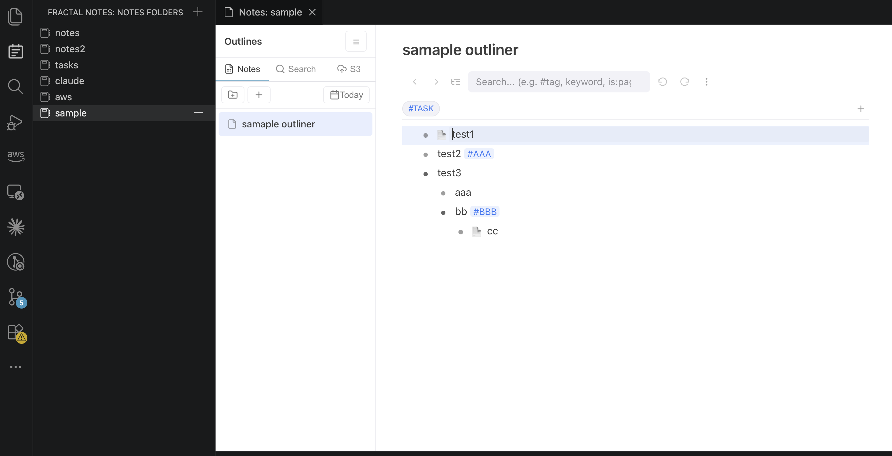
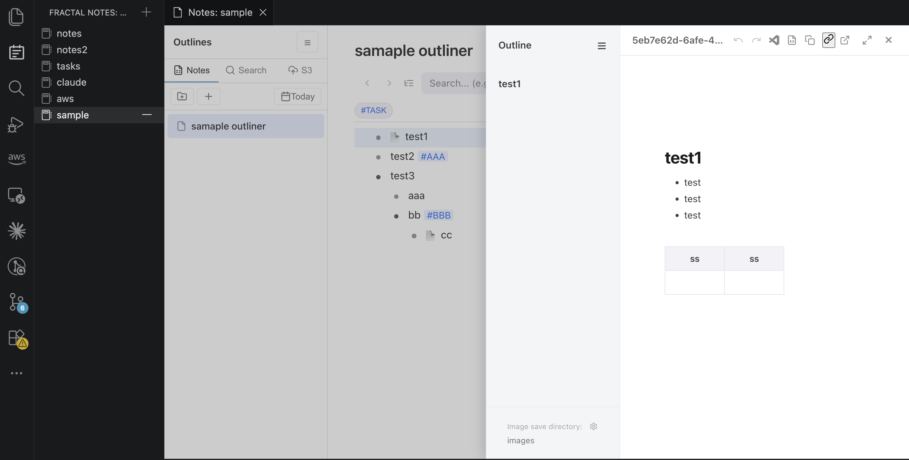
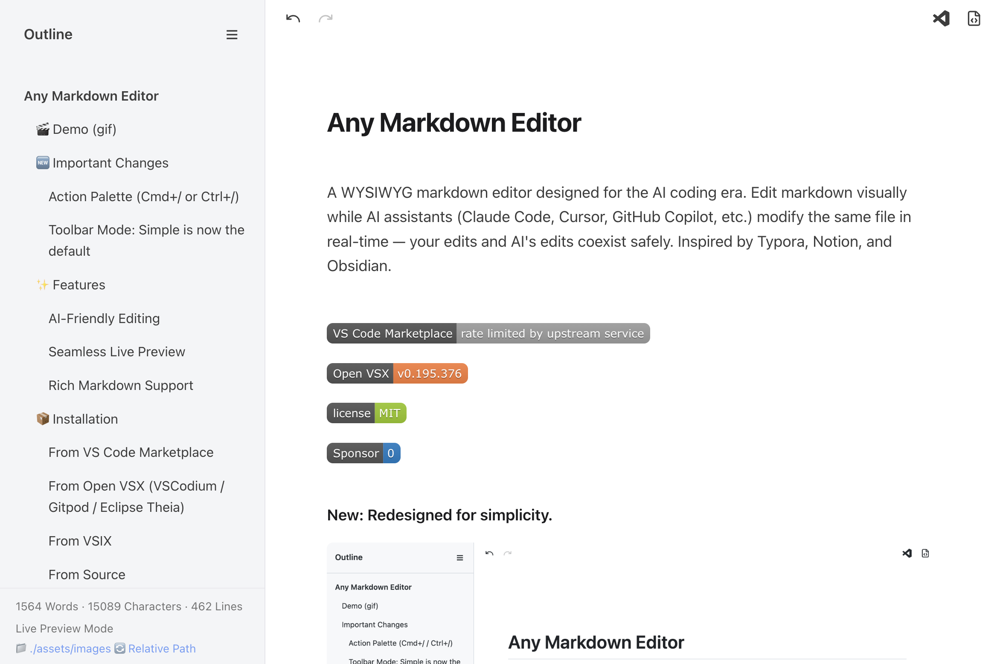
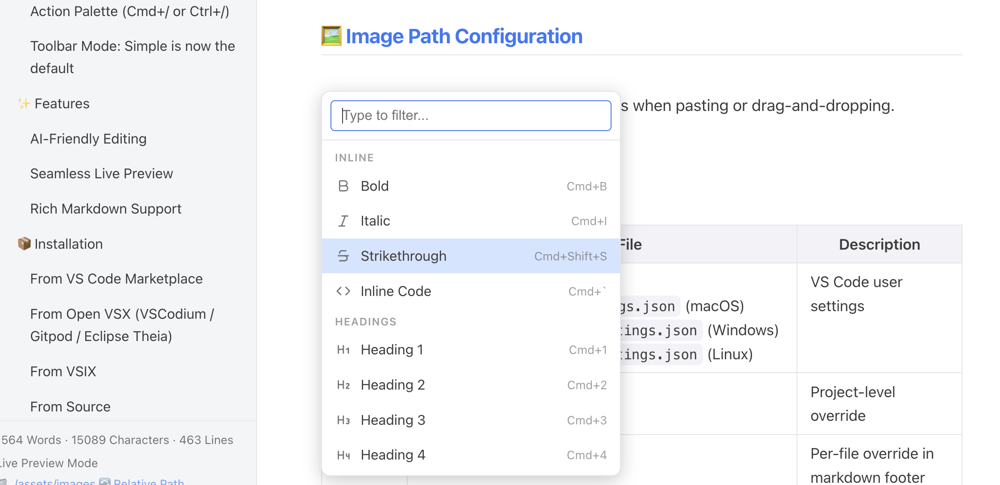
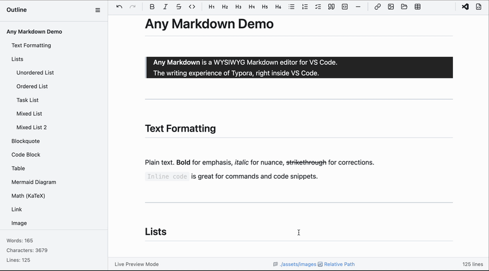
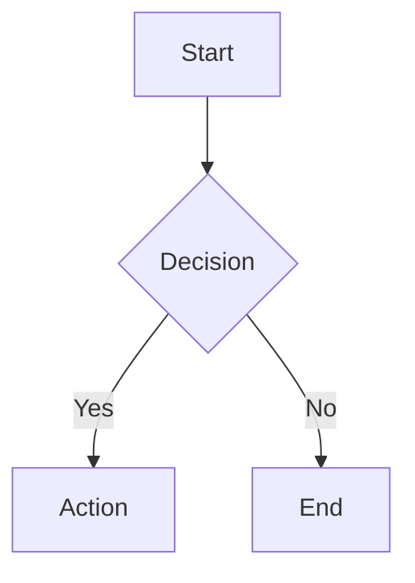

 Fractal - Markdown & Outliner Editor VS Code
=

A note app that lives in your VS Code Activity Bar. Add folders, organize outlines, write markdown pages — all without leaving the editor. Fractal combines a **Dynalist-like outliner** and a **Typora-like WYSIWYG markdown editor** into a single, integrated note-taking experience with Daily Notes, full-text search, and S3 cloud sync. The markdown editor is **AI-friendly** — edit visually while AI assistants (Claude Code, Cursor, etc.) modify the same file in real-time, with your edits and AI's edits coexisting safely.

Each `.out` (outliner) and `.md` (markdown) file also works standalone — but the real power is in the **Notes manager**, where everything comes together.


## Visual
### Outliner Editor
The Outliner Editor can be used by first adding a Note (any folder) from Fractal Notes in the VSCode Activity Bar.
The Outliner Editor is an outliner with features comparable to Dynalist and Workflowy. Additionally, you can structurally organize outline files using folders, and perform full-text search across both outline node text and Markdown content. You can also back up notes to S3 and restore them from S3.

### Side Panel Markdown Editor
Each node in the outliner can easily embed a Markdown file as a page using the `@page` command. Nodes with an attached page display a page icon, and pressing Cmd+Enter opens the Markdown editor in the side panel.


### Markdown Editor (Standalone)
The Markdown editor can be launched in standalone mode from the side panel. The functionality is the same, but standalone mode offers the advantage of a larger editing area. It can also be set as the default Markdown editor, allowing you to edit any Markdown file with the Fractal Markdown editor.

**Action Palette (Cmd+/ / Ctrl+/)**


## 🎬 Demo (gif)

You can freely use markdown using only the keyboard.
lists, tables, code blocks, and everything else! And when you want to request AI Chat, select the range and press cmd+l (ctr+l).

> Note: The editor design shown in the gif above is from an older version.

---

## ✨ Features

### Markdown Editor (.md files)

A Typora / Notion-style WYSIWYG markdown editor.

- **Seamless live preview** — Edit markdown in a beautifully rendered view. No split windows
- **Source mode toggle** — Switch between WYSIWYG and raw markdown with one click
- **AI-friendly editing** — Edit visually while AI assistants (Claude Code, Cursor, etc.) modify the same file. Your edits and AI's edits coexist safely
- `Cmd+L` / `Ctrl+L` — Select text, press `Cmd+L` to open the source file in VS Code's text editor with the exact lines selected. Press `Cmd+L` again to send to AI chat. Works with VS Code, Cursor, Kiro, and more
- **Real-time external change sync** — When AI modifies the file, only changed blocks are patched via block-level DOM diff. Cursor position and in-progress edits are preserved
- **Headers** (H1-H6) with outline navigation
- **Text formatting** — Bold, Italic, Strikethrough, Inline Code
- **Lists** — Ordered, Unordered, Task Lists with checkboxes
- **Tables** — **Column resize from any cell** (drag right edge of any cell, not just the header) with **persistent widths** saved as a `<!-- fractal-col-widths: ... -->` HTML comment in the markdown source (re-opens at the same width, ignored by other markdown viewers). Alignment, Tab/Shift+Tab cell navigation, Enter to add row, Shift+Enter for in-cell line break
- **Code blocks** — Syntax highlighting for 24+ languages, expand to VS Code editor tab
- **Blockquotes** and **Horizontal rules**
- **Links and Images** — Drag & drop, paste, smart link creation (select text + paste URL)
  - **Image fullscreen lightbox** — Double-click any image to open it fullscreen. **Pinch to zoom** (Mac touchpad), **drag to pan** when zoomed, double-click to reset, ESC to close
  - **`fractal.imageMaxWidth` setting** (default 400px) — Cap inline image width
  - **Right-click → Rename Link** — Edit the visible text of any link without changing its URL
- **drawio.svg / drawio.png inline support** — Drag a `.drawio.svg` from Finder onto the editor, or use `Cmd+/` → **"Insert Drawio Diagram"** to create a new placeholder. Renders as an inline image in the MD; saving the file from drawio Desktop / `hediet.vscode-drawio` triggers automatic re-render of all open MDs that reference it (powered by a polling-fallback file watcher to catch atomic-rename saves). Dropping a `.drawio` (XML) file shows a "Open in drawio Desktop" guidance dialog instead of inserting raw XML
- **File attachments** — Drag & drop any file onto the editor to insert a `[📎 filename](path)` link. Click to open with OS default app
- **Notion-style side panel** — Click a `.md` link to open it in a side peek panel with full WYSIWYG editing. Cmd+Click to open in a new tab instead
  - **Back / Forward navigation** in the side panel header (or `Opt+Left` / `Opt+Right`) to revisit MD links you've followed inside the panel
  - **`Cmd+/` Add Page** also works inside the side panel — creates `<sidePanelDir>/pages/<timestamp>.md` and inserts the link
  - **Outline always visible** — the side panel's heading outline stays open even when the MD has zero headings (shows a placeholder)
- **Cmd+/ Add Page (link-name modal)** — Press `Cmd+/` → `Add Page` → type the link text → a new MD is created (auto-named) and `<a>{linkName}</a>` is inserted at the cursor. The new MD's H1 is synced from the link name (so the new page is immediately discoverable by title)
- **Mermaid diagrams** — Rendered inline, click to edit source
- **KaTeX math equations** — Display-mode equations with live re-rendering
- **YAML Front Matter** support
- **Action Palette** (`Cmd+/`) — Quick access to all formatting and insertion actions, including Add Page, Insert Drawio Diagram, and Insert Table

<!-- TODO: Add Markdown editor screenshot -->

---

### Outliner (.out files)

A Dynalist-like outliner built into VS Code.

- **Tree editing** — Unlimited nesting with bullet points. Enter, Backspace, Tab, Shift+Tab work as you expect
- **Collapse / Expand** — Click bullets to fold branches. `Ctrl+.` to toggle, `Ctrl+Shift+.` to toggle all
- **Subtree scoping** — Focus on any branch with breadcrumb navigation. `Cmd+]` to scope in, `Cmd+[` to scope out
- **Tags** — `#tag` and `@tag` are auto-highlighted and clickable for instant search
- **Pinned tags** — Pin frequently used tags for one-click filtering
- **Search** — Dynalist-compatible queries: AND, OR, NOT, `"phrase"`, `#tag`, `in:title`, `has:children`, `is:page`, `is:task`. Tree mode and focus mode
- **Page nodes** — Turn any bullet into a page with a full WYSIWYG markdown editor in a resizable side panel
- **Import .md files** — Import Markdown files (Notion, Obsidian exports) as page nodes via ⋮ menu. Images are auto-copied and paths rewritten
- **File attachments** — Attach any file type (PDF, Excel, etc.) to nodes via ⋮ → "Import any files...". File nodes display a 📎 icon; click to open with OS default app. Copy/paste duplicates the physical file
- **Task nodes** — `- [ ]` / `- [x]` checkboxes with toggle support
- **Inline formatting** — Bold (`Cmd+B`), italic (`Cmd+I`), strikethrough (`Cmd+Shift+S`), inline code (`Cmd+E`), `[text](url)` links
- **Clickable links** — `[text](url)` links are rendered and clickable in display mode. URLs pasted via `Cmd+V` are auto-converted to link format
- **Multi-select indent** — Select multiple nodes with Shift+Click, then Tab/Shift+Tab to indent/outdent them all at once
- **Move nodes** — `Ctrl+Shift+↑/↓` to reorder
- **Subtext** — `Shift+Enter` to add notes below any bullet
- **Navigation history** — Back / forward buttons to revisit previous search and scope states
- **Node images** — Paste images with `Cmd+V`. Thumbnails shown below the node, drag to reorder, double-click to enlarge
- **Undo / Redo** — Full undo/redo with `Cmd+Z` / `Cmd+Shift+Z`

<!-- TODO: Add Outliner feature screenshot -->

---

### Note (.note)

A 3-pane note management experience, accessed from the **Activity Bar**.

- **Multi-file management** — Organize multiple `.out` files in virtual folders with drag & drop
- **Full-text search** — Search across all outlines, pages, and standalone `.md` files. Streaming results with click-to-jump
- **Daily Notes** — One-click daily journal. Auto-creates year/month/day hierarchy. Navigate with `<` `>` buttons or a calendar picker
- **S3 cloud sync** — Sync your notes to AWS S3 with one click. Supports backup, full upload, and full download
- **Resizable panels** — Drag to resize left panel and side panel. Widths are saved per folder

<!-- TODO: Add Notes manager feature screenshot -->

---

## 📦 Installation

### From VS Code Marketplace

1. Open VS Code
2. Go to Extensions (`Ctrl+Shift+X`)
3. Search for **"Fractal"**
4. Click **Install**

Or install directly: [VS Code Marketplace](https://marketplace.visualstudio.com/items?itemName=imaken.fractal)

### From Open VSX (VSCodium / Gitpod / Eclipse Theia)

[Open VSX Registry](https://open-vsx.org/extension/imaken/fractal)

### From VSIX
```bash
code --install-extension fractal-{version}.vsix
```

### From Source
```bash
git clone https://github.com/raggbal/fractal
cd fractal
npm install
npm run compile
# Press F5 to launch in debug mode
```

### Optional: AWS CLI (for S3 sync & Translation features)

Fractal itself works without AWS CLI. However, the following features require the AWS CLI (`aws` command) to be installed and available in PATH:

- **S3 sync** (Notes: sync notes folder to/from S3 bucket)
- **Translation** (MD editor: translate selected text or full document via Amazon Translate)

If AWS CLI is not installed, the core editor features (Markdown, Outliner, Notes management) work normally — only these two AWS-based features will show an error when invoked.

**Install AWS CLI:** https://aws.amazon.com/cli/

**Configure credentials** in VS Code settings:
- For S3 sync: `fractal.s3AccessKeyId`, `fractal.s3SecretAccessKey`, `fractal.s3Region`
- For Translation: `fractal.transAccessKeyId`, `fractal.transSecretAccessKey`, `fractal.transRegion`

---

## ⚙️ Set as Default Editor

### For Markdown Files (.md)

1. Right-click any `.md` file in the Explorer
2. Select **"Open With..."**
3. Select **"Configure default editor for '*.md'..."**
4. Select **"Fractal"**

### For Outline Files (.out)

`.out` files open with Fractal automatically when the extension is installed.

---

## 🚀 Usage

### Markdown Editor
1. Open any `.md` or `.markdown` file
2. Right-click and select **"Open with Fractal"**
3. Or use Command Palette: `Fractal: Open with Fractal`

### Outliner
1. Open any `.out` file — it opens directly in the outliner
2. Or create a new `.out` file with `{}` as content to start fresh

### Notes (Fractal)
1. Click the **Notes** icon in the Activity Bar (left sidebar)
2. Add a folder to register it as a notes workspace
3. Click a folder to open the 3-pane Notes UI

### In-App Links
- Right-click an outliner node → **Copy In-App Link** to create a link to that node
- Click the 🔗 button in the sidepanel header to create a link to the current page
- Paste the link in any outliner or markdown editor — click to navigate instantly

---

## 📝 Creating Markdown Elements

### Block Elements

| Element | Pattern Input | Toolbar | Shortcut |
| --- | --- | --- | --- |
| Heading 1 | `# ` + Space | Heading menu → H1 | `Ctrl+1` |
| Heading 2 | `## ` + Space | Heading menu → H2 | `Ctrl+2` |
| Heading 3 | `### ` + Space | Heading menu → H3 | `Ctrl+3` |
| Heading 4 | `#### ` + Space | Heading menu → H4 | `Ctrl+4` |
| Heading 5 | `##### ` + Space | Heading menu → H5 | `Ctrl+5` |
| Heading 6 | `###### ` + Space | Heading menu → H6 | `Ctrl+6` |
| Paragraph | (default)<br> | — | `Ctrl+0` |
| Unordered List | `- ` or `* ` + Space | List button | `Ctrl+Shift+U` |
| Ordered List | `1. ` + Space | Numbered list button | `Ctrl+Shift+O` |
| Task List | `- [ ] ` + Space | Task list button | `Ctrl+Shift+X` |
| Blockquote | `> ` + Space | Quote button | `Ctrl+Shift+Q` |
| Code Block | ````` ``` ````` + Enter | Code button | `Ctrl+Shift+K` |
| Table | `| col1 | col2 |` + Enter | Table button | `Ctrl+T` |
| Horizontal Rule | `---` + Enter | HR button | `Ctrl+Shift+-` |


### Inline Elements

| Element | Pattern Input | Toolbar | Shortcut |
| --- | --- | --- | --- |
| Bold | `**text**` + Space | Bold button | `Ctrl+B` |
| Italic | `*text*` + Space | Italic button | `Ctrl+I` |
| Strikethrough | `~~text~~` + Space | Strikethrough button | `Ctrl+Shift+S` |
| Inline Code | ``` `text` ``` + Space | Code button | ``` Ctrl+` ``` |
| Link | `[text](url)` <br>Space conversion not supported<br> | Link button | `Ctrl+K` |
| Image | `` <br>Space conversion not supported<br> | Image button | `Ctrl+Shift+I` |


---

## ⌨️ Special Operations

### Markdown Editor Shortcuts

These shortcuts are active when the Fractal markdown editor is focused:

| Shortcut | Action |
| --- | --- |
| `Cmd+/` / `Ctrl+/` | Open Action Palette |
| `Cmd+N` / `Ctrl+N` | Add Page (create & link a new .md file) |
| `Cmd+.` / `Ctrl+.` | Toggle Source Mode |
| `Cmd+Shift+.` / `Ctrl+Shift+.` | Open in Text Editor |
| `Ctrl/Cmd + S` | Save |
| `Ctrl/Cmd + Z` | Undo |
| `Ctrl/Cmd + Shift + Z` | Redo |
| `Ctrl/Cmd + B` | Bold |
| `Ctrl/Cmd + I` | Italic |
| `Ctrl/Cmd + K` | Insert link |
| `Ctrl/Cmd + F` | Find |
| `Ctrl/Cmd + H` | Find and replace |
| `Ctrl/Cmd + L` | Open source file with selected lines in text editor |

### Side Panel Shortcuts

These shortcuts apply to the side panel markdown editor (Notion-style peek):

| Shortcut | Action |
| --- | --- |
| `Opt+Left` / `Alt+Left` | Navigate back through MD links followed inside the side panel |
| `Opt+Right` / `Alt+Right` | Navigate forward |
| `Cmd+/` / `Ctrl+/` → Add Page | Create a new MD under `<sidePanelDir>/pages/` and insert the link |
| `Esc` | Close the side panel (or close the image lightbox if open) |

### Outliner Shortcuts

These shortcuts are active when the Fractal outliner is focused:

| Shortcut | Action |
| --- | --- |
| `Enter` | Create new sibling node |
| `Option+Enter` / `Alt+Enter` | Create child node |
| `Shift+Enter` | Add/focus subtext |
| `Tab` | Indent node |
| `Shift+Tab` | Outdent node |
| `Backspace` at start | Merge with previous node |
| `↑` / `↓` | Navigate between nodes |
| `Ctrl+Shift+↑` / `Ctrl+Shift+↓` | Move node up / down |
| `Ctrl+.` | Toggle collapse/expand |
| `Ctrl+Shift+.` | Toggle all collapse/expand |
| `Cmd+]` / `Ctrl+]` | Scope into current node |
| `Cmd+[` / `Ctrl+[` | Scope out (back to document) |
| `Cmd+B` | Bold toggle |
| `Cmd+I` | Italic toggle |
| `Cmd+E` | Inline code toggle |
| `Cmd+Shift+S` | Strikethrough toggle |
| `Ctrl+F` | Focus search bar |
| `Ctrl+N` | Add new node at end |
| `Cmd+Z` | Undo |
| `Cmd+Shift+Z` | Redo |

### Escaping Block Elements

| Element | Key | Action |
| --- | --- | --- |
| Code Block | `Shift+Enter` | Exit code block and create new paragraph |
| Blockquote | `Shift+Enter` | Exit blockquote and create new paragraph |
| Mermaid/Math | `Shift+Enter` | Exit block and create new paragraph |
| Code Block | `↑` at first line | Exit to previous element |
| Code Block | `↓` at last line | Exit to next element |
| Blockquote | `↑` at first line | Exit to previous element |
| Blockquote | `↓` at last line | Exit to next element |
| Mermaid/Math | `↑` at first line | Exit to previous element |
| Mermaid/Math | `↓` at last line | Exit to next element |

### Escaping Inline Elements

To exit inline formatting, type the closing marker followed by Space:

| Element | Input | Action |
| --- | --- | --- |
| Bold | `**` + Space | Close bold and move cursor outside |
| Italic | `*` + Space | Close italic and move cursor outside |
| Strikethrough | `~~` + Space | Close strikethrough and move cursor outside |
| Inline Code | ``` ` ``` + Space | Close inline code and move cursor outside |

### Table Operations

| Key | Action |
| --- | --- |
| `Tab` | Move to next cell |
| `Shift+Tab` | Move to previous cell |
| `Enter` | Insert new row |
| `Shift+Enter` | Insert line break within cell |
| `↑` / `↓` | Navigate between rows |
| `←` / `→` | Navigate within/between cells |
| `Cmd+A` | Select all text in current cell |

### Code Block Operations

| Key | Action |
| --- | --- |
| `Tab` | Insert 4 spaces |
| `Shift+Tab` | Remove up to 4 leading spaces |
| `Cmd+A` | Select all text within code block |

### List Operations

| Key | Action |
| --- | --- |
| `Tab` | Indent list item (increase nesting) |
| `Shift+Tab` | Outdent list item (decrease nesting) |
| `Enter` on empty item | Convert to paragraph or decrease nesting |
| `Backspace` at start | Convert to paragraph |
| Pattern at line start + Space | Convert list type in-place (e.g., `1. ` converts `- item` to ordered list) |

### Multi-Block Selection

| Key | Action |
| --- | --- |
| `Tab` | Insert 4 spaces at the beginning of each selected block |
| `Shift+Tab` | Remove up to 4 leading spaces from each selected block |

---

## 💻 Code Block Features

### Supported Languages

The editor supports syntax highlighting for the following languages:

`javascript`, `typescript`, `python`, `json`, `bash`, `shell`, `css`, `html`, `xml`, `sql`, `java`, `go`, `rust`, `yaml`, `markdown`, `c`, `cpp`, `csharp`, `php`, `ruby`, `swift`, `kotlin`, `dockerfile`, `plaintext`

**Language Aliases:** `js`→javascript, `ts`→typescript, `py`→python, `sh`→bash, `yml`→yaml, `md`→markdown, `c++`→cpp, `c#`→csharp

### Display Mode / Edit Mode

- **Display Mode**: Shows syntax-highlighted code with language tag and copy button
- **Edit Mode**: Plain text editing (click on code block to enter)
- **Expand Button**: Open code in a separate VS Code editor tab for larger editing

### Mermaid Diagrams

Code blocks with language `mermaid` are rendered as diagrams:



- Click on diagram to edit source
- Diagram re-renders when exiting edit mode

### KaTeX Math Equations

Code blocks with language `math` are rendered as mathematical equations using KaTeX:

```math
E = mc^2
\int_0^\infty e^{-x} dx = 1
\sum_{n=1}^{\infty} \frac{1}{n^2} = \frac{\pi^2}{6}
```

- Each line is rendered as an independent display-mode equation
- Click on the rendered equation to edit the LaTeX source
- Equations re-render automatically (500ms debounce) while editing
- Invalid LaTeX is shown as a red error message (does not break the layout)
- Empty blocks show "Empty expression"
- Navigate in/out with arrow keys, just like code blocks and Mermaid diagrams

---

## 🖼️ Image & File Path Configuration

Images and file attachments can be saved to custom directories when pasting or drag-and-dropping. The same path resolution rules apply to both.

### Configuration Levels

| Level | Setting File | Description |
| --- | --- | --- |
| **Global** | `~/Library/Application Support/Code/User/settings.json` (macOS)<br>`%APPDATA%\Code\User\settings.json` (Windows)<br>`~/.config/Code/User/settings.json` (Linux) | VS Code user settings |
| **Project** | `.vscode/settings.json` | Project-level override |

### VS Code settings.json Setting

```json
{
  "fractal.imageDefaultDir": "./images",
  "fractal.forceRelativeImagePath": true,
  "fractal.fileDefaultDir": "./files",
  "fractal.forceRelativeFilePath": true
}
```

### Path Behavior Matrix

The `forceRelative` settings (`forceRelativeImagePath` / `forceRelativeFilePath`) allow you to separate the **save location** from the **path written in Markdown**.

**Use case**: When you want to save files to a specific absolute path but reference them using relative paths from the Markdown file, set this to `true`.

> **Note**: `forceRelative` only takes effect when the directory setting is an absolute path. When using relative paths, the setting is ignored as paths are always relative.

The same rules apply to both images and file attachments:

| Directory Setting | forceRelative | Save Location | Path in Markdown |
| --- | --- | --- | --- |
| Absolute (e.g., `/Users/shared/images`) | `false` (default) | Specified absolute path | Absolute path |
| Absolute (e.g., `/Users/shared/images`) | `true` | Specified absolute path | Relative path from Markdown file |
| Relative (e.g., `./images`) | `false` | Relative to Markdown file | Relative path |
| Relative (e.g., `./images`) | `true` | Relative to Markdown file | Relative path (setting ignored) |

---

## 🎨 Configuration

### VS Code Settings

| Setting | Description | Default |
| --- | --- | --- |
| `fractal.theme` | Editor theme (`github`, `sepia`, `night`, `dark`, `minimal`, `perplexity`, `things`) | `things` |
| `fractal.fontSize` | Base font size (px) | `16` |
| `fractal.imageDefaultDir` | Default directory for saved images | `""` (same as markdown file) |
| `fractal.forceRelativeImagePath` | Force relative paths for images | `false` |
| `fractal.imageMaxWidth` | Max width (px) for images and `.drawio.svg` thumbnails in the editor / side panel / outliner page side panel. Toolbar / lucide / command-palette icons are excluded. Min `100` | `400` |
| `fractal.language` | UI language (`default`, `en`, `ja`, `zh-cn`, `zh-tw`, `ko`, `es`, `fr`) | `default` |
| `fractal.toolbarMode` | Toolbar display mode (`full`, `simple`) | `simple` |
| `fractal.outlinerPageDir` | Default page directory for outliner | `./pages` |
| `fractal.outlinerPageTitle` | Show page title input in outliner | `false` |
| `fractal.outlinerImageDefaultDir` | Default image directory for outliner nodes | `./images` |
| `fractal.outlinerFileDir` | Default file attachment directory for outliner nodes | `./files` |
| `fractal.fileDefaultDir` | Default directory for file attachments in markdown | `""` (same as markdown file) |
| `fractal.forceRelativeFilePath` | Force relative paths for file attachments | `false` |
| `fractal.enableDebugLogging` | Enable debug logging in browser console | `false` |
| `fractal.showTranslateButtons` | Show translate buttons in standalone toolbar (leftmost) and side panel header. When off, translation can still be triggered via the `fractal.translate` command (Cmd+/) | `false` |

### Themes

All 7 themes apply to both the markdown editor and the outliner:

| Theme | Description |
| --- | --- |
| `github` | Clean GitHub-style rendering |
| `sepia` | Warm, paper-like appearance for comfortable reading |
| `night` | Dark theme with Tokyo Night inspired colors (blue tint) |
| `dark` | Pure dark theme with neutral black/gray colors |
| `minimal` | Distraction-free black and white design |
| `perplexity` | Light theme with Perplexity brand colors (Paper White background) |
| `things` | Clean, minimal theme inspired by Things app (SF Pro font, blue accents) (default) |

---

## 🌐 Supported Languages (i18n)

The editor UI supports the following languages:

| Language | Code |
| --- | --- |
| English | `en` (default) |
| Japanese | `ja` |
| Simplified Chinese | `zh-cn` |
| Traditional Chinese | `zh-tw` |
| Korean | `ko` |
| Spanish | `es` |
| French | `fr` |

Set via `fractal.language` or use `default` to follow VS Code's display language.

---

## 🔧 Commands

Available in Command Palette (`Ctrl+Shift+P` / `Cmd+Shift+P`):

| Command | Description |
| --- | --- |
| `Fractal: Open with Fractal` | Open markdown file in WYSIWYG editor |
| `Fractal: Insert Table` | Insert a new table |
| `Fractal: Insert TOC` | Insert table of contents |
| `Fractal: Open as Text` | Open in standard text editor |
| `Fractal: Compare as Text` | Compare with text version |
| `Fractal: Toggle Source Mode` | Switch between WYSIWYG and source mode |
| `Fractal: Undo` | Undo last edit |
| `Fractal: Redo` | Redo last undone edit |
| `Fractal: Clean Unused Files in Note` | Scan all notes for orphan images, markdown files, and file attachments. Move selected to trash |
| `Fractal: Clean Unused Files (Current Note)` | Same as above, limited to the currently open note |

---

## 🔄 External File Changes

When another tool (e.g., AI coding assistants like Claude Code, Cursor, etc.) modifies the same markdown file while you have it open in Fractal:

- **Block-level DOM diff**: Only changed blocks are updated — your cursor position and in-progress edits are preserved.
- **Toast notification**: A notification appears allowing you to review and accept or dismiss external changes.
- **Unsaved changes warning**: If you have unsaved edits, a confirmation dialog prevents accidental overwrites.

---

## 🛠️ Development

```bash
# Install dependencies
npm install

# Compile TypeScript
npm run compile

# Watch for changes
npm run watch

# Run tests
npm test

# Package extension
vsce package --no-dependencies
```

---

## 💖 Support This Project

If you find this extension useful, please consider:

- [**Sponsor** on GitHub](https://github.com/sponsors/raggbal) - Help keep this project maintained
- **Star** this repository on [GitHub](https://github.com/raggbal/fractal)
- **Report issues** or suggest features on [Issues](https://github.com/raggbal/fractal/issues)
- **Contribute** with pull requests

Your support helps keep this project maintained and improved!

---

## 📄 License

MIT License - feel free to use this extension in your projects.

---

## 🙏 Acknowledgments

- Built with love for the VS Code community

---