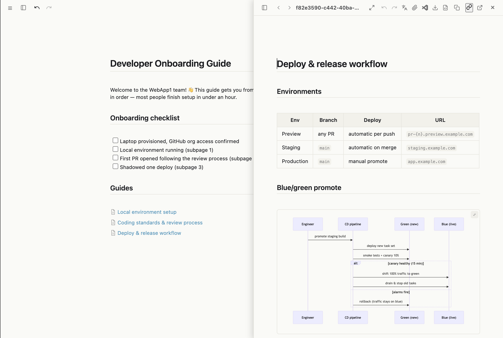
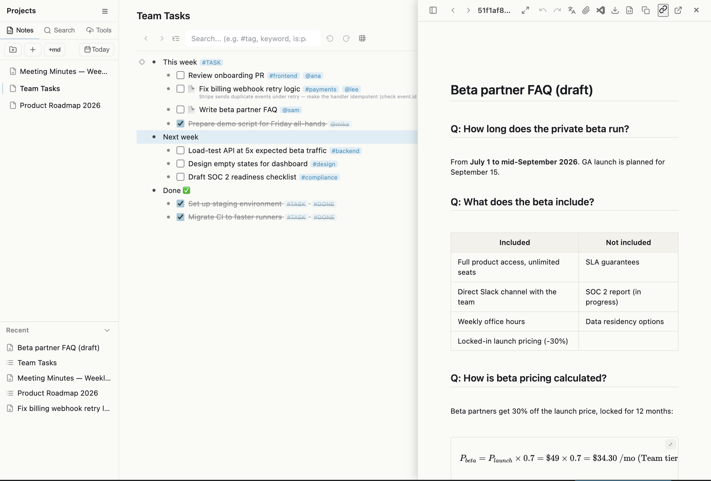
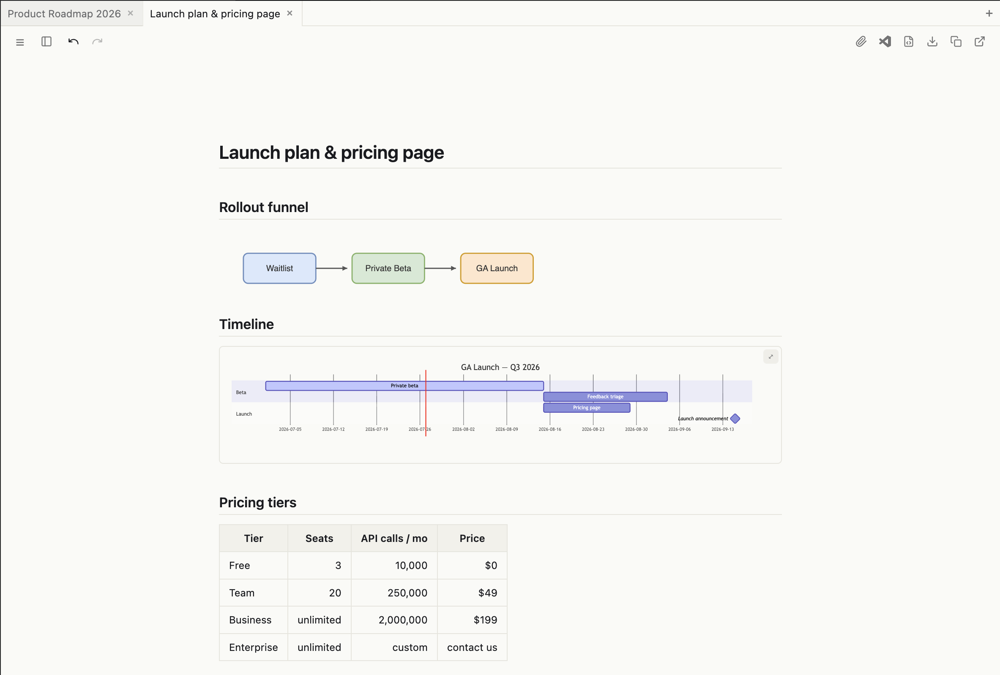
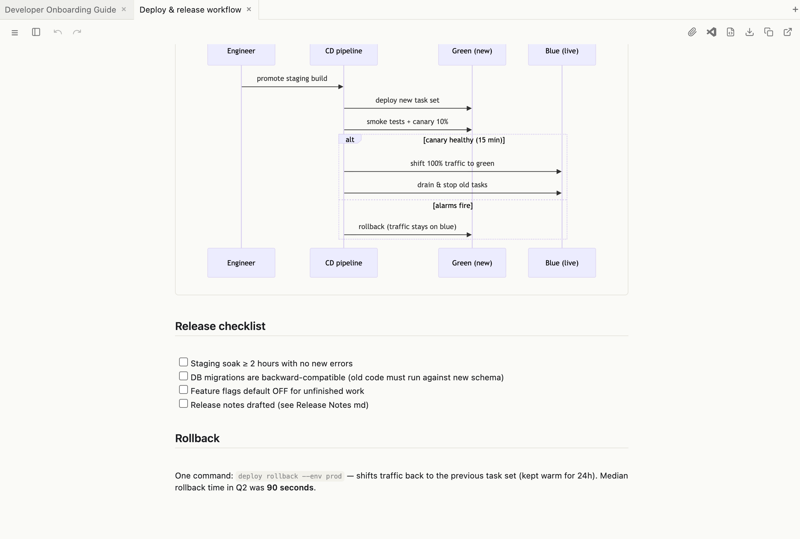
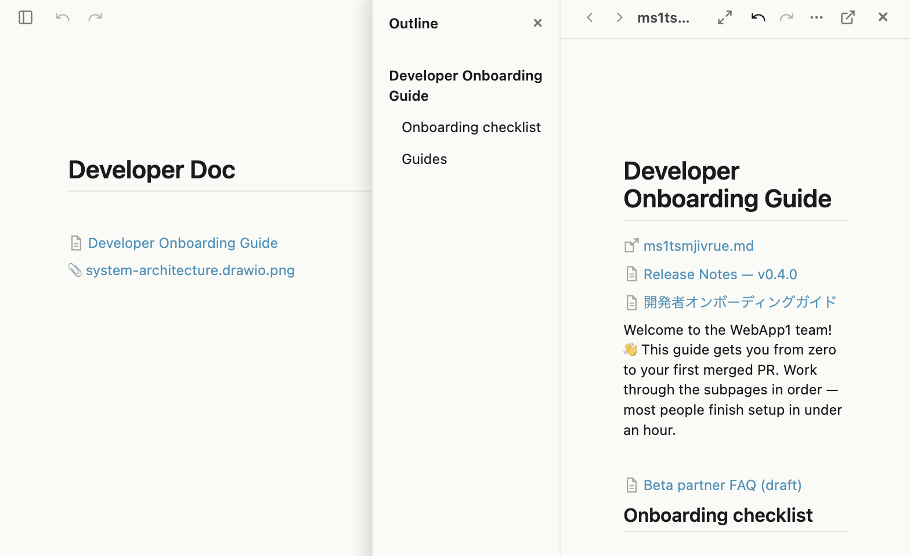
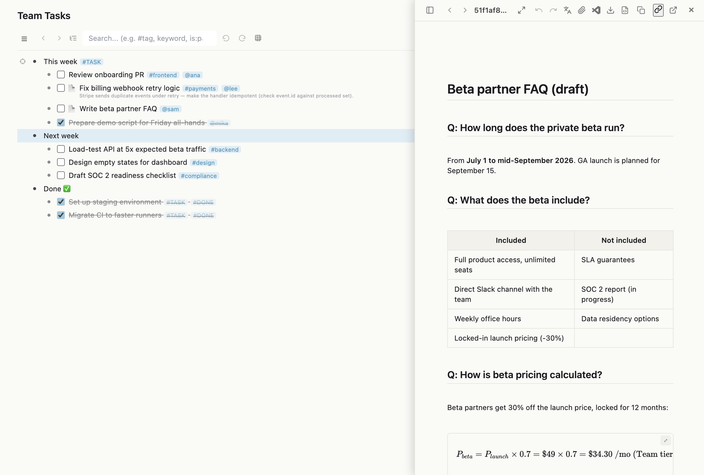
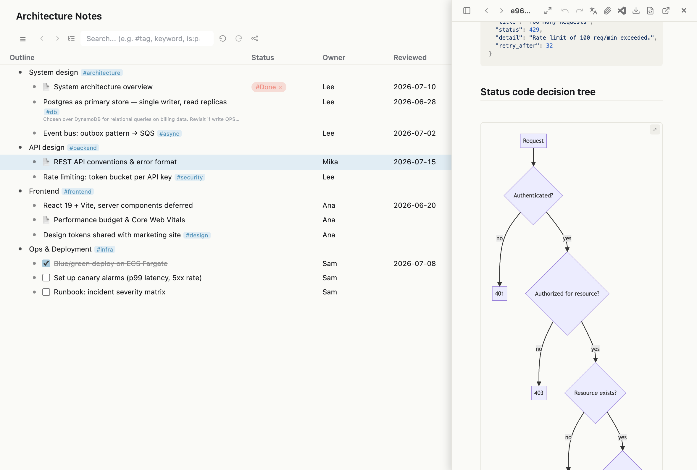
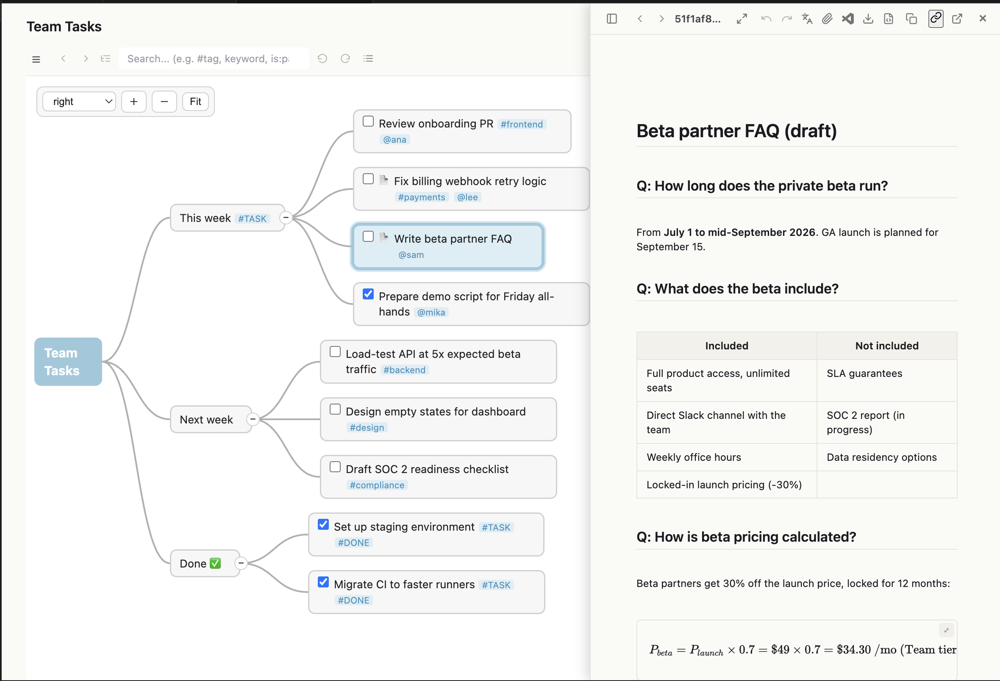

 Fractal Note — Markdown, Outliner, Database, Mindmap — and all your files, in one place
=

**A complete note-taking environment inside VS Code.** Fractal Note combines a **Notion-like WYSIWYG markdown editor** and a **Dynalist-like outliner (with Database / Mindmap modes)** in a single workspace. And **your notes and your documents live in one place** — keep any file (PDF, Word, Excel, PowerPoint, …) in the file tree, or **embed it directly into a markdown document or an outline node**, and **search its contents full-text** along with everything else. If your files have outgrown your folders — scattered across directories, always separated from the notes that reference them — **this is built for exactly that problem**. Organize it all into **Notes**, sync it to S3 — and it's built from the ground up for **working alongside AI coding assistants**.


---

## Why Fractal Note

- ✍️ **WYSIWYG Markdown** — Edit and read at the same time. No split preview, no raw markup. Tables (Excel-like editing, **cell merging included**), code blocks, Mermaid, math, draw.io — all rendered live.
- 🌲 **A real outliner** — Dynalist / Workflowy-style tree editing, with tag management, smooth filtering, and three views: **Outliner / Database / Mindmap**.
- 📄 **Subpages** — Embed markdown pages as children of outline nodes or of other markdown pages. Build hierarchical documents like a Notion database.
- 🤖 **AI-friendly by design** — External file changes are reflected on screen **in real time**. Let Claude Code, Cursor, or Kiro edit your notes while you keep working — your cursor position and in-progress edits are preserved.
- 🗂 **Notes** — Organize by folder ("note"). Files stay flat on disk while a virtual folder/file tree keeps everything structured on screen — including **arbitrary file attachments** (PDF, Excel, …). Cross-file full-text search — **including inside attached PDF / Word / Excel / PowerPoint files and any text-based attachment (HTML, JSON, …)**, with page / slide / sheet-cell hit locations and backlinks to the referencing nodes — tabs and history, Daily Notes.
- ☁️ **S3 backup & restore** — One-click backup to your own AWS S3 bucket, and restore from it.
- 🧩 **Beyond the editor** — A Chrome extension for clipping web pages, Amazon Translate integration, and published **AI skills** that let AI agents read and write your notes in Fractal Note (use Fractal Note instead of Obsidian).

`.md` and `.out` files work standalone, but Fractal Note shines when everything is connected in the **Notes manager**.

---

## Key visuals

### Markdown editor
A markdown editor with the same pleasant writing feel as Notion. Every basic markdown element is available, plus extended features like code blocks, math blocks, Mermaid blocks, embedded draw.io diagrams, and text color — covering everyone's markdown needs.
It also supports Notion-style **subpages** (distinct from plain links), so you can manage markdown hierarchically.


### Outliner editor
A Dynalist-class outliner. Folders, tags, and full-text search across both outline node text and markdown bodies.
The same outline can also be switched into a **Database view** (a Notion-like table) and a **Mindmap view** (an editable SVG mindmap).


---

## ✨ Core concept

**Manage Markdown, Outliner, Database, and Mindmap in one place — like Notion.** In Fractal Note these four kinds of content aren't separate tools; they connect inside the same note — hang markdown pages off outline nodes, view the same outline as a database or a mindmap, and search across all of it. And your data stays plain `.md` files and JSON.

| Content | Storage | Summary |
| --- | --- | --- |
| **Markdown** | `.md` | Notion-like WYSIWYG editor. Edit and read in a single view. Hierarchy via subpages |
| **Outliner** | `.out` | Dynalist-like tree editing. Tags, tasks, search |
| **Database** | `.out` (view) | The same outline as a Notion-like table. Text / tag / date columns |
| **Mindmap** | `.out` (view) | The same outline rendered and edited as an SVG mindmap |

Tying it all together is **Notes** — a folder-scoped workspace (virtual tree, cross-file search, tabs, Daily Notes, S3 sync). Markdown pages open from both the markdown editor and the outliner. Subpages open in the **side panel** by default, or as standalone documents in a **new tab**.

**Every file lives in one place, and moves freely.** Not just `.md` and `.out` — attach any file (PDF, Excel, images, …) to a note, and move it between the **note tree, outliner nodes, and markdown documents** with simple drag & drop or copy/cut/paste shortcuts. Ownership follows the move automatically, links keep working, and cross-note moves copy the assets for you — no manual file wrangling.

---

## 📝 Markdown editor (.md)
A Notion-style WYSIWYG editor. What you see is exactly what's in the file.



### Editing
- **Seamless live preview** — Markdown renders the moment you type it. Switch to **source mode** anytime (`Cmd+.`)
- **Headings, lists, task lists, quotes, horizontal rules** — all standard markdown, keyboard-first
- **Tables** — Excel-like cell selection: click selects a cell, arrows move, Shift+arrows / drag / Shift+click select ranges, and cmd+c/x/v interoperate with spreadsheets (TSV + HTML both ways). Enter/typing edits a cell; Tab moves right (last cell appends a row). Merge/unmerge cells from the toolbar (persisted as GFM-compatible markdown with a marker comment), filter rows with the toolbar search box (display-only), resize columns by dragging cell edges, and toggle the header row on/off — all markdown stays compatible with other viewers
- **Blocks inside list items** — Quote and code blocks can live inside a list item's continuation lines (Shift+Enter), created via `> ` / ` ` ``` autoformat, the palette, or shortcuts, and they survive markdown round-trips
- **Code blocks** — Syntax highlighting for 24+ languages, expandable into a VS Code editor tab
- **Inline formatting** — Bold, italic, strikethrough, inline code, smart link creation
- **Action palette** (`Cmd+/`) — Every formatting and insert action in one searchable menu

### Attachments & media
- **Images** — Paste or drag & drop. Full-screen lightbox with pinch-zoom and pan. Max display width is configurable
- **File attachments** — Drop any file (PDF, Excel, …) to insert a `[📎 filename](path)` link. Click to open — Office files (Word / Excel / PowerPoint), PDF, HTML, images and text/code files in the built-in viewer, everything else in the OS default app. Links show a file-type icon (📕 pdf / 📘 doc / 📗 xls / 📙 ppt / 🌐 html). The link text is editable like any other link; copy/cut a fully selected link text and it travels *as a link*, and dragging the 📎 icon moves the link within the document or out to the notes tree
- **Attachments panel** — Lists every image and file referenced in the document, with Open / Copy Path

### PDF export
- **One click to PDF** — Toolbar / side-panel button (or `Fractal Note: Export to PDF`) turns the current markdown into a print-ready PDF, rendered exactly like the editor (Mermaid, math, colors, checkboxes included)
- **Smart page breaks** — Breaks before `h1`/`h2` by default, but not before the first `h1` or the first `h2` right after an `h1` — chapters flow naturally
- **Your own stylesheet** — `fractal.pdfStyles` (array of CSS file paths) overrides the built-in print style; set `fractal.pdfIncludeDefaultStyles: false` to replace it entirely. Page breaks are plain CSS (`break-before`), so you can disable or extend them freely
- **Local & dependency-free** — Uses your installed Chrome/Edge headlessly; no network access during export, nothing added to the extension bundle

### Export bundle — take a document out of the note
Notes keep files flat with note-relative links, so copying a single `.md` out by hand breaks its images and subpages. **Export bundle** packs everything into one portable folder:
- Right-click an outliner node (or use the side-panel button on a markdown page) → **Export bundle**
- The page plus its **subpages (recursive), linked pages, images, and attachments** are copied into a single folder, with all links rewritten to be self-contained — ready to share, publish, or drop into another tool

### Diagrams & math
- **Mermaid** — Rendered inline; click to edit the source
- **KaTeX math** — Display-mode formulas re-render live; both ```` ```math ```` blocks and `$$...$$` blocks (Typora/Obsidian compatible), CJK/Hangul-friendly rendering

### Embedded draw.io

Create and edit draw.io diagrams without leaving VS Code.

- **Create** — `Cmd+/` → **Insert Drawio Diagram** generates an empty diagram and inserts it as an image at the cursor. Dragging & dropping existing `.drawio.svg` / `.drawio.png` files also works
- **File format** — Diagrams are saved as `.drawio.svg` (a real SVG with draw.io's editing data embedded inside). They render as images on GitHub as-is and stay editable in any draw.io client. They're embedded in the document as ordinary `` images, so compatibility with other markdown editors is preserved
- **Edit** — Hover a diagram to reveal three buttons:
  - **Open in VS Code** — Open it in a VS Code tab. With the [Draw.io Integration extension](https://marketplace.visualstudio.com/items?itemName=hediet.vscode-drawio) (hediet.vscode-drawio) installed, the draw.io editor opens right inside that tab (recommended)
  - **Open in External** — Open it in an external app. draw.io Desktop is preferred if installed; otherwise the OS default app is used
  - **Copy Path** — Copy the absolute path to the clipboard
- **Automatic re-render** — However you edited it, the diagram in your open document redraws itself the instant you save. A seamless edit loop — just bounce between editors

### Subpages
Embed markdown pages inside markdown pages, like Notion. A subpage isn't a mere link — it's **owned by its parent**, and that ownership follows the parent everywhere:

- `Cmd+/`** → Add Page** (or `Cmd+N`) — Create a child markdown page and insert a link at the cursor
- Click a `.md` link to open it in a **Notion-style side-peek panel** with full WYSIWYG editing, including back/forward navigation (`Opt+←` / `Opt+→`)
- `Cmd+click` to open it as a standalone document in a **new tab**
- Pages within pages — build hierarchies as deep as you like
- **Subpages travel with their parent** — copy a parent (node copy/paste, cross-note paste, "Move to Other Note") and its subpages are duplicated or moved along with it, images and attachments included, with links rewritten so nothing breaks. Delete the parent and orphaned subpages are collected by Clean Unused Files

### AI-friendly: live sync of external changes
When an AI assistant (Claude Code, Cursor, Kiro, …) — or anything else — modifies the file you have open:

- **Block-level DOM diffing** — only the changed blocks are patched; your cursor position and in-progress edits survive
- Your edits and the AI's edits **coexist safely** in the same document
- `Cmd+L` — send the selected text to the AI chat. `Cmd+Shift+.` opens the file in the VS Code text editor

### Standalone mode
- Set Fractal Note as your **default editor for **`.md` and edit any markdown on your machine — no note workspace required
- For standalone files you can **choose where images and attachments are saved** (stored in a hidden `.fractal.json` file next to the markdown — the markdown body itself is never touched, so other editors never see it)

---

## 🌲 Outliner (.out)
A Dynalist-like outliner. The same data from three perspectives.

#### Outline view


#### Database view


#### Mindmap view


### Three view modes
Switch with the view toggle:

1. **Outliner view** — Classic bullet tree. Unlimited nesting, collapse/expand, subtree scoping with breadcrumbs
2. **Database view** — Your outline as a Notion-like database (tree table). Text and tag (multi-select) columns, plus optional **Date / Date & Time columns** with a native date picker
3. **Mindmap mode** — The same `.out` rendered as an SVG mindmap. Four layouts (radial / left / right / balanced), keyboard-centric editing (navigation, sibling/child insert, swap, type-to-edit, copy/cut/paste with descendants), node colors and shapes, boundaries (groups), relationship lines — plus image attach/delete and drag & drop of 📄/📎 nodes to and from the note tree and markdown editors

### Organize with tags & search
- `#tag` and `@tag` are auto-highlighted; click to filter instantly
- **Pinned tags** — Turn frequent tags into one-click filters
- **Dynalist-compatible search** — AND, OR, NOT, `"phrases"`, `#tag`, `in:title`, `has:children`, `is:page`, `is:task` — with smooth incremental filtering

### Attach anything
- **Markdown subpages** — Turn any bullet into a page (`@page`) and edit it in the side panel's full WYSIWYG editor. Manage hierarchical markdown like a **Notion database**
- **Images** — Paste with `Cmd+V`. Thumbnails appear under the node; drag to reorder, double-click to zoom
- **Files** — Attach any file type to a node. 📎 nodes open Office / PDF / HTML / images / text in the built-in viewer, everything else in the OS default app
- `.md`** import** — Import Notion / Obsidian exports as page nodes. Images are copied automatically and paths rewritten

### Tasks
- `- [ ]` / `- [x]` checkboxes with rich keyboard support (`Cmd+Shift+X` to toggle)
- **Task mode** — New root nodes automatically get checkboxes
- **Task filter** — Hide completed subtrees with one click
- **Archive to Daily Notes** — Move finished tasks (with their pages, images, and files) under today's Daily Note, tagged `#TASK #DONE`

### Editing basics
Enter / Tab / Shift+Tab work the way you expect. Multi-select indenting, node moves (`Cmd+Shift+↑/↓`), subtext (`Shift+Cmd+Enter`), inline formatting, clickable links, navigation history (`Opt+←/→`), and full undo/redo. See "Key shortcuts" below for details.

---

## 🗂 Notes — where everything connects

Fractal Note organizes information into **notes**. Just register any folder from the activity bar.


- **Structure without lock-in** — Files are stored **flat** on disk while you organize `.out`, `.md`, and **any other files** in a **virtual folder/file tree** with drag & drop. Your data stays plain files
- **Import anything** — drag a .md from Finder **or the VS Code Explorer** (hold Shift for Explorer drops) onto the file tree to copy & register it into the note; drop **any file** (PDF, Excel, zip, …) to store it in the note's shared `files/` folder — click to open (Office / PDF / HTML / images / text in the built-in viewer, anything else in the OS default app; on a remote VS Code server this becomes a browser download)
- **Files flow everywhere** — drag a tree file, an outliner 📎/page node, or a markdown 📎/subpage link onto any outliner or markdown editor (main pane, side panel, or tree item) — or back into the tree. Within a note the physical file never moves (only its owner changes); across notes the file is copied to the destination and the source copy is kept until Clean Notes collects it
- **Markdown moves carry their assets** — when a markdown file travels across notes or between the tree and a linked folder (drag & drop or Duplicate), its images, 📎 attachments, and subpage markdowns (recursively) are copied along with it, and the layout converts automatically: a note's flat shared `images/` / `files/` ⇄ `images/` / `files/` folders next to the md in a linked folder. **Safety rule**: only files inside the source's own territory are followed — a note's asset folders, or anywhere inside the linked folder for moves out of a folder link. References that escape it (absolute paths or `../` beyond the boundary) are never copied; the link text is left untouched. This stops a crafted markdown from smuggling arbitrary local files (SSH keys, password files, …) into a note, where they would otherwise ride the S3 sync. Plain clipboard copy & paste of markdown text is unaffected
- **Link local folders** — register any folder on disk as a 🔗 **folder link** (`+linkfd`) and browse it in a built-in **folder view**: filter by name, create / rename / duplicate / delete (delete always via the OS trash), open markdown in the side panel and viewer-supported files (Office / PDF / HTML / images / text) in the built-in viewer — a single click on a file's 📄/📎 icon opens it too. The view **live-reloads** when files change on disk (builds, AI edits, …), and a 👁 header toggle shows hidden dotfiles when you need them (persisted per folder link; note that this can reveal sensitive folders like `.git` or `.ssh`). Drag files between the folder view, the tree, and side-panel markdown — these drops **move** the file, so it lives in exactly one place — when a markdown moves out, its accompanied images / attachments / subpages are cleaned up from the linked folder too (only when every copy succeeded, and never while another markdown in the folder still references them). Where the OS trash is unavailable (e.g. on a remote VS Code server) the verified-copied original is removed directly. The linked folder itself stays a plain reference: it's never synced, cleaned, or touched outside your explicit actions
- **Full-text search** — Search across every outline, subpage, and standalone markdown file in the note — **and inside attached PDF / Word / Excel / PowerPoint files, plus any text-based attachment (HTML, JSON, CSV, source code, …)** — with page / slide / sheet-cell hit locations and backlinks to the referencing nodes. Streaming results, click to jump
- **Filter by file type** — start the query with `ext:` to narrow the search: `ext:pdf invoice` searches only PDFs, `ext:pdf,docx report` covers both, `ext:md` / `ext:out` limit to markdown or outlines. Case and a leading dot don't matter (`ext:PDF` = `ext:.pdf`); put `ext:` anywhere else in the query and it's treated as literal text. The same syntax works in the `fractal-search` CLI (combines with `--scope`)
- **Tabs** — Switch between outliners and markdown files inside a note with browser-like tabs. Tab names follow the title / H1, and you can right-click an md tab to open it as a VS Code tab as well
- **Recent** — Jump back to a recently opened file with one click — markdowns and outlines, plus linked folders (🔗) and viewer/attachment files (📎)
- **Daily Notes** — One-click daily journal. Auto-creates a year/month/day hierarchy, with `<` `>` navigation and a calendar picker
- **In-app links** — Copy a link to any node or page (right-click a node / tree item → **Copy In-App Link**, or 🔗 in the side-panel header) and paste it anywhere in Fractal Note. Click to jump
- **Cross-note copy & paste with assets** — Copy markdown containing images, 📎 attachments, or subpage links and paste it into another note (md or outliner): the linked files are duplicated into the destination note and links keep working. Pasting into an outliner turns whole-line links into proper attachment / image / page nodes
- **Housekeeping** — "Clean Unused Files" finds orphaned images, pages, and attachments and moves them to the trash. "Move to Other Note" relocates pages together with their assets

### 📄 Built-in file viewer (Office, PDF, HTML, images & text)
Click an attached file anywhere — in the file tree, on an outliner 📎 node, or from a markdown 📎 link — and it opens right inside Fractal Note:
- **Word / Excel / PowerPoint** — read `.docx` / `.xlsx` / `.pptx` without leaving the editor, with **zero external dependencies**. Word renders page-width cards with tables, lists, images and ruby; Excel is a real spreadsheet grid (formats, colors, merged cells, sheet tabs, comments, hyperlinks — smooth even at 100k rows); PowerPoint shows slides with shapes, theme colors, auto-fit text, real list numbering and vertical Japanese text — vector EMF images (the format Office uses for logos) render as crisp SVG in both Word and PowerPoint
- **Plus PDF, HTML, images and text/code** — PDFs render locally with smooth selection (works on older-Chromium VS Code forks too); HTML is static by default (scripts only after explicit opt-in); images pan & zoom (incl. safe SVG display); 30+ text/code formats (.txt/.json/.js/.py/…) open read-only with line numbers
- **Three surfaces** — the note's main pane (as a regular tab), the side panel next to what you're writing, or a standalone VS Code tab
- **Find inside any file** — Cmd/Ctrl+F (or 🔍): highlights, match count, next/previous. Clicking a full-text-search hit opens the file pre-filled and jumps to the hit — PDFs land on the right page, Excel jumps to the exact sheet & cell, PowerPoint to the slide
- **Same feel as the md editor** — the familiar icon toolbar (copy path / in-app link / export / open in OS app), and Esc closes the side panel with the cursor back exactly where you left off
- **Safe & fast** — instant display, everything renders locally; OOXML parsing is hardened against zip bombs and malformed files, and password-protected / oversized files degrade to a clear message

### ☁️ S3 backup & restore
With an AWS account, you can sync your notes to S3:

- **Whole-note sync (Tools tab)** — Bidirectional newer-wins sync of the entire note folder, or upload-all / download-all / clean rebuild
- Per-file, mtime-based newer-wins resolution: your local edits are never overwritten by older S3 content

### 🌍 Translation
Translate a selection or the whole document with **Amazon Translate**, including Custom Terminology support for better accuracy.

> S3 sync and translation only need AWS credentials in settings — no AWS CLI installation required. Everything else works without AWS.

---

## 🤖 AI skills — make Fractal Note your agent's notebook

Fractal Note publishes **AI skills** (`ai_skills/`) that teach AI agents the Fractal Note data model so they can search, read, and write your notes directly:

- `fractal-structure` — Reference for the Notes / Outliner / Page data model
- `fractal-search` — Auto-discovers notes folders, full-text search across notes — including inside attached PDF / Word / Excel / PowerPoint files (zero-install, with hit locations) — tag and task-state filters (`--tag` / `--checked`), filtering by note name
- `fractal-edit` — Add / modify / delete / move nodes, import markdown pages (single or bulk), attach images and files, add subpages and attachments to markdown files, create new outliners and markdown files
- `fractal-doctor` — Note integrity checks (broken references, orphaned files, layout inspection; read-only)
- `fractal-summary` — Bundle an outliner or a markdown file (including subpages recursively) into a single markdown for an AI to read
- `collect` and other converters — Ingest web pages / YouTube transcripts / arXiv papers / PDF & Office documents as Markdown

```bash
ai_skills/install.sh         # install into every detected AI IDE (Claude Code / Cursor / Kiro / Antigravity)
./install-skills.sh          # Claude Code only, with rules
```

With the skills installed, agents like Claude Code can organize research, summarize clips, and build knowledge bases by writing straight into Fractal Note — a practical **Obsidian alternative** with an AI-native workflow.

---

## 🌐 Chrome extension (web clipper)

Save any web page into a Fractal Note — straight from Chrome, without launching VS Code.

- Lives in `chrome-extension/` in this repository (load it as an unpacked extension)
- Click the icon (or `Alt+Shift+F` for a quick clip) → the page is extracted with **Mozilla Readability** and converted through **Fractal Note's own HTML→MD pipeline** (tables, GFM, Medium / dev.to code blocks, and more)
- Save to an **outliner** (added as a page node) or to **markdown** (a new md is created and a subpage link is appended to the md you picked) — both are supported
- **Destination presets** — Register multiple "Note + destination" pairs and mark a ★default. The popup opens with the default pre-selected, ready to save immediately
- Writes directly to disk via the File System Access API — no communication with VS Code needed
- Concurrent clips are serialized through a queue to prevent write conflicts

See `chrome-extension/README.md` for details.

---

## 💻 Supported OS

| OS | Status |
| --- | --- |
| **macOS** | ✅ Verified (development and testing happen on macOS) |
| **Windows** | ⚠️ Implemented, not guaranteed |
| **Linux** | ⚠️ Implemented, not guaranteed |

The Windows / Linux implementations (path handling, clipboard, launching external apps, and so on) are in place, but day-to-day verification only happens on macOS, so **behavior cannot be guaranteed**. If you hit a problem, please file a request in [GitHub Issues](https://github.com/raggbal/fractal/issues) — I'll get to it when time allows. Reproduction steps plus your OS / VS Code version are much appreciated.

---

## 📦 Installation

### VS Code Marketplace
1. Open Extensions (`Ctrl+Shift+X`)
2. Search **"Fractal Note"** → Install

Or directly: [VS Code Marketplace](https://marketplace.visualstudio.com/items?itemName=imaken.fractal)

### Open VSX (VSCodium / Gitpod / Eclipse Theia)
[Open VSX Registry](https://open-vsx.org/extension/imaken/fractal)

### From VSIX
```bash
code --install-extension fractal-{version}.vsix
```

### From source
```bash
git clone https://github.com/raggbal/fractal
cd fractal
npm install
npm run compile
# press F5 to launch in debug mode
```

### Optional: AWS credentials (S3 sync & translation)
Core features work without AWS. To use S3 sync and Amazon Translate, just configure credentials in VS Code settings — the extension talks to AWS directly (built-in AWS SDK; no CLI installation needed). Note: connections through an HTTP(S) proxy are not currently supported for these features:

- S3 sync: `fractal.s3AccessKeyId`, `fractal.s3SecretAccessKey`, `fractal.s3Region`
- Translation: `fractal.transAccessKeyId`, `fractal.transSecretAccessKey`, `fractal.transRegion`

---

## 🚀 Getting started

### 1. Create your first note (recommended)
1. Click the **Fractal Note** icon in the activity bar (left edge of VS Code)
2. Click **+ Add Notes Folder** and pick (or create) an empty folder — say `~/notes/work`. That folder is now a **note**
3. Click the note name — the three-pane UI opens: **file tree (left) / editor (center) / outline & side panel (right)**

### 2. Add content to the note
Everything is created from the file tree on the left — right-click it (or a folder inside it):
- **New Outline here** — creates an outliner (`.out`). Start typing; Enter adds a node, Tab indents
- **New Markdown here** — creates a markdown page and opens it in the WYSIWYG editor
- **New Subfolder** — folders are virtual (the files on disk stay flat), so reorganize freely
- Or just **drag files in** — drop a `.md` from Finder / VS Code Explorer (hold Shift for Explorer) to import it; drop a PDF, Excel, or any other file to attach it

From an outliner, type `@page` at the end of a node (or press `Cmd+Enter`) to hang a markdown page off that node — this is the core Fractal Note workflow: **outline the structure, write the details in pages**.

### 3. Find it again
- `Cmd+P`-style cross-note search lives at the top of the file tree — it matches node text, markdown bodies, and the contents of attached PDF / Word / Excel / PowerPoint files
- Click any `#tag` to filter; pin frequent tags for one-click filtering
- Tabs and navigation history (`Opt+←/→`) work like a browser

### Using the markdown editor standalone (without Notes)
Right-click any `.md` → **"Open with Fractal Note"**. To make it the default: right-click → **Open With…** → **Configure default editor** → **Fractal Note**

### Learning the ropes
- **Long-press cmd (Ctrl on Windows)** — a shortcut overlay (HUD) pops up for the current view (Markdown / Outliner / Mindmap / Database). Release to dismiss. This is the fastest way to discover features
- `Cmd+/` in the markdown editor opens the **action palette** — every formatting and insert action, searchable
- The full shortcut list is below

---

## ⌨️ Key shortcuts

A quick reference. (Mac notation; almost every shortcut also works with `Ctrl` instead of `Cmd`, and Windows/Linux uses `Ctrl`.)

### Markdown editor

| Shortcut | Action |
| --- | --- |
| `Cmd+/` | Action palette (searchable menu of every action) |
| `Cmd+N` | Add Page (create a subpage and insert a link) |
| `Cmd+.` | Toggle source mode |
| `Cmd+Shift+.` | Open in the VS Code text editor |
| `Cmd+\` | Toggle sidebar (outline / file panel) |
| `Cmd+L` | Send selected text to the AI chat |
| `Cmd+B` / `Cmd+I` / `Cmd+Shift+S` | Bold / italic / strikethrough |
| ``` Cmd+`  ``` / `Cmd+K` | Inline code / insert link |
| `Cmd+1`…`Cmd+6` / `Cmd+0` | Heading 1–6 / back to paragraph |
| `Cmd+T` / `Cmd+Shift+I` | Insert table / insert image |
| `Cmd+F` / `Cmd+H` | Find / replace |
| `Cmd+S` / `Cmd+Z` / `Cmd+Shift+Z` | Save / undo / redo |
| `Tab` / `Shift+Tab` | Tables: move between cells (Tab on the last cell adds a row); lists: indent / outdent |
| `Shift+Enter` | Lists: line break within the item (continuation line) |
| `Opt+←` / `Opt+→` | Side-panel back / forward (side panel only) |

Tables have an Excel-like **select mode** (click a cell to enter it):

| Shortcut | Action |
| --- | --- |
| `↑↓←→` | Move between cells (up/down at the table edge leaves the table) |
| `Shift+↑↓←→` / `Shift+Click` / drag | Extend a rectangular range selection |
| `Cmd+C` / `Cmd+X` / `Cmd+V` | Copy / cut / paste the range — interoperates with Excel & Google Sheets (TSV + HTML, merged cells reproduced) |
| `Enter` / `F2` / type | Edit the cell (typing replaces the content) |
| `Enter` / `Tab` / `Esc` (while editing) | Commit and return to select / commit and move right / discard |
| `Delete` | Clear the contents of the selected range |

### Outliner view

| Shortcut | Action |
| --- | --- |
| `Enter` / `Option+Enter` | New sibling node / new child node |
| `Shift+Enter` | Line break within the node text |
| `Shift+Cmd+Enter` | Open / close subtext (note) |
| `Tab` / `Shift+Tab` | Indent / outdent (multi-select supported) |
| `Cmd+Enter` | Open the page (creates one if missing; file attachments open in an external app) |
| `↑` / `↓`, `Shift+↑/↓` | Move between nodes / extend multi-selection |
| `Cmd+Shift+↑/↓` | Move node up / down |
| `←` / `→` | Collapse / expand (at start / end of line) |
| `Cmd+.` | Toggle collapse for the node |
| `Cmd+]` / `Cmd+Shift+]` | Scope in (zoom) / scope out |
| `Cmd+Shift+X` | Toggle checkbox (`Cmd+Shift+Opt+X` to remove) |
| `Cmd+B` / `Cmd+I` / `Cmd+E` / `Cmd+Shift+S` | Bold / italic / inline code / strikethrough |
| `Cmd+C` / `Cmd+X` / `Cmd+V` | Copy / cut / paste nodes (multi-select and image paste supported) |
| `Cmd+A` | Select all nodes |
| `Cmd+F` / `Cmd+H` / `Cmd+Shift+F` | Text search / replace / filter |
| `Cmd+N` | New node at the end |
| `Cmd+Z` / `Cmd+Shift+Z` | Undo / redo |
| `Opt+←` / `Opt+→` | Navigation history back / forward |
| `Backspace` (at line start) | Merge with previous node / delete empty node |

### Database view

The outliner column supports all of the outliner shortcuts above. In addition:

| Shortcut | Action |
| --- | --- |
| `Cmd+←/→/↑/↓` | Move between cells (all columns) |
| `Tab` / `Shift+Tab` | Next / previous cell (text columns) |
| `Enter` or `Space` | Open the tag dropdown (tag columns) / the date picker (Date columns; clicking works too) |
| `↑↓` + `Enter` | Select and confirm inside the dropdown |
| `Cmd+B` / `Cmd+I` / `Cmd+E` | Inline formatting in text columns |

### Mindmap mode

| Shortcut | Action |
| --- | --- |
| `↑↓←→` | Navigate between nodes (layout-aware spatial navigation) |
| `Enter` / `Shift+Enter` | Add next sibling / add previous sibling |
| `Tab` | Add child node |
| `Space` / `F2` / type any character | Start editing (typed characters are appended as-is) |
| `Enter` / `Tab` / `Esc` (while editing) | Commit the edit |
| `Delete` / `Backspace` | Delete node (deletes the group when a group is selected) |
| `Option+↑/↓` | Swap with sibling |
| `Cmd+Shift+L` | Cycle layout (radial → right → left → balanced) |
| `Cmd+Enter` | Open / create the page |
| `Cmd+Shift+X` / `Cmd+Shift+Option+X` | Add / toggle checkbox — remove checkbox |
| `Cmd+C` / `Cmd+X` / `Cmd+V` | Copy / cut the node with all descendants / paste as children of the focused node (same asset rules as the outliner) |
| `Cmd+V` (image in clipboard) | Attach a pasted image to the node |
| Click image + `Delete` | Select an attached image (accent outline) and remove it |
| Click 📄 / 📎 | Open the page / attached file (icons are also draggable to the note tree and markdown editors) |
| `Cmd+A` / `Cmd+Z` | Select all / undo |
| `Cmd+wheel` | Zoom (toolbar ＋/−/Fit also available) |
| Drag | Empty space: pan; node: re-parent (top ⅓ = previous sibling, bottom ⅓ = next sibling, middle = child) |
| Right-click | Colors & shapes, create a group (boundary), create a relationship line, add / remove checkbox |

Task Mode works in Mindmap too: click checkboxes to toggle completion, and use the header's Task Mode / Filter / Archive buttons while in Mindmap view. With the completion filter on, completed nodes disappear from the map together with their subtrees and connector lines (same shared data as the Outliner view).

### Markdown syntax shortcuts

Type a markdown pattern and it converts in place: `# ` for headings, `- ` for lists, `- [ ] ` for tasks, `> ` for quotes, ````` ``` ````` for code blocks, `**bold**`, `*italic*`, ``` `code` ```, and more.

<details>
<summary>Full markdown element reference</summary>

#### Block elements

| Element | Pattern | Shortcut |
| --- | --- | --- |
| Heading 1–6 | `#`…`######` + Space | `Cmd+1`…`Cmd+6` |
| Paragraph | (default) | `Cmd+0` |
| Bullet list | `- ` or `* ` + Space | `Cmd+Shift+U` |
| Numbered list | `1. ` + Space | `Cmd+Shift+O` |
| Task list | `- [ ] ` + Space | `Cmd+Shift+X` |
| Quote | `> ` + Space | `Cmd+Shift+Q` |
| Code block | ````` ``` ````` + Enter (````` ```mermaid ````` / ````` ```math ````` too) | `Cmd+Shift+K` |
| Table | `| col1 | col2 |` + Enter | `Cmd+T` |
| Horizontal rule | `---` + Space/Enter | `Cmd+Shift+-` |

#### Inline elements

| Element | Pattern | Shortcut |
| --- | --- | --- |
| Bold | `**text**` + Space | `Cmd+B` |
| Italic | `*text*` + Space | `Cmd+I` |
| Strikethrough | `~~text~~` + Space | `Cmd+Shift+S` |
| Inline code | ``` `text` ``` + Space | ``` Cmd+`  ``` |
| Link | `[text](url)` | `Cmd+K` |
| Image | `` | `Cmd+Shift+I` |

</details>

---

## 🎨 Settings

| Setting | Description | Default |
| --- | --- | --- |
| `fractal.theme` | Editor theme (`light`, `dark`, `auto`) | `auto` |
| `fractal.fontSize` | Base font size (px) | `12` |
| `fractal.imageMaxWidth` | Max display width for inline images (px) | `400` |
| `fractal.language` | UI language (`default`, `en`, `ja`, `zh-CN`, `zh-TW`, `ko`, `es`, `fr`) | `default` |
| `fractal.toolbarMode` | Toolbar mode (`full`, `simple`) | `simple` |
| `fractal.resourceRoots` | Directories the editor may load images/attachments from | `[]` (home directory) |
| `fractal.showTranslateButtons` | Show translate buttons in the toolbar / side panel | `false` |
| `fractal.showOpenInTextEditor` | Show the Open in Text Editor button | `true` |
| `fractal.enableDebugLogging` | Debug logging to the browser console | `false` |

### S3 sync (AWS)

| Setting | Description | Default |
| --- | --- | --- |
| `fractal.s3AccessKeyId` | AWS Access Key ID for S3 sync | `""` |
| `fractal.s3SecretAccessKey` | AWS Secret Access Key for S3 sync | `""` |
| `fractal.s3Region` | AWS region for S3 sync (e.g. `ap-northeast-1`) | `us-east-1` |

### Translation (Amazon Translate)

| Setting | Description | Default |
| --- | --- | --- |
| `fractal.transAccessKeyId` | AWS Access Key ID for Amazon Translate | `""` |
| `fractal.transSecretAccessKey` | AWS Secret Access Key for Amazon Translate | `""` |
| `fractal.transRegion` | AWS region for Amazon Translate (e.g. `ap-northeast-1`) | `us-east-1` |
| `fractal.translateSourceLang` | Default source language | `en` |
| `fractal.translateTargetLang` | Default target language | `ja` |
| `fractal.translateTerminologyName` | Custom Terminology name registered in Amazon Translate | `""` |
| `fractal.translateTerminologyFile` | Path to a Custom Terminology file (CSV / TMX) to register | `""` |

### PDF export

| Setting | Description | Default |
| --- | --- | --- |
| `fractal.pdfStyles` | Additional CSS file paths applied to the exported PDF | `[]` |
| `fractal.pdfIncludeDefaultStyles` | Include the built-in print stylesheet | `true` |
| `fractal.pdfBrowserPath` | Explicit path to a Chromium-based browser executable | `""` (auto-detect) |

Image and attachment destinations are fixed by convention rather than by settings (shared `images/` / `files/` inside a note; standalone md outside a note uses the `.fractal.json` sidecar).

The UI is localized in **English, Japanese, Simplified/Traditional Chinese, Korean, Spanish, and French** (`fractal.language`; `default` follows VS Code).

---

## 🛠️ Development

```bash
npm install        # install dependencies
npm run compile    # compile TypeScript + build locales + copy assets
npm run watch      # watch mode
npm test           # run tests (parallel Playwright suite)
vsce package --no-dependencies   # package the extension
```

---

## 💖 Support the project

- [**Sponsor** on GitHub](https://github.com/sponsors/raggbal) — support ongoing maintenance of the project
- **Star** it on [GitHub](https://github.com/raggbal/fractal)
- **Report bugs** and suggest features in [Issues](https://github.com/raggbal/fractal/issues)
- **Contribute** via pull requests

---

## 📄 License

MIT License — free to use in your own projects.

---

## 🙏 Acknowledgements

- Made with love for the VS Code community
