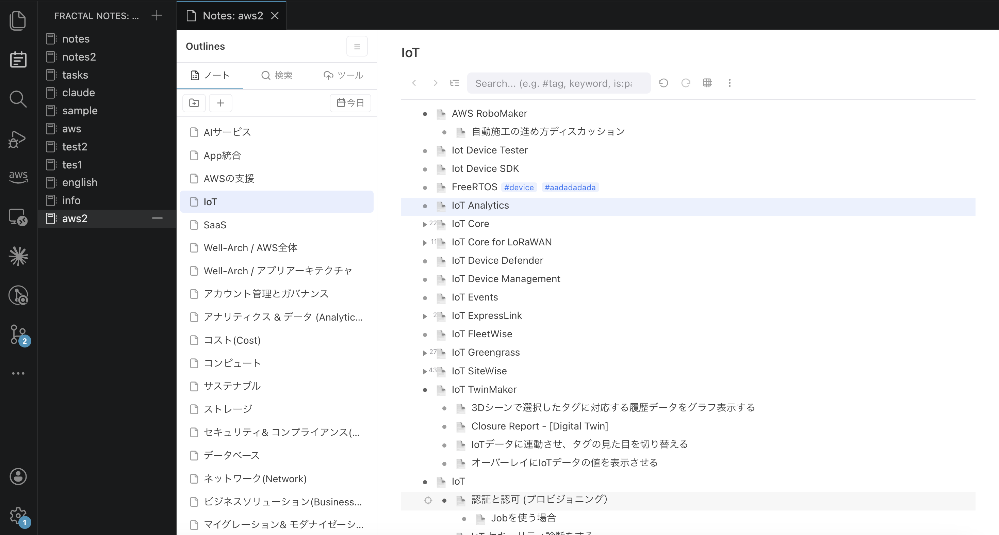
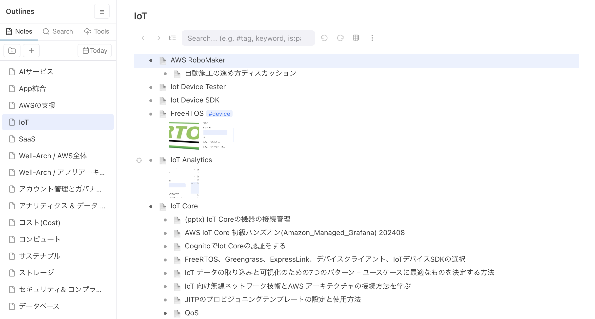
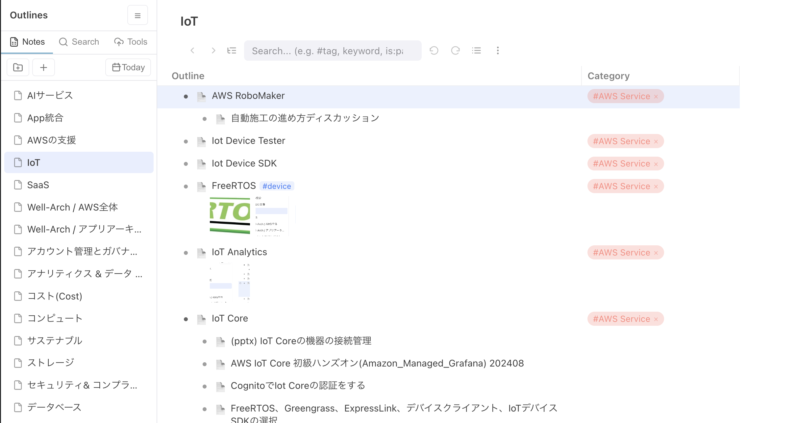
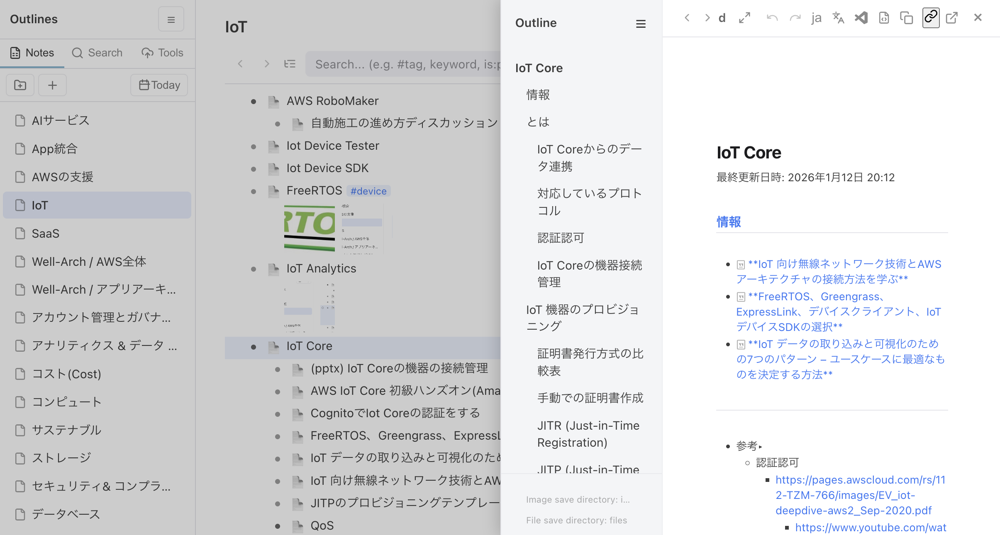
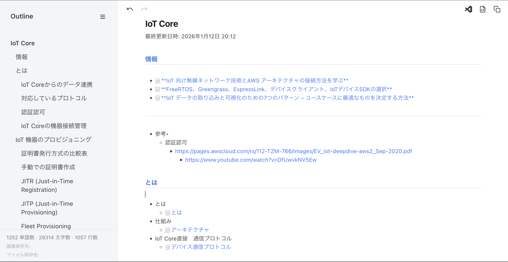
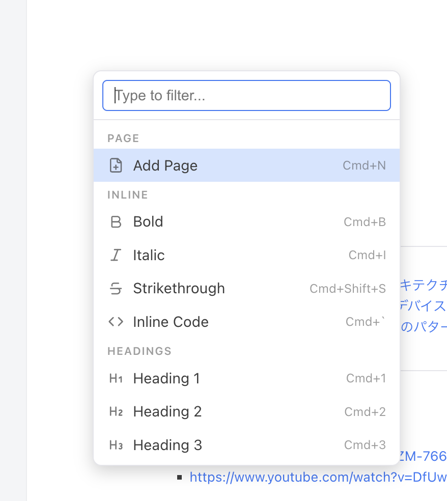
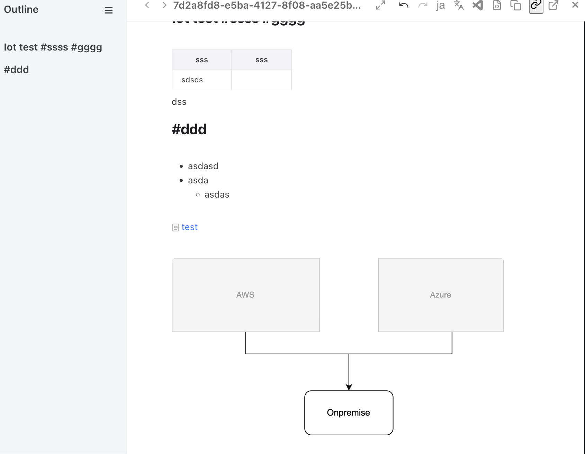

 Fractal — Markdown & Outliner (Database & Mindmap) for VS Code
=

**A complete note-taking environment inside VS Code.** Fractal combines a **Notion-like WYSIWYG markdown editor** and a **Dynalist-like outliner (with Database and Mindmap modes)** in one workspace. Organize everything into **Notes**, search across all of it, sync to S3 — designed from the ground up for **working alongside AI coding assistants**.


---

## Why Fractal

- ✍️ **WYSIWYG Markdown** — Edit and read at the same time. No split preview, no raw markup. Tables, code blocks, Mermaid, math, draw.io — all rendered live.
- 🌲 **A real outliner** — Dynalist / Workflowy-style tree editing with tags, smooth filtering, and **three views: Outliner / Database / Mindmap**.
- 📄 **Subpages** — Embed markdown pages as children of outline nodes or of other markdown pages. Build hierarchical documents like a Notion database.
- 🤖 **AI-friendly by design** — External file changes are reflected on screen **in real time**. Let Claude Code, Cursor, or Kiro edit your notes while you keep working — your cursor and in-progress edits are preserved.
- 🗂 **Notes** — Organize by folder ("note"). Files stay flat on disk while a virtual folder/file tree keeps things structured on screen. Full-text search across everything, tabs and history, Daily Notes.
- ☁️ **S3 backup & restore** — One-click backup to your own AWS S3 bucket, and restore from it.
- 🧩 **Beyond the editor** — A Chrome extension for clipping web pages, Amazon Translate integration, and published **AI skills** that let AI agents read and write your Fractal notes (use Fractal instead of Obsidian).

`.md` and `.out` files work standalone, but Fractal shines when everything is connected in the **Notes manager**.

---

## Visuals

### Outliner editor
A Dynalist-class outliner. Folders, tags, and full-text search across outline nodes and markdown bodies.

Overview


Outline view


Database view


<!-- TODO: add a Mindmap mode screenshot -->

### Side-panel markdown editor (subpages)
Attach a markdown file to any node as a **subpage** (`@page`). Open it with `Cmd+Enter` as a side-panel WYSIWYG editor, or as a standalone document in a new tab.


### Markdown editor (standalone)
The same editor at full width. Set it as your default markdown editor and edit any `.md` outside Fractal notes too.


Action palette (`Cmd+/`)


Embedded draw.io


---

## ✨ Core concept

**Manage Markdown, Outliner, Database, and Mindmap in one place — like Notion.** In Fractal these four kinds of content aren't separate tools; they connect inside the same note — hang markdown pages off outline nodes, view the same outline as a database or a mindmap, and search across all of it. And the data stays plain `.md` files and JSON.

| Content | Storage | Summary |
| --- | --- | --- |
| **Markdown** | `.md` | Notion-like WYSIWYG editor. Edit and read in a single view. Hierarchy via subpages |
| **Outliner** | `.out` | Dynalist-like tree editing with tags, tasks, and search |
| **Database** | `.out` (view) | The same outline as a Notion-like table. Text / tag / date columns |
| **Mindmap** | `.out` (view) | The same outline rendered and edited as an SVG mindmap |

Tying it all together is **Notes** — a folder-scoped workspace (virtual tree, cross-file search, tabs, Daily Notes, S3 sync). Markdown pages open from both the markdown editor and the outliner. Subpages open in the **side panel** by default, or as standalone documents in a **new tab**.

---

## 📝 Markdown editor (.md)

A Notion-style WYSIWYG editor. What you see is what's in the file.

### Editing
- **Seamless live preview** — Markdown renders as you type. Switch to **source mode** anytime (`Cmd+.`)
- **Headings, lists, task lists, quotes, horizontal rules** — all standard markdown, keyboard-first
- **Tables** — Drag any cell edge to resize columns; widths are saved into the file (as an HTML comment that doesn't affect other viewers). Tab to move between cells, Enter to add rows
- **Code blocks** — Syntax highlighting for 24+ languages, expandable into a VS Code editor tab
- **Inline formatting** — Bold, italic, strikethrough, inline code, smart link creation
- **Action palette** (`Cmd+/`) — Every formatting and insert action in one searchable menu

### Attachments & media
- **Images** — Paste or drag & drop. Full-screen lightbox with pinch-zoom and pan. Max display width is configurable
- **File attachments** — Drop any file (PDF, Excel, …) to insert a `[📎 filename](path)` link. Click to open in the OS default app
- **Attachments panel** — Lists every image and file referenced in the document, with Open / Copy Path

### Diagrams & math
- **Mermaid** — Rendered inline; click to edit the source
- **KaTeX math** — Display-mode formulas re-render live
- **draw.io** — Create and edit diagrams without leaving VS Code. Saved as `.drawio.svg` (a real SVG that renders on GitHub and stays editable in any draw.io client) and embedded like a normal image. Saving from draw.io Desktop or the drawio VS Code extension re-renders it in your open document automatically

### Subpages
- **`Cmd+/` → Add Page** (or `Cmd+N`) — Create a child markdown page and insert a link at the cursor
- Click a `.md` link to open it in a **Notion-style side-peek panel** with full WYSIWYG editing and back/forward navigation (`Opt+←` / `Opt+→`)
- `Cmd+click` to open it as a standalone document in a **new tab**
- Pages within pages — build hierarchies as deep as you like

### AI-friendly: live sync of external changes
When an AI assistant (Claude Code, Cursor, Kiro, …) — or anything else — modifies the file you have open:

- **Block-level DOM diffing** — only changed blocks are patched; your cursor position and in-progress edits survive
- Your edits and the AI's edits **coexist safely** in the same document
- `Cmd+L` — send the selected text to the AI chat. `Cmd+Shift+.` opens the file in the VS Code text editor

### Standalone mode
- Set Fractal as your **default editor for `.md`** and edit any markdown on your machine — no Fractal note required
- For standalone files you can **choose where images and attachments are saved** (stored in a hidden `.fractal.json` file next to the markdown — the markdown body itself is never touched, so other editors never see it)

---

## 🌲 Outliner (.out)

A Dynalist-like outliner. The same data from three perspectives.

### Three view modes
Switch with the view toggle:

1. **Outliner view** — Classic bullet tree. Unlimited nesting, collapse/expand, subtree scoping with breadcrumbs
2. **Database view** — Your outline as a Notion-like database (tree table). Text and tag (multi-select) columns, plus **Date / Date & Time columns** with a native date picker
3. **Mindmap mode** — The same `.out` rendered as an SVG mindmap. Four layouts (radial / left / right / balanced), keyboard-centric editing (navigation, sibling/child insert, swap, type-to-edit), node colors & shapes, boundaries (groups), and relationship lines

### Organize with tags & search
- `#tag` and `@tag` are auto-highlighted; click to filter instantly
- **Pinned tags** — Turn frequent tags into one-click filters
- **Dynalist-compatible search** — AND, OR, NOT, `"phrases"`, `#tag`, `in:title`, `has:children`, `is:page`, `is:task` — with smooth incremental filtering

### Attach anything
- **Markdown subpages** — Turn any bullet into a page (`@page`) and edit it in the side panel's full WYSIWYG editor. Manage hierarchical markdown like a **Notion database**
- **Images** — Paste with `Cmd+V`. Thumbnails under the node, drag to reorder, double-click to zoom
- **Files** — Attach any file type to a node. 📎 nodes open in the OS default app
- **`.md` import** — Import Notion / Obsidian exports as page nodes. Images are copied automatically and paths rewritten

### Tasks
- `- [ ]` / `- [x]` checkboxes with rich keyboard support (`Cmd+Shift+X` to toggle)
- **Task mode** — New root nodes automatically get checkboxes
- **Task filter** — Hide completed subtrees with one click
- **Archive to Daily Notes** — Move finished tasks (with their pages, images, and files) under today's Daily Note, tagged `#TASK #DONE`

### Editing basics
Enter / Tab / Shift+Tab work the way you expect. Multi-select indenting, node moves (`Cmd+Shift+↑/↓`), subtext (`Shift+Enter`), inline formatting, clickable links, navigation history (`Opt+←/→`), and full undo/redo. See "Key shortcuts" below for the full list.

---

## 🗂 Notes — where everything connects

Fractal organizes information into **notes**. Just register any folder from the activity bar.

- **Structure without lock-in** — Files are stored **flat** on disk while you organize `.out` and `.md` files in a **virtual folder/file tree** with drag & drop. Your data stays plain files
- **Full-text search** — Search across every outline, subpage, and standalone markdown in the note. Streaming results, click to jump
- **Tabs** — Switch between outliners and markdown files with browser-like tabs inside a note. Tab names follow titles / H1s; right-click an md tab to open it as a VS Code tab
- **Recent** — Jump back to recently opened files with one click
- **Daily Notes** — One-click daily journal. Auto-creates a year/month/day hierarchy, with `<` `>` navigation and a calendar picker
- **In-app links** — Copy a link to any node or page and paste it anywhere in Fractal. Click to jump
- **Housekeeping** — "Clean Unused Files" finds orphaned images, pages, and attachments and moves them to the trash. "Move to Other Note" relocates pages together with their assets

### ☁️ S3 backup & restore
With an AWS account, sync your notes to S3:

- **Whole-note sync (Tools tab)** — Bidirectional newer-wins sync of the entire note folder, or upload-all / download-all / clean rebuild
- Accurate per-file mtime-based newer-wins: your local edits are never overwritten by older S3 content

### 🌍 Translation
Translate a selection or the whole document with **Amazon Translate**, including Custom Terminology support for better accuracy.

> S3 sync and translation require the AWS CLI. Everything else works without AWS.

---

## 🤖 AI skills — make Fractal your agent's notebook

Fractal publishes **AI skills** (`ai_skills/`) that teach AI agents the Fractal data model, so they can search, read, and write your notes directly:

- `fractal-structure` — Reference for the Notes / Outliner / Page data model
- `fractal-search` — Auto-discovers notes folders; full-text search across notes; tag and task-state filters (`--tag` / `--checked`); filter by note name
- `fractal-edit` — Add / modify / delete / move nodes, import markdown pages (single or bulk), attach images and files, add subpages and attachments to markdown files, create new outliners and markdown items
- `fractal-doctor` — Note integrity checks (broken references, orphaned files, layout inspection; read-only)
- `fractal-summary` — Bundle an outliner or a markdown file (with recursive subpages) into a single markdown for AI consumption
- `collect` and converters — Ingest web pages / YouTube transcripts / arXiv papers / PDF & Office documents as Markdown

```bash
ai_skills/install.sh         # install into every detected AI IDE (Claude Code / Cursor / Kiro / Antigravity)
./install-skills.sh          # Claude Code only, with rules
```

With the skills installed, agents like Claude Code can organize research, summarize clips, and build knowledge bases by writing straight into Fractal — a practical **Obsidian alternative** with an AI-native workflow.

---

## 🌐 Chrome extension (web clipper)

Save any web page into a Fractal Note — straight from Chrome, without launching VS Code.

- Lives in `chrome-extension/` in this repository (load as an unpacked extension)
- Click the icon (or `Alt+Shift+F` for quick clip) → the page is extracted with **Mozilla Readability** and converted through **Fractal's own HTML→MD pipeline** (tables, GFM, Medium / dev.to code blocks, and more)
- Save to an **outliner** (added as a page node) or to a **markdown file** (a new md is created and a subpage link is appended to the target md)
- **Destination presets** — Register multiple "Note + destination" pairs in Options and mark a ★default. The popup opens with the default pre-selected, ready to save immediately
- Writes directly to disk via the File System Access API — no communication with VS Code needed
- Concurrent clips are serialized through a queue to prevent write conflicts

See `chrome-extension/README.md` for details.

---

## 📦 Installation

### VS Code Marketplace
1. Open Extensions (`Ctrl+Shift+X`)
2. Search **"Fractal"** → Install

Or directly: [VS Code Marketplace](https://marketplace.visualstudio.com/items?itemName=imaken.fractal)

### Open VSX (VSCodium / Gitpod / Eclipse Theia)
[Open VSX Registry](https://open-vsx.org/extension/imaken/fractal)

### From VSIX
```bash
code --install-extension fractal-{version}.vsix
```

### From source
```bash
git clone https://github.com/raggbal/fractal
cd fractal
npm install
npm run compile
# press F5 to launch in debug mode
```

### Optional: AWS CLI (S3 sync & translation)
Core features work without AWS. To use S3 sync and Amazon Translate, install the [AWS CLI](https://aws.amazon.com/cli/) and configure credentials in VS Code settings:

- S3 sync: `fractal.s3AccessKeyId`, `fractal.s3SecretAccessKey`, `fractal.s3Region`
- Translation: `fractal.transAccessKeyId`, `fractal.transSecretAccessKey`, `fractal.transRegion`

---

## 🚀 Getting started

### Notes (recommended)
1. Click the **Fractal Notes** icon in the activity bar
2. Add any folder to register it as a note
3. Click the note to open the three-pane UI — create outliners, pages, and folders from there

### Markdown editor
1. Right-click any `.md` → **"Open with Fractal"**
2. Or make it the default: right-click a `.md` → **Open With…** → **Configure default editor** → **Fractal**

### Outliner
- `.out` files open in Fractal automatically
- Create one from the command palette: `Fractal: New Outliner File`

### In-app links
- Right-click an outliner node → **Copy In-App Link**
- Use 🔗 in the side-panel header to link to the current page
- Paste anywhere in Fractal — click to jump

---

## ⌨️ Key shortcuts

A quick reference. (Mac notation; almost every shortcut also works with `Ctrl` instead of `Cmd`, and Windows/Linux uses `Ctrl`.)

### Markdown editor

| Shortcut | Action |
| --- | --- |
| `Cmd+/` | Action palette (searchable menu of every action) |
| `Cmd+N` | Add Page (create a subpage and insert a link) |
| `Cmd+.` | Toggle source mode |
| `Cmd+Shift+.` | Open in the VS Code text editor |
| `Cmd+\` | Toggle sidebar (outline / file panel) |
| `Cmd+L` | Send selected text to the AI chat |
| `Cmd+B` / `Cmd+I` / `Cmd+Shift+S` | Bold / italic / strikethrough |
| ``Cmd+` `` / `Cmd+K` | Inline code / insert link |
| `Cmd+1`…`Cmd+6` / `Cmd+0` | Heading 1–6 / back to paragraph |
| `Cmd+T` / `Cmd+Shift+I` | Insert table / insert image |
| `Cmd+F` / `Cmd+H` | Find / replace |
| `Cmd+S` / `Cmd+Z` / `Cmd+Shift+Z` | Save / undo / redo |
| `Tab` / `Shift+Tab` | Tables: move between cells; lists: indent / outdent |
| `Opt+←` / `Opt+→` | Side-panel back / forward (side panel only) |

### Outliner view

| Shortcut | Action |
| --- | --- |
| `Enter` / `Option+Enter` | New sibling node / new child node |
| `Shift+Enter` | Open subtext (note) |
| `Tab` / `Shift+Tab` | Indent / outdent (multi-select supported) |
| `Cmd+Enter` | Open the page (creates one if missing; opens attached files externally) |
| `↑` / `↓`, `Shift+↑/↓` | Move between nodes / extend multi-selection |
| `Cmd+Shift+↑/↓` | Move node up / down |
| `←` / `→` | Collapse / expand (at start / end of line) |
| `Cmd+.` | Toggle collapse for the current node |
| `Cmd+]` / `Cmd+Shift+]` | Scope in (zoom) / scope out |
| `Cmd+Shift+X` | Toggle checkbox (`Cmd+Shift+Opt+X` to remove it) |
| `Cmd+B` / `Cmd+I` / `Cmd+E` / `Cmd+Shift+S` | Bold / italic / inline code / strikethrough |
| `Cmd+C` / `Cmd+X` / `Cmd+V` | Copy / cut / paste nodes (multi-select and image paste supported) |
| `Cmd+A` | Select all nodes |
| `Cmd+F` / `Cmd+H` / `Cmd+Shift+F` | Text search / replace / filter |
| `Cmd+N` | New node at the end |
| `Cmd+Z` / `Cmd+Shift+Z` | Undo / redo |
| `Opt+←` / `Opt+→` | Navigation history back / forward |
| `Backspace` (at line start) | Merge with previous node / delete empty node |

### Database view

The outliner column supports all outliner shortcuts above. In addition:

| Shortcut | Action |
| --- | --- |
| `Cmd+←/→/↑/↓` | Move between cells (all columns) |
| `Tab` / `Shift+Tab` | Next / previous cell (text columns) |
| `Enter` or `Space` | Open the tag dropdown (tag columns) / date picker (Date columns; click also works) |
| `↑↓` + `Enter` | Select and confirm inside the dropdown |
| `Cmd+B` / `Cmd+I` / `Cmd+E` | Inline formatting in text columns |

### Mindmap mode

| Shortcut | Action |
| --- | --- |
| `↑↓←→` | Navigate between nodes (layout-aware spatial navigation) |
| `Enter` / `Shift+Enter` | Add next sibling / previous sibling |
| `Tab` | Add child node |
| `Space` / `F2` / type any character | Start editing (typing appends as-is) |
| `Enter` / `Tab` / `Esc` (while editing) | Commit the edit |
| `Delete` / `Backspace` | Delete node (deletes the group when a group is selected) |
| `Option+↑/↓` | Swap with sibling |
| `Cmd+Shift+L` | Cycle layout (radial → right → left → balanced) |
| `Cmd+Enter` | Open / create the page |
| `Cmd+V` | Attach a pasted image to the node |
| `Cmd+A` / `Cmd+Z` | Select all / undo |
| `Cmd+wheel` | Zoom (toolbar ＋/−/Fit also available) |
| Drag | Empty space: pan; node: re-parent (top ⅓ = above, bottom ⅓ = below, middle = child) |
| Right-click | Colors & shapes, create a group (boundary), create a relationship line |

### Markdown syntax shortcuts

Type a markdown pattern and it converts in place: `# ` for headings, `- ` for lists, `- [ ] ` for tasks, `> ` for quotes, ``` ``` ``` for code blocks, `**bold**`, `*italic*`, `` `code` ``, and more.

<details>
<summary>Full markdown element reference</summary>

#### Block elements

| Element | Pattern | Shortcut |
| --- | --- | --- |
| Heading 1–6 | `#`…`######` + Space | `Cmd+1`…`Cmd+6` |
| Paragraph | (default) | `Cmd+0` |
| Bullet list | `- ` or `* ` + Space | `Cmd+Shift+U` |
| Numbered list | `1. ` + Space | `Cmd+Shift+O` |
| Task list | `- [ ] ` + Space | `Cmd+Shift+X` |
| Quote | `> ` + Space | `Cmd+Shift+Q` |
| Code block | ````` ``` ````` + Enter (also `` ```mermaid `` / `` ```math ``) | `Cmd+Shift+K` |
| Table | `| col1 | col2 |` + Enter | `Cmd+T` |
| Horizontal rule | `---` + Space/Enter | `Cmd+Shift+-` |

#### Inline elements

| Element | Pattern | Shortcut |
| --- | --- | --- |
| Bold | `**text**` + Space | `Cmd+B` |
| Italic | `*text*` + Space | `Cmd+I` |
| Strikethrough | `~~text~~` + Space | `Cmd+Shift+S` |
| Inline code | `` `text` `` + Space | ``Cmd+` `` |
| Link | `[text](url)` | `Cmd+K` |
| Image | `` | `Cmd+Shift+I` |

</details>

---

## 🎨 Settings

| Setting | Description | Default |
| --- | --- | --- |
| `fractal.theme` | Editor theme (`light`, `dark`, `auto`) | `auto` |
| `fractal.fontSize` | Base font size (px) | `12` |
| `fractal.imageMaxWidth` | Max display width for inline images (px) | `400` |
| `fractal.language` | UI language (`default`, `en`, `ja`, `zh-CN`, `zh-TW`, `ko`, `es`, `fr`) | `default` |
| `fractal.toolbarMode` | Toolbar mode (`full`, `simple`) | `simple` |
| `fractal.resourceRoots` | Directories the editor may load images/attachments from | `[]` (home directory) |
| `fractal.showTranslateButtons` | Show translate buttons in the toolbar / side panel | `false` |
| `fractal.showOpenInTextEditor` | Show the Open in Text Editor button | `true` |
| `fractal.enableDebugLogging` | Debug logging to the browser console | `false` |

There are also settings for S3 sync (`fractal.s3AccessKeyId` / `s3SecretAccessKey` / `s3Region`) and translation (`fractal.transAccessKeyId` / `transSecretAccessKey` / `transRegion`, `translateSourceLang` / `translateTargetLang`, custom terminology). Image and attachment destinations are fixed by convention rather than settings (shared `images/` / `files/` inside a note; standalone markdown outside a note uses a `.fractal.json` sidecar).

The UI is localized in **English, Japanese, Simplified/Traditional Chinese, Korean, Spanish, and French** (`fractal.language`; `default` follows VS Code).

---

## 🛠️ Development

```bash
npm install        # install dependencies
npm run compile    # compile TypeScript + build locales + copy assets
npm run watch      # watch mode
npm test           # run tests (parallel Playwright suite)
vsce package --no-dependencies   # package the extension
```

---

## 💖 Support the project

- [**Sponsor** on GitHub](https://github.com/sponsors/raggbal) — support ongoing maintenance
- **Star** it on [GitHub](https://github.com/raggbal/fractal)
- **Report bugs** and suggest features in [Issues](https://github.com/raggbal/fractal/issues)
- **Contribute** via pull requests

---

## 📄 License

MIT License — free to use in your own projects.

---

## 🙏 Acknowledgements

- Made with love for the VS Code community
