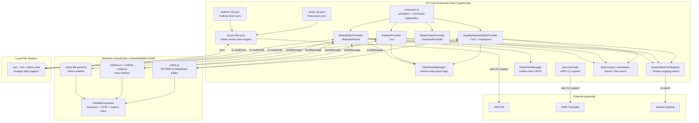
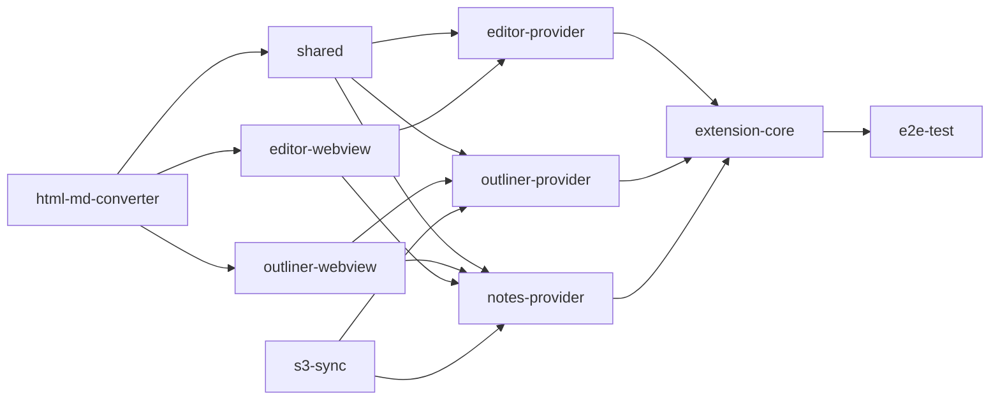
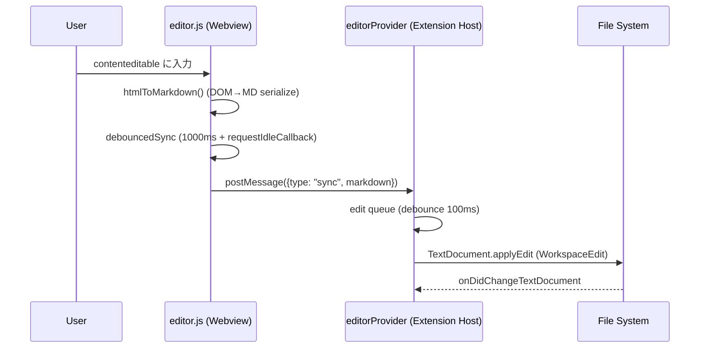
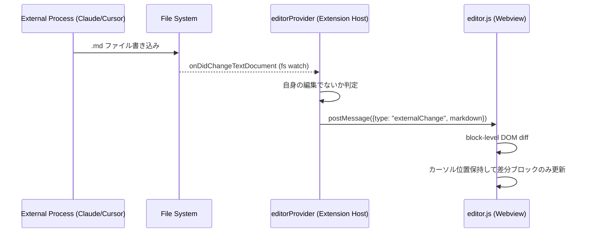
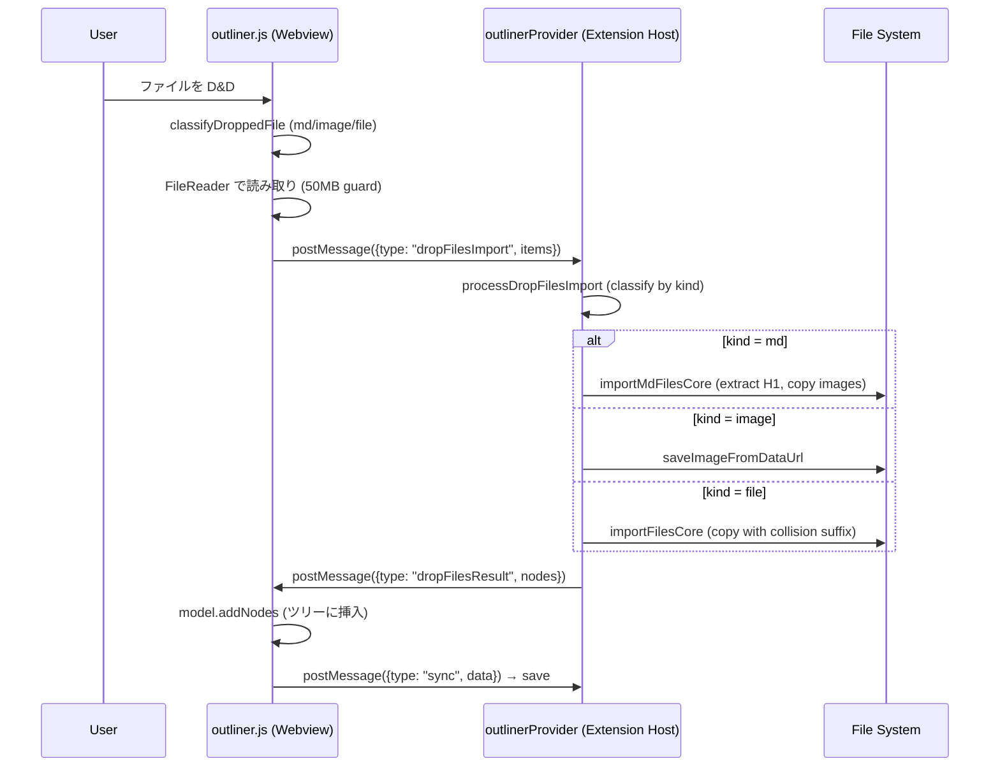
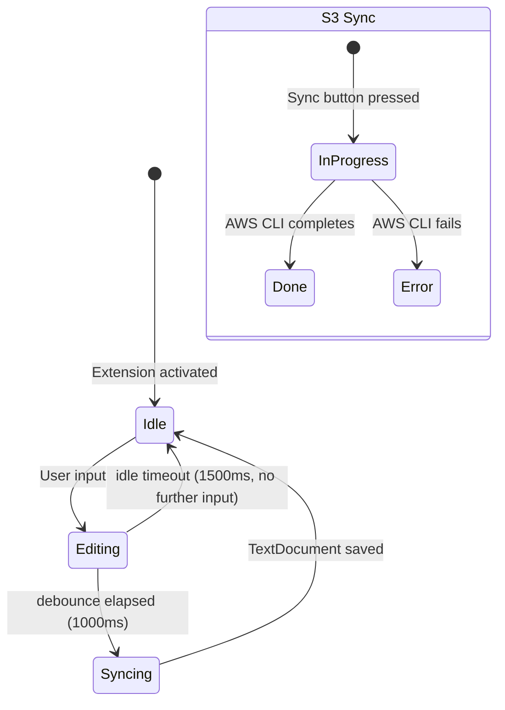
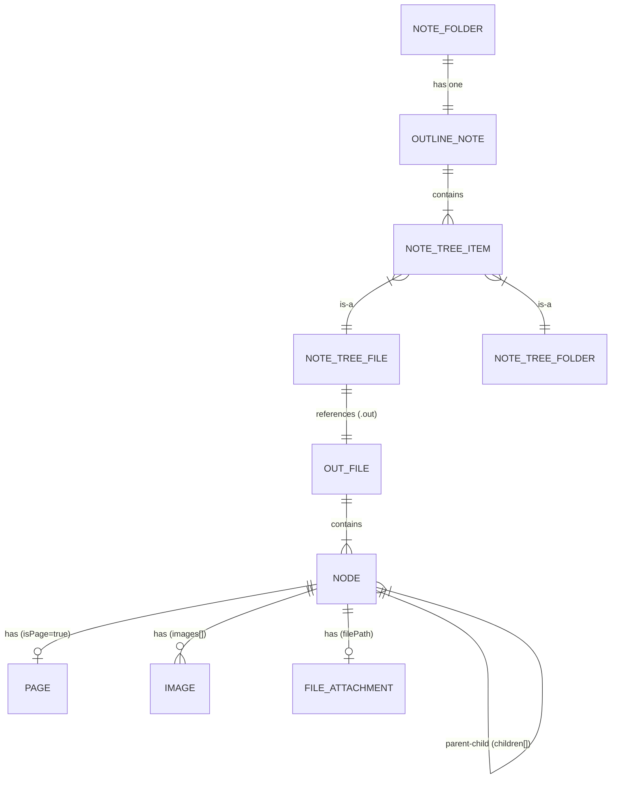
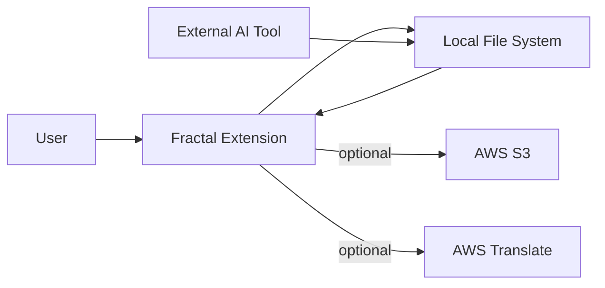
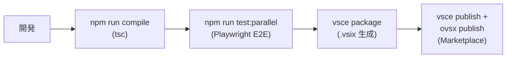

# Fractal — Design

> Status: draft
> Owner: Imaizumi, Kensuke
> Phase: GA
> Primary language: TypeScript + JavaScript
> Last updated: 2026-06-02
> Sprint binding: -

## §0 Document Frame

Fractal — VS Code 拡張機能。Dynalist ライクなアウトライナーと Typora ライクな WYSIWYG Markdown エディタを統合したノートツール。

- **Owner**: Imaizumi, Kensuke
- **Phase**: GA (v0.207.59, VS Code Marketplace + Open VSIX 公開済み)
- **Primary language**: TypeScript (Extension Host) + JavaScript (Webview)
- **Audience**: 実装者 + レビュアー

(skill default — AWS-DESIGN-CHECKLIST §0.2: Status = draft)

## §1 Goals / Non-goals

### §1.1 Goals

1. **アウトライナーと WYSIWYG Markdown エディタの統合** — 1 つのツールで構造化思考（ツリー）と長文執筆（ページ）をシームレスに行える
2. **外部 AI ツールとの協調** — External Change Sync + Cmd+L で IDE AI 機能とシームレスに連携
3. **ローカルファイルベース + オプショナルなクラウドバックアップ** — データはローカルファイル（`.out` / `.md` / `outline.note`）に保持、S3 Sync は任意

(asked 2026-06-02; user confirmed with `.note` ファイル追加指摘)

### §1.2 Non-goals

1. **リアルタイム共同編集** — External Change Sync は外部変更検知のみ、マルチカーソル協調編集ではない
2. **独自 AI サービスとの直接通信** — AI 連携は IDE ネイティブ機能へのブリッジのみ（Cmd+L）
3. **サーバーサイドコンポーネント** — バックエンドなし、全処理はローカル

(asked 2026-06-02; user confirmed)

### §1.3 Hard MUST conditions

1. **データロスしない** — ユーザーのローカルファイル（.out / .md / outline.note）を破壊・消失させない。S3 Sync も `--delete` なし（片側にしか存在しないファイルは保全）。(ADR-002)
2. **全モードでの動作保証** — 機能の追加・修正時は、Outliner（Single モード + Note モード）、Markdown Editor（Single モード + Side Panel モード）の全4パターンで正しく動作することを必須とする。モード漏れは許容しない。

(asked 2026-06-02; user confirmed + モード網羅要件を明示指示)

### §1.4 Acceptance bar

リリース判定条件（GA 済みプロダクトの継続リリースゲート）:

1. E2E テスト（Playwright）が全件 green
2. 4 モード手動確認: Outliner Single / Outliner Note / Markdown Single / Markdown SidePanel
3. VS Code Marketplace + Open VSIX に publish 成功

(asked 2026-06-02; user confirmed)

### §1.5 User Stories

1. ユーザーとして、アウトライナーでアイデアをツリー構造で整理し、深掘りしたい項目をページ（Markdown）に展開したい。また、画像・ファイル・Markdown をノードに添付して一元管理したい。
2. ユーザーとして、WYSIWYG で Markdown を書き、全要素（見出し・リスト・テーブル・コードブロック・数式・Mermaid・draw.io 等）をインラインプレビューしたい。
3. ユーザーとして、IDE の AI 機能（Cursor/Copilot）で Markdown ファイルを編集してもらい、エディタにリアルタイム反映されてほしい（External Change Sync）。
4. ユーザーとして、複数デバイス間で Note フォルダを S3 経由でバックアップ・同期したい。
5. ユーザーとして、Markdown を他言語に翻訳したい（AWS Translate）。
6. ユーザーとして、Outliner のサブツリーを llms.txt 形式でエクスポートし、AI ツールにコンテキストとして渡したい。

(asked 2026-06-02; user confirmed with 画像/ファイル添付 + 全MD要素プレビュー + draw.io 追加指摘)

### §1.6 NFR summary table

| カテゴリ | ターゲット | 測定方法 | ソース |
|---|---|---|---|
| パフォーマンス | エディタ入力中に UI ブロックなし | debounce 設計 (sync 1000ms, idle 1500ms, typing 500ms) + requestIdleCallback | code |
| 信頼性 | データロスゼロ | §1.3 MUST #1、S3 Sync `--delete` なし | user |
| ファイルサイズ | 50MB/ファイル（webview ドロップ時上限） | ガード実装 (outliner.js L1007) | code |
| Undo 容量 | 200 スナップショット（Outliner / Editor 共通） | MAX_UNDO=200, MAX_STACK=200 | code |
| S3 Sync スケール | ~10,000 ファイル規模対応、500 ファイル/バッチ | BATCH_SIZE=500, AWS CLI 内部 10 並列 | code |
| テスト | E2E Playwright 全件 green | CI | user |
| モード網羅 | 4 モード全動作保証 | §1.3 MUST #2、手動確認 | user |

(derived from code constants; asked 2026-06-02 "プログラムをチェックして")

### §1.7 Success Criteria

1. E2E テスト全件 green を維持
2. S3 Sync でデータ消失ゼロ
3. 4 モード（Outliner Single/Note, Markdown Single/SidePanel）で回帰なし

(asked 2026-06-02; user: 数値KPIは追跡していない)

### §1.8 Acceptance Conditions

1. E2E テスト全件 green
2. 4 モード手動確認 pass（Outliner Single/Note, Markdown Single/SidePanel）
3. `vsce publish` + Open VSIX publish 成功
4. §1.3 MUST 条件に違反する既知バグなし

(asked 2026-06-02; user confirmed)

## §2 System Overview

### §2.1 Core value

アウトライナーの構造化思考と WYSIWYG Markdown の長文執筆を 1 つの VS Code 拡張に統合し、ローカルファイルベースで AI ツールとシームレスに協調できるノートツール。

(asked 2026-06-02; user confirmed)

### §2.2 Position in larger system

**上流（データ入力元）:**
- ユーザー手入力（WYSIWYG / Outliner）
- クリップボードペースト（HTML → MD 変換）
- D&D: Finder/OS ファイルドロップ（.md / 画像 / 任意ファイル、50MB 上限）
- D&D: VS Code Explorer ドロップ（file:// URI 経由、サイズ上限なし）
- D&D: Web 画像 URL ドロップ（http(s) 画像を直接挿入）
- ファイルインポートダイアログ: Markdown インポート（相対画像も解決・コピー）
- ファイルインポートダイアログ: 任意ファイル添付
- 外部プロセスによるファイル書き込み（AI ツール、drawio Desktop 等） → fs watch で検知・反映
- Chrome Extension（Web Clipper）が .out に直接書き込み
- S3 Sync（リモートからの復元・同期）

**下流（出力消費先）:**
- IDE AI（Cmd+L で .md を AI に渡す）
- S3（バックアップ）
- claude-skills（fractal-search / fractal-edit で読み書き）
- llms.txt エクスポート（クリップボード経由で AI ツールへ）

**Ownership:** 全データはユーザーのローカルファイルシステム。Fractal はエディタであり、データを所有しない。

(asked 2026-06-02; user指摘でD&D・ファイルインポートを追加、コード確認済み)

### §2.3 Outputs

| 出力 | トリガー |
|---|---|
| .out ファイル (JSON) | Outliner 編集 → debounce 1000ms → ディスク保存 |
| .md ファイル | Markdown Editor 編集 → debounce → ディスク保存 |
| outline.note (JSON) | Note 構造変更 → debounce 1000ms → ディスク保存 |
| 画像ファイル（.drawio.svg / .drawio.png 含む） | D&D / ペースト / インポート / drawio Desktop 外部編集時に保存 |
| 添付ファイル | ファイルインポート / D&D 時にファイルフォルダへ保存 |
| S3 アップロード | S3 Sync ボタン押下 → AWS CLI spawn |
| クリップボード（llms.txt） | 右クリック → llms.txt Export |
| VS Code テキストエディタ開き | Cmd+L → .md を native editor で選択状態で開く |

(derived from code; asked 2026-06-02)

### §2.4 Classification axes

入力を異なる経路にルーティングする分類軸:

**1. ファイル拡張子 → Provider ルーティング (ADR-001)**

| パターン | Provider |
|---|---|
| `*.md`, `*.markdown` | AnyMarkdownEditorProvider (priority: option) |
| `*.out` | OutlinerProvider (priority: default) |
| `outline.note` | NotesEditorProvider 内部消費（Custom Editor ではない） |

**2. ドロップ分類 (3 箇所に独立した分類器)**

| クラス | Editor (editor.js) | Outliner (outliner.js) | Backend (drop-import.ts) |
|---|---|---|---|
| `.drawio.svg` / `.drawio.png` | drawio-file → 画像保存+挿入 | file → ファイル添付 | image → 画像保存 |
| `.drawio` (XML) | drawio-xml → 棄却+通知 | file → ファイル添付 | file → ファイル添付 |
| 画像拡張子 (png/jpg/jpeg/gif/webp/svg/bmp) | image → 画像保存+挿入 | image → 画像ノード | image → 画像保存 |
| `.md` | — (Editor にはMDドロップなし) | md → MD インポート | md → MD インポート |
| その他 | file → ファイルリンク挿入 | file → ファイル添付ノード | file → ファイル添付 |

**3. ドロップソースチャネル分類**

| dataTransfer.types | ルーティング |
|---|---|
| `Files` (Finder/OS) | FileReader 経由、50MB 上限 |
| `application/vnd.code.uri-list` (VS Code Explorer) | file:// URI 直読み、サイズ上限なし |
| neither (内部) | ノード並び替え D&D |

**4. ペースト分類 (Editor)**

優先順: image file (non-rich HTML) → 内部 cross-MD コピー (`text/x-any-md-context`) → 内部コピー (`text/x-any-md`) → plain text が MD テーブルっぽい → 外部 HTML (HtmlMdConverter) → plain text

**5. ペースト分類 (Outliner)**

優先順: clipboard image file → 内部 clipboard (同一 webview) → cross-outliner HTML metadata → メタデータ付き（page/image/file アセット付き）→ 単一行テキスト → 複数行テキスト

**6. ノード種別 (mutually exclusive)**

| 種別 | 判定条件 | Cmd+Enter 動作 |
|---|---|---|
| Page | `isPage=true`, `pageId` あり | Side Panel で MD 開く |
| File | `filePath` あり | OS デフォルトアプリで開く |
| Image | `images[]` あり | — |
| Plain | 上記なし | no-op |

**7. リンク分類 (`classifyLinkHref`)**

| href パターン | クラス | クリック動作 |
|---|---|---|
| `fractal://note/.../page/{id}` | fractal-page | navigateInAppLink |
| `fractal://note/...` | fractal-node | navigateInAppLink |
| `http(s)://...` | external | vscode.env.openExternal |
| `#anchor` | anchor | scrollToAnchor |
| `.md` / `.markdown` (ローカル) | internal-md | fractal.editor で開く |
| その他ローカル | local-file | OS デフォルトアプリ |

**8. モードルーティング (§1.3 MUST #2)**

| モード | Host ファイル | ディレクトリ解決ポリシー |
|---|---|---|
| Standalone MD Editor | editorProvider.ts | 3-tier (file > settings > default) |
| Standalone Outliner | outlinerProvider.ts | JSON field > `./basename/` convention > legacy |
| Notes mode | notesEditorProvider.ts + notes-message-handler.ts | NotesFileManager; `<outlinerId>/` 配下 |

**9. その他**
- Outliner カラム型 (`outliner | text | multiselect | date | datetime`) → セルレンダラー分岐
- S3 Sync コンフリクトモード (`auto | confirm`) → 自動上書き or ユーザー確認ダイアログ
- Toolbar モード (`full | simple`) → 表示ボタン数
- EOL 分類 (CRLF / LF) → 保存時復元

(derived from code; asked 2026-06-02 "ソースをチェックして網羅して")

### §2.5 System type tags

- **domain-heavy**: YES（Node/Page/Outliner/Note のドメインモデル、ノード種別排他性等）
- ai/ml: N/A（AI 直接通信なし、IDE AI へのブリッジのみ）
- iot / physical-ai / saas / data-lake / microservices: N/A
- web-app: N/A（VS Code 拡張、HTTP エンドポイントなし）
- lambda-like / containerized: N/A

→ §12 AI は `(N/A)` で記載。DDD 観点 (D.1-D.5) は §5/§6 内で扱う。

(asked 2026-06-02; user confirmed)

### §2.6 Language / framework summary table

| コンポーネント | 言語 | フレームワーク | 主要ライブラリ | 理由 |
|---|---|---|---|---|
| Extension Host | TypeScript | VS Code Extension API | — | VS Code 拡張の標準 |
| Webview (Editor / Outliner) | JavaScript (plain) | contenteditable DOM | marked, KaTeX, Mermaid | 歴史的経緯（意図なし） |
| HtmlMdConverter | JavaScript | — | turndown, turndown-plugin-gfm | HTML→MD 変換 (ADR-003) |
| E2E Test | TypeScript | Playwright | @playwright/test | VS Code webview テスト |
| S3 Sync / Translate | — | AWS CLI spawn | — | 認証再利用 (ADR-002) |

(asked 2026-06-02; user confirmed)

### §2.7 Testing strategy

| コンポーネント | テストフレームワーク | テストファイル場所 | 命名規則 | CI コマンド |
|---|---|---|---|---|
| Editor / Outliner / Notes (E2E) | Playwright | `test/specs/` | `<feature>.spec.ts` | `npm run test:parallel` |

- **spec 数**: ~178 ファイル
- **ビルド**: `test/build-standalone.js` で webview をスタンドアロン HTML にビルド → Playwright でテスト
- **並列実行**: `test/run-parallel-tests.sh`
- **カバレッジターゲット**: 設定なし（E2E は機能網羅ベース）
- **モック境界**: なし（E2E で実 webview を操作）
- **ユニットテスト**: 未導入（望ましいが現状なし — CONTEXT.md 記載）
- **テスト配置**: 集中型（`test/specs/` に全件）

(derived from code: package.json scripts, test/ directory)

## §3 High-Level Architecture

### §3.1 Component placement diagram



### §3.2 Account / region / AZ topology

(N/A — ローカル VS Code 拡張。AWS はオプショナルな外部依存のみ。S3 バケットとリージョンはユーザー設定で指定。)

### §3.3 Trigger sources

| トリガー | ルーティング先 |
|---|---|
| `.md` / `.markdown` ファイルを開く | AnyMarkdownEditorProvider |
| `.out` ファイルを開く | OutlinerProvider |
| Activity Bar "Notes Folders" → フォルダ選択 | NotesEditorProvider (WebviewPanel) |
| コマンドパレット / キーバインド | extension.ts → 各 Provider へ dispatch |
| `fractal://` リンククリック | extension.ts `navigateInAppLink` → parseFractalLink |
| S3 Sync ボタン | notes-s3-sync / outliner-s3-sync |
| drawio Desktop がファイル保存 | DrawioWatcherRegistry → Provider へ通知 |
| 外部プロセスが .md を変更 | editorProvider fs watch → webview DOM diff |

### §3.4 Components

| コンポーネント | 役割 | 決定論的? | 入力 | 出力 |
|---|---|---|---|---|
| AnyMarkdownEditorProvider | WYSIWYG MD エディタの webview ライフサイクル管理 | No (effectful) | TextDocument (.md) + config | TextDocument edits, 画像/ファイル保存 |
| OutlinerProvider | ツリーアウトライナーの webview ライフサイクル管理 | No (effectful) | TextDocument (.out JSON) + config | JSON edits, pages/images/files 保存 |
| NotesEditorProvider | Notes ワークスペース (WebviewPanel) 管理 | No (effectful) | Notes folder path + outline.note | WebviewPanel, ファイル書き込み, S3 sync |
| NotesFolderProvider | Activity Bar フォルダ一覧 (TreeDataProvider) | Yes (pure CRUD) | globalState | TreeItem[] |
| SidePanelManager | Side Panel の共通ロジック (watch/save/nav) | No (stateful) | SidePanelHost + config | ファイル保存, webview message |
| DrawioWatcherRegistry | drawio ファイル外部変更の検知 | Yes (bookkeeping) | drawio path references | onChange callback |
| NotesFileManager | outline.note の CRUD + 検索 | No (fs) | outline.note path | ファイル読み書き |
| s3-per-file-sync | mtime newer-wins 双方向同期エンジン | Yes (決定ロジック) / No (AWS CLI) | ローカル/S3 ファイル一覧 | ファイル転送コマンド |
| aws-translate | Markdown 翻訳 (segment 保護 + チャンク) | Yes (チャンク) / No (API) | MD テキスト + 言語設定 | 翻訳済みテキスト |
| editor.js | WYSIWYG contenteditable エディタ | No (DOM操作) | postMessage + ユーザー入力 | postMessage (sync, save) |
| outliner.js + outliner-model.js | ツリー操作 + データモデル | model: Yes / UI: No | postMessage + ユーザー入力 | postMessage (sync, save) |
| HtmlMdConverter | HTML → Markdown 変換 | Yes (pure) | HTML string | Markdown string |

### §3.5 Deterministic terminals

| コンポーネント | 保証 |
|---|---|
| outliner-model.js | ツリー CRUD は純粋関数。同一入力 → 同一 JSON 出力 |
| HtmlMdConverter | 同一 HTML → 同一 Markdown（turndown + custom rules） |
| s3-per-file-sync `decideSyncDirection` | mtime 比較ロジックは純粋。方向決定は決定論的 |
| aws-translate segment 分割 | preserve/translate 分類は正規表現ベースで決定論的 |

### §3.6 External dependencies

| 依存 | 種別 | バージョン / エンドポイント |
|---|---|---|
| VS Code Extension API | ホスト API | ^1.85.0 |
| marked | npm (runtime) | — (MD→HTML パーサ, editor.js 内) |
| KaTeX | vendored | ^0.16.9 (数式レンダリング) |
| Mermaid | vendored | ^10.6.0 (図表レンダリング) |
| turndown + GFM plugin | npm (runtime) | ^7.2.2 / ^1.0.2 |
| Playwright | npm (dev) | ^1.58.1 (E2E テスト) |
| AWS CLI (`aws`) | 外部バイナリ (optional) | ユーザー環境依存 (ADR-002) |
| drawio Desktop | 外部アプリ (optional) | ユーザー環境依存 |

### §3.7 Repository structure + UNIT 分割

```
fractal/
├── src/                        # Extension Host (TypeScript)
│   ├── extension.ts            # エントリーポイント
│   ├── editorProvider.ts       # MD Editor Provider
│   ├── outlinerProvider.ts     # Outliner Provider
│   ├── notesEditorProvider.ts  # Notes Provider
│   ├── notesFolderProvider.ts  # TreeDataProvider
│   ├── notes-s3-sync.ts       # Note-level S3 sync
│   ├── outliner-s3-sync.ts    # Outliner-level S3 sync
│   ├── s3-per-file-sync.ts    # Shared sync engine
│   ├── outliner-s3-sync-utils.ts
│   ├── sync-conflict-dialog.ts
│   ├── webviewContent.ts      # Editor webview HTML builder
│   ├── outlinerWebviewContent.ts
│   ├── notesWebviewContent.ts
│   ├── i18n/                   # Localization
│   ├── shared/                 # Shared logic (both TS and JS)
│   │   ├── sidePanelManager.ts
│   │   ├── drawioWatcher.ts
│   │   ├── notes-file-manager.ts
│   │   ├── notes-file-panel.js
│   │   ├── aws-translate.ts
│   │   ├── drop-import.ts
│   │   ├── markdown-import.ts
│   │   ├── file-import.ts
│   │   ├── llms-txt-builder.ts
│   │   └── ...
│   └── webview/                # Webview assets (JavaScript)
│       ├── editor.js           # WYSIWYG Editor (~17000 lines)
│       ├── outliner.js         # Outliner UI (~8000 lines)
│       ├── outliner-model.js   # Tree data model
│       ├── outliner-cell.js    # Table View cell
│       ├── editor-utils.js
│       ├── styles.css / fr-base.css / tokens.css / outliner.css
│       └── ...
├── html-md-converter/          # Shared sub-package (ADR-003)
│   ├── src/                    # turndown + custom rules
│   ├── dist/                   # Built artifact
│   └── test/
├── vendor/                     # Vendored browser libs (KaTeX, Mermaid)
├── test/                       # E2E tests (Playwright)
│   ├── specs/                  # ~178 spec files
│   ├── unit/                   # Unit tests
│   ├── fixtures/
│   └── html/                   # Standalone test harness
├── scripts/                    # Build helpers
├── docs/                       # Design docs, ADRs
├── patterns/                   # Implementation patterns
├── chrome-extension/           # (separate product)
├── claude_skills/              # (separate product)
└── electron/                   # (inactive)
```

**UNIT 分割:**

| UNIT | 所有フォルダ | 主言語 | depends-on |
|---|---|---|---|
| editor-webview | src/webview/editor*.js, src/webview/styles.css | JS | html-md-converter |
| outliner-webview | src/webview/outliner*.js, src/webview/outliner*.css | JS | html-md-converter |
| html-md-converter | html-md-converter/ | JS | (none — leaf) |
| editor-provider | src/editorProvider.ts, src/webviewContent.ts | TS | shared, editor-webview |
| outliner-provider | src/outlinerProvider.ts, src/outlinerWebviewContent.ts | TS | shared, outliner-webview |
| notes-provider | src/notesEditorProvider.ts, src/notesWebviewContent.ts, src/notesFolderProvider.ts | TS | shared, outliner-webview, editor-webview |
| shared | src/shared/ | TS+JS | html-md-converter |
| s3-sync | src/*s3*.ts, src/sync-conflict-dialog.ts | TS | (none — leaf) |
| extension-core | src/extension.ts, src/i18n/ | TS | editor-provider, outliner-provider, notes-provider |
| e2e-test | test/ | TS | extension-core (全体) |

**UNIT dependency DAG:**



Wave 1 (leaf, 並列可): `html-md-converter`, `s3-sync`
Wave 2: `shared`, `editor-webview`, `outliner-webview`
Wave 3: `editor-provider`, `outliner-provider`, `notes-provider`
Wave 4: `extension-core`
Wave 5: `e2e-test`

(derived from code; repository structure + dependency analysis)

## §4 Pipeline / Control Flow

### §4.1 Pipeline DAG

Fractal はイベント駆動型。パイプライン DAG ではなく、ユーザー操作→イベント→ハンドラーの応答フロー。

### §4.2 Branching rules

§2.4 Classification axes 参照。主な分岐:
- ファイル拡張子 → Provider 選択
- ドロップ分類 → md / image / file / drawio ハンドラー
- モード (Single / Note / SidePanel) → ディレクトリ解決ポリシー

### §4.3 Sequence diagrams

**Flow 1: Markdown Editor 編集 → 保存**



**Flow 2: External Change Sync (AI ツールがファイルを書き換え)**



**Flow 3: Outliner D&D ファイルインポート**



### §4.4 Retry strategy

(N/A — ローカル操作にリトライなし。S3 Sync は AWS CLI 内部のリトライに委任。Translate は 10KB チャンク単位で失敗時に即エラー返却。)

### §4.5 State schema

エディタ/アウトライナーに GraphState / RunState はない。各コンポーネントの状態:

- **editor.js**: `markdown` (string), `undoStack`/`redoStack` (string[]), `isEditing` (bool), `editingIdleTimer`
- **outliner.js**: `model` (tree data), `undoStack`/`redoStack` (snapshot[]), `currentScope` ({type, rootId}), `navHistory` (nodeId[])
- **Provider (Extension Host)**: `activeWebviewPanel`, `document` (TextDocument)

### §4.6 Run lifecycle



### §4.7 Idempotency keys

(N/A — 外部書き込みなし。S3 Sync は mtime 比較で冪等。ファイルインポートは collision suffix で重複回避。)

(derived from code: editorProvider.ts, outlinerProvider.ts, editor.js, outliner.js)

## §5 Data Model & Schema Contract

### §5.1 Schema authoring policy

JSON ファイルが SoT。型定義は TypeScript interface (`notes-file-manager.ts`) と JavaScript コンストラクタ (`outliner-model.js`) で暗黙的に定義。JSON Schema ファイルは存在しない。バリデーションは load 時に ad-hoc（欠落フィールドのデフォルト補完、レガシー形式の変換）。

### §5.2 Schema inventory

| スキーマ | オーナー | 消費者 | 永続化先 |
|---|---|---|---|
| `.out` (Outliner JSON) | outliner-model.js | outlinerProvider, notesEditorProvider, NotesFileManager, chrome-extension | `<name>.out` ファイル |
| `outline.note` (Note structure JSON) | NotesFileManager | notesEditorProvider, notes-file-panel.js, chrome-extension | Note フォルダ root |
| Page `.md` | editor.js (serialize) | editorProvider, SidePanelManager | `<pageDir>/<pageId>.md` |

### §5.3 ER diagram



### §5.4 Decision-rich schema snippets

**.out top-level:**
```json
{
  "version": 1,
  "title": "My Outline",
  "rootIds": ["n1abc", "n2def"],
  "nodes": {
    "n1abc": { "id": "n1abc", "parentId": null, "children": ["n3ghi"], "text": "...", ... },
    ...
  },
  "columns": [],
  "taskMode": false,
  "taskFilter": "all",
  "pageDir": "./<basename>/",
  "fileDir": "./<basename>/files",
  "imageDir": "./<basename>/images"
}
```

**Node (mutually exclusive types):**
```javascript
// Page Node
{ id, parentId, children, text, isPage: true, pageId: "uuid-v4", filePath: null, images: [] }
// File Node
{ id, parentId, children, text, isPage: false, pageId: null, filePath: "relative/path", images: [] }
// Image Node
{ id, parentId, children, text, isPage: false, pageId: null, filePath: null, images: ["img1.png"] }
// Plain Node
{ id, parentId, children, text, isPage: false, pageId: null, filePath: null, images: [] }
```

**ID 生成:**
| ID 種別 | アルゴリズム | 例 |
|---|---|---|
| Node ID | `'n' + Date.now().toString(36) + random(6)` | `n1m2abc3de` |
| Page ID | `crypto.randomUUID()` (UUID v4) | `a1b2c3d4-...` |
| Outline ID | `Date.now().toString(36) + random(4)` | `1m2abcde` |
| Folder ID | `'f' + Date.now().toString(36) + random(4)` | `f1m2abcd` |

**outline.note:**
```typescript
interface NoteStructure {
    version: number;
    rootIds: string[];
    items: Record<string, NoteTreeFile | NoteTreeFolder>;
    panelWidth?: number;
    sidePanelWidth?: number;
    sidePanelOutlineWidth?: number;
    s3BucketPath?: string;
    favorites?: string[];  // v0.207.36+
}

interface NoteTreeFile {
    type: 'file';
    id: string;       // .out basename (拡張子なし)
    title: string;
    color?: string;   // v11+: Tailwind palette name
}

interface NoteTreeFolder {
    type: 'folder';
    id: string;
    title: string;
    childIds: string[];
    collapsed: boolean;
    color?: string;   // v11+
}
```

### §5.5 Versioning policy

- `version` フィールドは `.out` / `outline.note` 両方に存在するが、値は常に `1`。
- バージョン駆動のマイグレーションロジックは**存在しない**。
- 後方互換は ad-hoc で処理:
  - `.out` の `nodes` が配列（レガシー）→ オブジェクトマップに変換 (load 時)
  - `children` フィールド欠落 → `[]` にデフォルト補完 + console.error
  - `subtext` / `images` 欠落 → デフォルト補完
  - `.note` → `outline.note` リネーム（ファイル名マイグレーション）
  - 新規 optional フィールド (`color`, `favorites`) は undefined 許容

### §5.6 Cross-organisation contracts

(N/A — 個人プロダクト、外部チームとの共有スキーマなし)

### §5.7 Backward-compatibility policy

- 新フィールドは optional で追加（既存ファイルが壊れない）
- レガシーフォーマットは load 時に自動変換（書き出しは常に最新形式）
- `--delete` なし (S3 Sync) により、旧形式ファイルが消失しない

(derived from code: outliner-model.js, notes-file-manager.ts, outlinerProvider.ts, extension.ts)

## §6 Component-Level Design

### §6.1 AnyMarkdownEditorProvider

**§6.1.1 Responsibilities:**
- `.md` / `.markdown` ファイルの Custom Text Editor ライフサイクル管理
- Webview HTML 生成（テーマ、フォント、画像パス注入）
- postMessage ハンドラー（sync, save, image/file 保存, link open, paste, drawio, translate 等）
- 外部変更検知 → webview への差分配信
- Side Panel 管理（SidePanelManager 委任）

**§6.1.2 Tech stack:** TypeScript, VS Code CustomTextEditorProvider API

**§6.1.3 I-O contract:**
- Input: `vscode.TextDocument` (markdown), VS Code config, webview messages
- Output: TextDocument edits (WorkspaceEdit), 画像/ファイル/drawio 書き込み, webview postMessage

**§6.1.4 Internal flow:** §4.3 Flow 1, Flow 2 参照

**§6.1.5 Dependencies:** SidePanelManager, DrawioWatcherRegistry, ImageDirectoryManager, FileDirectoryManager, HtmlMdConverter (webview 側)

**§6.1.6 Configuration:**
- `fractal.imageDefaultDir` — 画像保存先 (file / settings / default の 3-tier)
- `fractal.fileDefaultDir` — ファイル保存先
- `fractal.fontSize`, `fractal.toolbarMode`, `fractal.imageMaxWidth`
- テーマ: VS Code カラーテーマ追従

**§6.1.7 Scaling:** N/A（ローカル単一プロセス）

**§6.1.8 Failure modes:** ファイル書き込み失敗 → vscode.window.showErrorMessage。DLQ なし。

**§6.1.9 IAM:** N/A（ローカル拡張）

---

### §6.2 OutlinerProvider

**§6.2.1 Responsibilities:**
- `.out` ファイルの Custom Text Editor ライフサイクル管理
- ツリーデータの JSON 読み書き
- ページ/画像/ファイルの作成・管理
- D&D / インポート処理の Host 側ハンドラー
- Side Panel（ページ閲覧）管理
- S3 Sync (Outliner-level) 統合
- llms.txt エクスポート

**§6.2.2 Tech stack:** TypeScript, VS Code CustomTextEditorProvider API

**§6.2.3 I-O contract:**
- Input: `vscode.TextDocument` (.out JSON), dropped/imported files, webview messages
- Output: JSON edits, page .md files, images, attached files, clipboard (llms.txt)

**§6.2.5 Dependencies:** SidePanelManager, DrawioWatcherRegistry, drop-import, markdown-import, file-import, outliner-s3-sync, llms-txt-builder

**§6.2.6 Configuration:**
- `.out` JSON 内の `pageDir` / `fileDir` / `imageDir`（自己完結型レイアウト）
- `fractal.outlinerS3SyncMode` (`auto` | `confirm`)
- `fractal.toolbarMode`, `fractal.imageMaxWidth`

---

### §6.3 NotesEditorProvider

**§6.3.1 Responsibilities:**
- Notes フォルダのワークスペース管理（WebviewPanel）
- 複数パネル管理（フォルダごとに独立パネル）
- NotesFileManager への委任（outline.note CRUD）
- Note-level S3 Sync 統合
- in-app リンクナビゲーション
- ページのカレントパネル内オープン

**§6.3.2 Tech stack:** TypeScript, VS Code WebviewPanel API

**§6.3.3 I-O contract:**
- Input: Notes folder path, outline.note, webview messages
- Output: WebviewPanel, ファイル書き込み (NotesFileManager 経由), S3 sync

**§6.3.5 Dependencies:** NotesFileManager, SidePanelManager, DrawioWatcherRegistry, notes-s3-sync, outliner-s3-sync, drop-import, markdown-import, file-import

---

### §6.4 editor.js (WYSIWYG Markdown Editor)

**§6.4.1 Responsibilities:**
- contenteditable DOM による WYSIWYG Markdown 編集
- MD→HTML レンダリング (`markdownToHtmlFragment`)
- HTML→MD シリアライズ (`htmlToMarkdown`)
- ペースト分類 + HtmlMdConverter 連携
- コードブロック / 数式 / Mermaid / drawio インラインプレビュー
- Undo/Redo（markdown string スナップショット）
- External Change Sync 受信（block-level DOM diff）
- D&D ハンドラー（画像/ファイル/drawio/Web URL）
- Source Mode トグル

**§6.4.2 Tech stack:** Plain JavaScript, contenteditable API, marked, KaTeX, Mermaid

**§6.4.3 I-O contract:**
- Input: postMessage (markdown, externalChange, config), ユーザー入力
- Output: postMessage (sync, save, image/file requests)

**§6.4.6 Configuration:** テーマ (CSS custom properties), fontSize, imageMaxWidth, toolbarMode

---

### §6.5 outliner.js + outliner-model.js (Tree Outliner)

**§6.5.1 Responsibilities:**
- ツリー UI レンダリング + ユーザー操作ハンドリング
- outliner-model.js: 純粋なツリーデータ CRUD（addNode, moveNode, removeNode, serialize）
- Tag パーシング + フィルタリング
- Scope (subtree focus) 管理
- Table View (columns) レンダリング
- Task Mode（チェックボックス + フィルタ）
- D&D（内部ノード並び替え + 外部ファイルドロップ）
- ペースト分類 + ノード構造ペースト
- ナビゲーション履歴 (MAX_NAV_HISTORY=50)
- Undo/Redo (MAX_UNDO=200)

**§6.5.2 Tech stack:** Plain JavaScript, DOM API

---

### §6.6 HtmlMdConverter

**§6.6.1 Responsibilities:**
- 外部 HTML → Markdown 変換（clipboard paste, Chrome Extension, claude-skills）
- SVG 前処理（computed style inline 化 → `` 化）
- GFM テーブル / strikethrough / task list 対応
- Fractal 固有カスタムルール

**§6.6.2 Tech stack:** JavaScript, turndown ^7.2.2, turndown-plugin-gfm

**§6.6.3 I-O contract:**
- Input: HTML string
- Output: Markdown string

**§6.6.5 Dependencies:** なし（leaf UNIT）

---

### §6.7 S3 Sync Engine

**§6.7.1 Responsibilities:**
- 双方向ファイル同期（mtime newer-wins）
- AWS CLI spawn (`aws s3 cp` / `aws s3 ls`)
- バッチ処理 (BATCH_SIZE=500, argv 上限考慮)
- コンフリクト検出 + ダイアログ（`confirm` モード時）

**§6.7.2 Tech stack:** TypeScript, child_process.spawn, AWS CLI

**§6.7.3 I-O contract:**
- Input: ローカルディレクトリ + S3 バケットパス + AWS credentials (env)
- Output: ファイル転送（upload/download）

**§6.7.5 Dependencies:** AWS CLI バイナリ (ADR-002)

**§6.7.6 Configuration:**
- `s3BucketPath` (outline.note 内 or Outliner 設定画面)
- AWS credentials: 環境変数 or AWS CLI profiles
- `fractal.outlinerS3SyncMode`: `auto` | `confirm`

---

### §6.8 aws-translate

**§6.8.1 Responsibilities:**
- Markdown テキストの翻訳（AWS Translate API via CLI）
- コードブロック/インラインコード/数式/HTML コメントの保護 (segment 分割)
- 10KB チャンク分割
- Custom Terminology 管理 (importTerminology)

**§6.8.2 Tech stack:** TypeScript, child_process.spawn, AWS CLI

**§6.8.3 I-O contract:**
- Input: Markdown text, source/target language, AWS credentials
- Output: 翻訳済み Markdown text

**§6.8.6 Configuration:**
- `fractal.translate.sourceLang`, `fractal.translate.targetLang`
- `fractal.translate.region`
- `fractal.translate.terminologyName`
- AWS credentials: 環境変数 or AWS CLI profiles

---

### §6.9 SidePanelManager

**§6.9.1 Responsibilities:**
- Side Panel（右ペイン）の共通ロジック管理
- ファイル監視 + 外部変更反映
- 保存処理
- TOC 抽出
- ナビゲーション (back/forward) 履歴スタック

**§6.9.2 Tech stack:** TypeScript

---

### §6.10 DrawioWatcherRegistry

**§6.10.1 Responsibilities:**
- `.drawio.svg` / `.drawio.png` ファイルの外部変更監視
- 双方向マップ管理 (drawioPath ↔ mdPath)
- 参照カウント + 自動 dispose
- debounce (200ms) 付き change 通知

**§6.10.2 Tech stack:** TypeScript, fs.watchFile + vscode.FileSystemWatcher

---

### §6.11 NotesFileManager

**§6.11.1 Responsibilities:**
- `outline.note` の CRUD（読み書き、構造変更）
- ディスク上の .out ファイルとの同期 (`syncStructureWithDisk`)
- ファイル/フォルダ作成・削除・移動
- 全文検索 (Outliner node text + page MD)
- ディレクトリ解決 (pageDir / fileDir / imageDir)
- Daily Notes 自動生成

**§6.11.2 Tech stack:** TypeScript, fs/path

(derived from code: all provider files, webview JS, shared modules)

## §7 State Management

### §7.1 In-memory state

| コンポーネント | 状態 | ライフサイクル |
|---|---|---|
| editor.js | `markdown` string, undoStack/redoStack (MAX_STACK=200), isEditing flag, editingIdleTimer | webview 生存期間 |
| outliner.js | OutlinerModel (tree), undoStack/redoStack (MAX_UNDO=200), currentScope, navHistory (MAX=50), dragState | webview 生存期間 |
| editorProvider | activeWebviewPanel, editQueue, sidePanelManager state | Provider dispose まで |
| outlinerProvider | activeWebviewPanel, outlinerPagePaths (static Map), S3 sync coordinator | Provider dispose まで |
| notesEditorProvider | openPanels Map, syncInProgressIds Set | Extension 生存期間 |
| NotesFolderProvider | notesFolders (globalState 永続化) | Extension 生存期間 |

### §7.2 Artefact / evidence store

| 保存先 | レイアウト | 書き込み元 |
|---|---|---|
| `<basename>.out` | 単一 JSON ファイル | outlinerProvider / notesEditorProvider |
| `<basename>/<pageId>.md` | Page Markdown | editorProvider / SidePanelManager |
| `<basename>/images/` | 画像ファイル群 | drop-import / paste handler |
| `<basename>/files/` | 添付ファイル群 | file-import / drop handler |
| `outline.note` | Note 構造 JSON | NotesFileManager |
| S3 bucket (optional) | ローカルのミラー | s3-per-file-sync |

### §7.3 Progress / source-of-truth

ローカルファイルシステムが唯一の SoT。S3 はバックアップコピー（mtime newer-wins で同期）。

### §7.4 Write owner per layer

| ストア | 単一書き込み元 |
|---|---|
| `.out` JSON | outlinerProvider OR notesEditorProvider（同時オープンはない — TextDocument 排他） |
| Page `.md` | editorProvider OR SidePanelManager（同時に 1 エディタのみ） |
| `outline.note` | NotesFileManager（debounce 1000ms、単一インスタンス） |
| images / files | drop-import / paste handler（ファイル作成のみ、上書きなし） |

### §7.5 Backup / restore policy

- S3 Sync（ユーザー任意、手動トリガー）。自動バックアップスケジュールなし。
- リストアは S3 Sync の逆方向（S3→ローカル、mtime newer-wins）。

### §7.6 Encryption at rest

(N/A — ローカルファイル。暗号化はユーザーの OS / ディスク暗号化に委任。S3 側の暗号化はバケット設定依存。)

(derived from code)

## §8 Observability

(N/A — ローカル VS Code 拡張。テレメトリ送信なし、CloudWatch / X-Ray なし。)

### §8.1 Three-pillar overview

| Pillar | 実装 | 用途 |
|---|---|---|
| Logs | `console.log` / `console.error` (webview), VS Code Output Channel なし | 開発デバッグのみ |
| Metrics | なし | — |
| Traces | なし | — |

### §8.2 DFD L0



### §8.7 Log levels

- webview (`editor.js`, `outliner.js`): `console.log` (debug), `console.error` (legacy data detection, unexpected state)
- Extension Host: VS Code の標準エラー出力 (`console.error` for unexpected failures)
- 本番ログ基盤なし（個人ツールのため）

(derived from code — no telemetry/observability infrastructure exists)

## §9 Security

### §9.1 Auth boundary

(N/A — ローカル拡張。外部からのリクエストなし。AWS 認証はユーザーの AWS CLI 設定に委任。)

### §9.2 IAM blast-radius

(N/A — AWS IAM は使用しない。AWS CLI のユーザープロファイル権限がそのまま適用。)

### §9.4 STRIDE threat model

| カテゴリ | リスク | 緩和策 |
|---|---|---|
| **Tampering** | パストラバーサル: 外部入力（node ID, page ID, file name）を含むパスでディレクトリ外にアクセス | `safeResolveUnderDir` (resolve + `is_relative_to` チェック) を全パス操作に適用。generator_failures.md に過去 2 件の発見歴あり |
| **Info Disclosure** | webview が任意ローカルファイルを読める | VS Code CSP + `localResourceRoots` で制限 |
| **Elevation** | 拡張機能が OS レベル権限で動作 | VS Code Extension Host のサンドボックス内。spawn する AWS CLI もユーザー権限。 |
| Spoofing / Repudiation / DoS | 低リスク（ローカル単一ユーザー） | — |

### §9.5 Secrets management

- AWS credentials: AWS CLI profiles / 環境変数（ユーザー管理）。拡張機能内に secrets 保存なし。
- VS Code `globalState` に保存されるのは Notes フォルダパス一覧のみ（非機密）。

### §9.6 Network boundary

(N/A — VPC / ネットワーク制御なし。唯一の外部通信は AWS CLI 経由の S3 / Translate。)

(derived from code: safeResolveUnderDir in outlinerProvider.ts, drop-import.ts; CSP in webviewContent.ts)

## §10 Performance / SLA

### §10.1 Latency targets

数値コミットメントなし。設計目標は「入力中に UI ブロックしない」:
- Sync debounce: 1000ms + requestIdleCallback（メインスレッドブロック回避）
- Typing debounce: 500ms
- Idle detection: 1500ms

### §10.5 Capacity planning

| リソース | 上限 | 根拠 |
|---|---|---|
| ドロップファイルサイズ | 50MB | webview メモリ保護 (outliner.js:1007) |
| Undo スタック | 200 スナップショット | メモリ上限 |
| ナビゲーション履歴 | 50 エントリ | メモリ上限 |
| S3 Sync バッチ | 500 ファイル/チャンク | OS argv 上限 (macOS 1MB / Linux 130KB) |
| S3 Sync スケール | ~10,000 ファイル | AWS CLI 内部 10 並列転送で数分 |
| Translate チャンク | 10KB/リクエスト | AWS Translate API 制限 |

### §10.6 Scalability bottleneck

1. **editor.js DOM**: ~17,000 行の単一 JS ファイル。超大規模 MD ファイル（数万行）で DOM ノード数がブラウザ限界に到達する可能性
2. **outliner.js tree rendering**: 全ノードを DOM に展開するため、数万ノードの .out で描画コスト増大
3. **S3 Sync**: ~10,000 ファイル超で CLI の起動回数増加

(derived from code constants)

## §11 Deployment / CI

### §11.1 Environments

単一環境（ローカル開発 → Marketplace 公開）。staging / prod の区別なし。

### §11.2 IaC choice

(N/A — インフラなし。VS Code Extension のパッケージング + publish のみ。)

### §11.3 Pipelines



- ビルド: `tsc` (TypeScript → `out/`) + `scripts/copy-vendor.js` + `scripts/copy-webview.js`
- テスト: `test/run-parallel-tests.sh` (Playwright 並列実行)
- パッケージ: `vsce package` → `.vsix`
- 公開: VS Code Marketplace (`vsce publish`) + Open VSIX (`ovsx publish`)
- CI 自動化: リポジトリにコミットされた CI 設定なし（ローカル実行）

### §11.4 Branch / merge policy

main ブランチ直接コミット（個人開発）。PR / branch protection なし。

### §11.5 PR-reviewable artefacts

(N/A — 個人開発、PR レビューフロー未使用)

### §11.7 CI gates

- E2E テスト全件 green（手動実行）
- 4 モード手動確認

### §11.8 Migration / rollback strategy

- ロールバック: Marketplace で旧バージョンの .vsix を再 publish
- マイグレーション: §5.5 参照（スキーマバージョン駆動のマイグレーションなし、後方互換は ad-hoc）

(derived from code: package.json scripts, build.sh, repository structure)

## §12 AI / Agent Architecture

(N/A — LLM/ML をコア機能として使用しない。AI 連携は IDE ネイティブ AI へのブリッジ (Cmd+L) と External Change Sync のみ。)

## §13 Correctness Properties

### §13.1 Output-shape invariants

- `.out` の `nodes` は常にオブジェクトマップとして書き出される（配列形式は load 時に変換、書き出しはしない）
- Node の `isPage` / `filePath` / `images` は排他的（§5.4 参照）

### §13.2 Safety invariants

- **データロス禁止** (§1.3 MUST #1): S3 Sync は `--delete` なし、ファイル削除は明示的ユーザー操作のみ
- **パストラバーサル禁止**: 外部入力を含むパス結合には必ず `safeResolveUnderDir` を適用

### §13.4 Schema-contract invariants

- `outline.note` 書き込み前に必ず `syncStructureWithDisk`（ディスク上の実ファイルと構造の整合確認）
- `.out` 保存は TextDocument API 経由（VS Code の dirty/undo 管理と統合）

### §13.6 Boundary invariants

- Webview は `localResourceRoots` 外のファイルにアクセスできない（VS Code CSP 強制）
- AWS CLI spawn はユーザーの OS 権限の範囲内でのみ動作

(derived from code: safeResolveUnderDir, s3-per-file-sync, outliner-model.js serialize, notes-file-manager.ts)

## §14 Operations / Runbook

(N/A — ローカルツール。オンコール / インシデント対応 / DR なし。)

ユーザー向けトラブルシューティング:
- S3 Sync 失敗 → `aws sts get-caller-identity` で認証確認
- 翻訳失敗 → AWS CLI インストール確認 + リージョン設定確認
- drawio 変更未反映 → drawio Desktop で保存したか確認（auto-save ではなく明示保存が必要）

## §15 Migration / Backward-Compat

### §15.1 既存マイグレーション

| 対象 | 旧形式 | 新形式 | マイグレーション方法 |
|---|---|---|---|
| .out `nodes` | 配列 | オブジェクトマップ | load 時に自動変換 (outliner-model.js:67-72) |
| Note manifest | `.note` ファイル名 | `outline.note` ファイル名 | load 時にリネーム (notes-file-manager.ts:162-172) |
| ディレクトリ構成 | `./pages`, `./images`, `./files` (flat) | `./<basename>/`, `./<basename>/images`, `./<basename>/files` (self-contained) | legacy fallback: 旧パスが存在すればそちらを使用 |

### §15.2 Backward-compatibility contract

- 新バージョンの Fractal は旧形式のファイルを読めること（load 時変換）
- 書き出しは常に最新形式（旧バージョンの Fractal では読めない可能性あり）
- optional フィールド追加は後方互換（`undefined` 許容）

(derived from code: outliner-model.js, notes-file-manager.ts)

## §16 Sustainability / Cost Optimisation

(N/A — ローカルツール。AWS コストはユーザー負担（S3 ストレージ + Translate API 従量課金）。拡張機能自体にランニングコストなし。)

## §17 Governance / Compliance

(N/A — 個人プロダクト。規制対象データなし、マルチテナントなし、組織ガバナンスなし。)

- VS Code Marketplace 公開ポリシーに準拠
- MIT ライセンス（ vendored ライブラリのライセンス: vendor/ 内に LICENSE 同梱）

## §18 Out of Scope / Future Work

### §18.1 Functional scope expansion

- ユニットテスト導入（現状 E2E のみ、CONTEXT.md に「望ましい」と記載）
- Electron 版の復活（現在非アクティブ）
- vscode.dev (Web 版) 対応

### §18.2 Architecture expansion

- Webview の TypeScript 化（歴史的経緯で plain JS、技術的債務）
- editor.js の分割（現在 ~17,000 行の単一ファイル）
- 仮想スクロール / lazy rendering（大規模 .out 対応）

### §18.4 Observability hardening

- テレメトリ基盤（使用状況の可視化）
- E2E テスト CI 自動化（GitHub Actions 等）

(derived from CONTEXT.md, code analysis)

## §19 Open Questions

(なし — 現時点で DECISION-PENDING マーカーなし)

## §20 UI/UX Design

### §20.1 デザインシステム / ビジュアル基盤

**デザインコンセプト:** ミニマル。コンテンツ（テキスト）が主役、UI クロムは最小限。

**テーマシステム:**
- 3 モード: `light` / `dark` / `auto`（OS `prefers-color-scheme` 追従）
- 設定: `fractal.theme`（デフォルト `auto`）
- **VS Code テーマには追従しない** — 独自のトークンベースカラーパレット
- CSS Cascade Layers: `@layer fr-legacy, fr-tokens, fr-base, fr-components, fr-chrome`
- テーマ適用: `data-fr-theme` HTML 属性
- レガシー 7 テーマ（night/github/sepia/minimal/things/perplexity）から 3 モードへ自動マイグレーション

**カラーパレット:**
- Primary: `#9CC8DC` (light) / `#7DC4DF` (dark) — teal-blue pastel
- Surface: `--fr-bg-app` / `--fr-bg-panel` (unified)
- Text: primary → muted スケール
- Status: success / warning / danger / info (各 soft variant あり)

**トークン体系 (`tokens.css`):**
- スペーシング: CSS custom properties スケール
- Border-radius: トークン定義
- Shadow: `--fr-shadow-focus` (フォーカスリング)
- Typography: フォントファミリー + サイズスケール
- Z-index: レイヤー定義

**レスポンシブ:** N/A（VS Code webview 内、固定幅コンテナ）

**アニメーション:** テーマ切り替え時の smooth transition（fr-base.css）。その他は最小限。

---

### §20.2 グローバルインタラクション

#### VS Code 登録キーバインド (package.json)

| キー (mac) | キー (Win/Linux) | コマンド | コンテキスト |
|---|---|---|---|
| `Cmd+Z` | `Ctrl+Z` | Undo | editor active |
| `Cmd+Shift+Z` | `Ctrl+Shift+Z` | Redo | !editorTextFocus |
| `Cmd+Y` | `Ctrl+Y` | Redo | !editorTextFocus |
| `Cmd+.` | `Ctrl+.` | Source Mode トグル | editor active |
| `Cmd+Shift+.` | `Ctrl+Shift+.` | テキストエディタで開く | editor active |
| `Cmd+]` | `Ctrl+]` | Scope In | outliner active |
| `Cmd+Shift+]` | `Ctrl+Shift+]` | Scope Out | outliner active |
| `Cmd+Shift+T` | `Ctrl+Shift+T` | 翻訳 | editor active |
| `Cmd+\` | `Ctrl+\` | Side Panel トグル | editor/outliner/notes |

#### VS Code メニュー

| メニュー位置 | 項目 | 条件 |
|---|---|---|
| editor/context | Insert Table, Insert TOC | markdown |
| explorer/context | Open as Text Editor | markdown |
| explorer/context | Compare as Text | markdown |
| editor/title/context | Open as Text Editor | markdown |
| view/title | Add Notes Folder | notesExplorer |
| view/item/context | Remove Notes Folder | notesExplorer |

#### Editor キーバインド (editor.js)

**書式ショートカット (_handleGlobalShortcut):**

| キー | 操作 |
|---|---|
| `Cmd+B` | Bold |
| `Cmd+I` | Italic |
| `Cmd+Shift+S` | Strikethrough |
| `` Cmd+` `` | Inline code |
| `Cmd+1` – `Cmd+6` | Heading 1–6 |
| `Cmd+0` | Paragraph (heading 解除) |
| `Cmd+Shift+U` | Unordered list |
| `Cmd+Shift+O` | Ordered list |
| `Cmd+Shift+X` | Task list |
| `Cmd+Shift+Q` | Blockquote |
| `Cmd+Shift+K` | Code block |
| `Cmd+T` | Table 挿入 |
| `Cmd+Shift+-` | Horizontal rule |
| `Cmd+K` | Link 挿入 |
| `Cmd+Shift+I` | Image 挿入 |
| `Cmd+/` | Command Palette トグル |
| `Cmd+N` | Add Page Action Panel トグル |
| `Cmd+L` | AI Handoff (選択テキストを chat に送信) |
| `Cmd+S` | Save (flush sync + host.save) |
| `Cmd+F` | 検索ボックス |
| `Cmd+H` | 検索＋置換ボックス |

**構造操作キー (editor keydown handler):**

| キー | コンテキスト | 操作 |
|---|---|---|
| `Tab` (capture) | editor 内 | ネイティブフォーカス移動を抑制 |
| `Cmd+Z` / `Cmd+Shift+Z` (capture) | not source mode | Undo / Redo (capture phase) |
| `Alt+Left` / `Alt+Right` | side panel mode | Side Panel 履歴 back / forward |
| `Backspace` | `<li>` / selection | リスト項目マージ、ネストリスト昇格、選択削除 |
| `Cmd+A` | table cell / code block / blockquote | コンテキスト内全選択 |
| `Enter` | ブロックコンテキスト | 新段落 / リスト項目分割 (IME composing 時スキップ) |
| `Tab` / `Shift+Tab` | table cell | 次/前セルへ移動 |
| `Tab` / `Shift+Tab` | list item | インデント / アウトデント |
| `ArrowUp` / `ArrowDown` | code block / mermaid / math 境界 | 特殊ブロックへの出入りナビゲーション |
| `Escape` | 各オーバーレイ | 閉じる (画像オーバーレイ / 翻訳 / 添付ファイル等) |

**検索ボックスキー:**

| キー | 操作 |
|---|---|
| `Enter` | 次のマッチ |
| `Shift+Enter` | 前のマッチ |
| `Escape` | 閉じる |

**Command Palette キー:**

| キー | 操作 |
|---|---|
| `ArrowDown` / `ArrowUp` | 選択移動 |
| `Enter` | 実行 |
| `Escape` | 閉じる |

#### Outliner キーバインド (outliner.js)

**ノードレベル (handleNodeKeydown):**

| キー | 操作 |
|---|---|
| `Cmd+Enter` | Page → side panel で開く / File → 外部アプリで開く |
| `Enter` | 新規兄弟ノード (@page トリガー確認 / scope-header → 子ノード) |
| `Alt+Enter` | 子ノード追加 |
| `Shift+Enter` | Subtext 開く/フォーカス |
| `Space` | Tag span escape / チェックボックストグル / @page トリガー |
| `Backspace` | 行頭でマージ / 先頭スペース除去 |
| `Tab` | インデント (複数選択対応) |
| `Shift+Tab` | アウトデント (複数選択対応) |
| `Cmd+Shift+Up` | ノード上へ移動 |
| `Cmd+Shift+Down` | ノード下へ移動 |
| `Shift+Up` | 複数選択を上へ拡張 |
| `Shift+Down` | 複数選択を下へ拡張 |
| `ArrowUp` | 前ノードへフォーカス |
| `ArrowDown` | 次ノードへフォーカス |
| `ArrowLeft` (行頭) | 折りたたみ |
| `ArrowRight` (行末+折りたたみ中) | 展開 |
| `Escape` | 検索クリア |
| `Cmd+Z` / `Cmd+Shift+Z` / `Cmd+Y` | Undo / Redo |
| `Backspace` / `Delete` (複数選択) | 選択ノード削除 |
| `Cmd+]` | Scope In |
| `Cmd+Shift+]` | Scope Out |
| `Cmd+Shift+F` | ヘッダーフィルター検索にフォーカス |
| `Cmd+H` | テキスト検索＋置換 |
| `Cmd+Shift+Option+X` | チェックボックス削除 |
| `Cmd+Shift+X` | チェックボックストグル (追加/true⇄false) |
| `Cmd+Shift+C` | ページパスコピー |
| `Cmd+Shift+Option+C` | 添付ファイルパスコピー |
| `Cmd+S` | Sync + Save |
| `Cmd+F` | テキスト検索 |
| `Cmd+.` | 折りたたみトグル |
| `Cmd+C` | ノードコピー (text + HTML + metadata) |
| `Cmd+X` | ノードカット |
| `Cmd+A` | 全ノード選択 |
| `Cmd+B` | Bold (`**`) |
| `Cmd+I` | Italic (`*`) |
| `Cmd+E` | Inline code (`` ` ``) |
| `Cmd+Shift+S` | Strikethrough (`~~`) |

**ドキュメントレベル (setupKeyHandlers fallback):**

| キー | 操作 |
|---|---|
| `Cmd+F` / `Cmd+H` / `Cmd+Shift+F` | 検索 / 置換 / ヘッダーフィルター (フォールバック) |
| `Delete` / `Backspace` (画像選択中) | 選択画像削除 |
| `Cmd+]` / `Cmd+Shift+]` | Scope in / out (フォールバック) |
| `Cmd+N` | 新規ルートノード |
| `Cmd+Z` / `Cmd+Shift+Z` / `Cmd+Y` | Undo / Redo (ノード/検索外の場合) |
| `Alt+Left` / `Alt+Right` | Outliner ナビゲーション Back / Forward |

**Subtext キー:**

| キー | 操作 |
|---|---|
| `Shift+Enter` / `Escape` | Subtext 閉じる |
| `Cmd+S` | Save |

#### Notes File Panel キーバインド (notes-file-panel.js)

| キー | コンテキスト | 操作 |
|---|---|---|
| `Enter` | リネーム入力 / 新規ファイル入力 / 新規フォルダ入力 | 確定 |
| `Escape` | リネーム入力 / 新規入力 / S3 確認ダイアログ | キャンセル |
| `Enter` | 検索入力 | 検索実行 |
| `Escape` | 検索入力 | Notes タブに戻る |

#### Table View キーバインド (outliner-cell.js + outliner.js)

| キー | コンテキスト | 操作 |
|---|---|---|
| `Cmd+Arrow` (上下左右) | テーブルセル | 隣接セルへ移動 |
| `Tab` / `Shift+Tab` | テキストセル | 行内の次/前セルへ移動 |
| `Cmd+B` / `Cmd+I` / `Cmd+E` | テキストセル | Bold / Italic / Code |
| `Cmd+Shift+S` | テキストセル | Strikethrough |
| `Enter` / `Space` | マルチセレクトセル | ドロップダウン開く |
| `Escape` / `Enter` | 日付セル | blur (確定) |

---

### §20.3 Markdown Editor View

**対応コンポーネント:** §6.1 (AnyMarkdownEditorProvider) + §6.4 (editor.js)

#### レイアウト
- 構造: Toolbar (top) + Editor wrapper (contenteditable main area) + Side Panel (right, optional)
- Toolbar: `full` モード (全ボタン表示) / `simple` モード (undo/redo + ユーティリティのみ、Cmd+/ でコマンドパレット)
- Side Panel: resizable (150px–500px), Cmd+\ でトグル

#### ビジュアル仕様
- WYSIWYG: 全 Markdown 要素をインラインプレビュー（見出し/リスト/テーブル/コードブロック/数式/Mermaid/drawio/画像/リンク）
- コードブロック: シンタックスハイライト + 言語ラベル + コピーボタン + 展開/折りたたみ
- 数式: KaTeX レンダリング（inline `$...$` + block `$$...$$`）
- Mermaid: SVG プレビュー
- drawio: `.drawio.svg` / `.drawio.png` を画像として表示、外部編集時に自動更新、「Open」「Copy Path」ボタン
- 画像: max-width 設定可能 (`fractal.imageMaxWidth`, デフォルト 600px), ズーム 0.2x–16x

#### ツールバーボタン (full mode)
- **inline**: Bold, Italic, Strikethrough, Code
- **block**: H1–H6, UL, OL, Task, Quote, Code block, Mermaid, Math, HR
- **insert**: Link, Image, Table
- **translate**: Translate ボタン (設定で表示/非表示)
- ツールバーがオーバーフローする場合、左右スクロールボタン (‹ ›) を表示

#### Command Palette 項目 (Cmd+/)

| グループ | アクション |
|---|---|
| Page | Add Page |
| Inline | Bold, Italic, Strikethrough, Inline Code |
| Headings | H1–H6 |
| Lists | UL, OL, Task |
| Blocks | Blockquote, Code block, HR, Mermaid, Math |
| Insert | Link, Image, drawio, Table |

#### マウス / タッチ操作

| 操作 | コンテキスト | 挙動 |
|---|---|---|
| Click | `<a href>` リンク | リンクを開く |
| `Cmd+Click` | `<a href>` リンク | 新タブで開く |
| Click | table cell | セル活性化 + テーブルツールバー表示 |
| Triple-click | table cell | セル内容全選択 |
| `mousedown` + drag | セル境界 | カラムリサイズ |
| `dblclick` | `` | フルスクリーンズームオーバーレイ |
| `Ctrl+wheel` | 画像オーバーレイ | ピンチズーム (カーソル方向) |
| `mousedown` + drag | ズーム画像 | パン |
| `dblclick` | ズーム画像 | ズームリセット |
| Click | オーバーレイ背景 | オーバーレイ閉じる |
| Click | コードブロック言語タグ | 言語セレクター開く |
| Click | コードブロック Copy ボタン | コードコピー |
| Click | コードブロック ⤢ ボタン | 展開/折りたたみ |
| Click | コードブロック本体 (display mode) | 編集モードに入る |
| Click | drawio "Open" ボタン | 外部アプリで開く |
| Click | drawio "Copy Path" ボタン | 絶対パスをコピー |
| Click | ツールバーボタン | dispatchToolbarAction |
| `contextmenu` | エディタ内 (not source mode) | カスタムコンテキストメニュー |

**Editor コンテキストメニュー項目:**
- Rename Link (`<a>` 上のみ)
- Cut (`Cmd+X`)
- Copy (`Cmd+C`)
- Paste (`Cmd+V`)

#### D&D 操作

| イベント | 挙動 |
|---|---|
| `dragenter` / `dragover` | `drag-over` クラス付与、`dropEffect='copy'`、キャレット位置にドラッグカーソル表示 |
| `dragleave` | インジケータ消去 |
| `drop` | キャレット位置にドロップ → `classifyDroppedFile` で分類 → 保存+挿入 |

ドロップ分類: §2.4 参照（drawio-file / drawio-xml 棄却 / image / file）。Web 画像 URL (`http(s)://...png` 等) も直接挿入可能。

#### 状態別の表示・操作制約

| 状態 | 表示 | 操作 |
|---|---|---|
| 通常編集 | WYSIWYG | 全操作可能 |
| Source Mode | raw markdown textarea | Cmd+/ 以外の書式ショートカット無効 |
| 読み取り専用 | WYSIWYG (toolbar disabled) | 翻訳ボタンのみ有効 |

---

### §20.4 Outliner View

**対応コンポーネント:** §6.2 (OutlinerProvider) + §6.5 (outliner.js) + §6.5b (outliner-cell.js)

#### レイアウト
- 構造: Title input (top) + Toolbar (undo/redo, nav, view toggle, task mode, archive, search, menu) + Breadcrumb + Tree area + Side Panel (right, optional)
- Tree: `role="tree"`, 無限ネスト、折りたたみ可能
- Side Panel: ページ MD のプレビュー/編集 (resize 対応、Outline サイドバー付き)
- Daily Notes Navigation Bar (isDailyNotes 時のみ表示)

#### ビジュアル仕様
- ノード種別アイコン: 📄 (Page), 📎 (File), 画像サムネイル (Image)
- Table View: カラム定義可能 (outliner | text | multiselect | date | datetime)
- Task Mode: ルートノードにチェックボックス自動付与
- Scope: サブツリーフォーカス (Cmd+])
- 検索: Tree モード (ハイライト) / Focus モード (マッチのみ表示)、200ms debounce
- Pinned Tags: 設定ダイアログで管理、検索バーと連動

#### ツールバーボタン

| ボタン | 操作 |
|---|---|
| Undo (←) | Undo |
| Redo (→) | Redo |
| Nav Back (◄) | ナビゲーション Back |
| Nav Forward (►) | ナビゲーション Forward |
| View Toggle | Outliner ↔ Table View 切り替え |
| Task Mode | Task Mode トグル (ルートノードにチェックボックス自動付与) |
| Task Filter | Active (未完了のみ) / All トグル |
| Archive | 完了済タスクをアーカイブ |
| Search Clear (×) | 検索クリア |
| Search Mode Toggle | Tree Mode (ハイライト) ↔ Focus Mode (マッチのみ表示) |
| Menu (☰) | メニュードロップダウン展開 |
| S3 Sync | Outliner S3 同期 (state=idle 時のみ) |

#### メニュードロップダウン (☰ ボタン)

| 項目 | 操作 | 条件 |
|---|---|---|
| Open in Text Editor | .out を VS Code テキストエディタで開く | 常時 |
| Copy File Path | .out ファイルパスをコピー | 常時 |
| Set page directory... | ページ保存ディレクトリ設定 | Single mode のみ |
| Set image directory... | 画像保存ディレクトリ設定 | Single mode のみ |
| Set file directory... | ファイル保存ディレクトリ設定 | Single mode のみ |
| Import .md files... | MD ファイルをインポート | 常時 |
| Import any files... | 任意ファイルをインポート | 常時 |

#### マウス / クリック操作

| 操作 | コンテキスト | 挙動 |
|---|---|---|
| Click | Scope ボタン (各ノード左端) | Scope In (サブツリーフォーカス) |
| Click | Bullet (●/▶) | 折りたたみトグル |
| Alt+Click | Bullet | Scope In (= Scope ボタンと同等) |
| Click | Page アイコン (📄) | Side Panel でページ開く |
| Click | File アイコン (📎) | 添付ファイルを外部アプリで開く |
| Click | Checkbox (input) | checked トグル (active filter 時: checked→即非表示) |
| Click | Image thumbnail | 画像選択 (is-selected クラス付与) |
| Dblclick | Image thumbnail | 画像オーバーレイ (フルスクリーン表示) |
| Click | Node text `<a>` リンク (unfocused node) | リンクを開く (mousedown でハンドル) |
| Shift+Click | Node text | 範囲選択 (selectionAnchor から対象ノードまで) |
| Click | Node text (通常) | 選択クリア + フォーカス移動 |
| Dblclick | Tag span (.outliner-tag) | タグで検索実行 (pushNavState → executeSearch) |
| Click | 検索バー Clear ボタン | 検索クリア |
| Click | 検索バー Mode Toggle | Tree ↔ Focus 切り替え |
| Click | ツリー空エリア (rootIds 末尾) | 新規ルートノード追加 |
| Click | Side Panel Close ボタン | Side Panel 閉じる |
| Click | Side Panel Overlay 背景 | Side Panel 閉じる |
| Click | Side Panel Expand ボタン | 全幅表示トグル |
| Click | Side Panel "Open in Tab" | ページを別タブで開く (Side Panel は閉じる) |
| Click | Side Panel "Copy Path" | ページファイルパスをコピー |
| Click | Side Panel "Copy In-App Link" | `fractal://` リンクをクリップボードへ (Notes mode のみ) |
| Click | Side Panel Outline ボタン | TOC サイドバー表示 |
| Click | Side Panel Sidebar Close | TOC サイドバー非表示 |
| Drag | Side Panel 境界 | Side Panel 幅リサイズ |
| Drag | TOC Sidebar 境界 | Outline サイドバー幅リサイズ |

#### コンテキストメニュー (右クリック)

ノード上で右クリックすると表示。clickedTag がある場合は先頭にタグ項目を追加。

| 項目 | ショートカット | 条件 |
|---|---|---|
| Add to Pinned Tags (`<tag>`) | — | 右クリックがタグ span 上、未 pin の場合 |
| ─ separator ─ | | |
| Copy Page Path | Cmd+Shift+C | 複数選択中かつ選択内にページあり |
| ─ separator ─ | | |
| Open Page | Cmd+Enter | node.isPage |
| Copy Page Path | Cmd+Shift+C | node.isPage (単一選択時) |
| Delete Page | — | node.isPage |
| Make Page | @page | !node.isPage |
| Open File | — | node.filePath |
| Copy File Path | — | node.filePath |
| Remove File | — | node.filePath |
| Copy subtree as llms.txt (MD pages) | — | 常時 |
| Copy subtree as llms.txt (files) | — | 常時 |
| Copy subtree as llms.txt (MD + files) | — | 常時 |
| ─ separator ─ | | |
| Add Sibling Node | Enter | 常時 |
| Add Child Node | Option+Enter | 常時 |
| ─ separator ─ | | |
| Indent | Tab | 常時 |
| Dedent | Shift+Tab | 常時 |
| ─ separator ─ | | |
| Remove Checkbox | — | node.checked != null |
| Add Checkbox | — | node.checked == null |
| Edit/Add Subtext | Shift+Enter | 常時 |
| ─ separator ─ | | |
| Scope | Cmd+] | 常時 |
| Clear Scope | Cmd+Shift+] | currentScope != document |
| ─ separator ─ | | |
| Move Up | Cmd+Shift+↑ | 常時 |
| Move Down | Cmd+Shift+↓ | 常時 |
| ─ separator ─ | | |
| Delete Node | — | スコープヘッダー以外 |

#### Table View コンテキストメニュー (カラムヘッダー右クリック)

| 項目 | 条件 |
|---|---|
| Rename column | 常時 |
| Insert column to the left | outliner 列以外 |
| Insert column to the right | 常時 |
| Remove column | outliner 列以外 (赤色表示) |

#### D&D 操作

| ソース | ターゲット | 挙動 |
|---|---|---|
| Bullet (内部ノード) | 他ノード上 25% | 兄弟として前に挿入 (before) |
| Bullet (内部ノード) | 他ノード中央 50% | 子の先頭に挿入 (child) |
| Bullet (内部ノード) | 他ノード下 25% | 兄弟として後に挿入 (after) |
| Bullet (内部ノード) | Tree 空エリア | ルート末尾に移動 |
| Finder ファイル (Files type) | ノード / 空エリア | classifyDroppedFile → import (image/file/md) |
| VS Code Explorer (uri-list type) | ノード / 空エリア | handleVscodeUrisDrop → import |
| Image thumbnail | 同一ノード内 | 画像並び替え (fromIndex → toIndex) |
| Table View カラムヘッダー | 他カラムヘッダー | カラム順序変更 (outliner 列は常に先頭固定) |
| Pinned Tag 行 (設定ダイアログ内) | 他 Pinned Tag 行 | タグ順序変更 |

ドロップインジケータ: `before` (上線) / `child` (ハイライト) / `after` (下線) を表示。
自身の子孫へのドロップは `dropEffect='none'` で禁止。

#### Image thumbnail 操作

| 操作 | 挙動 |
|---|---|
| Click | 画像選択 (`is-selected`) |
| Dblclick | フルスクリーンオーバーレイ (Ctrl+wheel zoom 0.2x–16x, drag pan, dblclick reset) |
| Drag | 同一ノード内で画像並び替え |
| Delete / Backspace (選択中) | 選択画像削除 |
| Click (オーバーレイ背景) | オーバーレイ閉じる |
| Escape | オーバーレイ閉じる |

#### Daily Notes ナビゲーションバー (isDailyNotes 時のみ)

| 操作 | 挙動 |
|---|---|
| Click "Today" | 本日の Daily Note を開く |
| Click "Prev" (◄) | 前日の Daily Note |
| Click "Next" (►) | 翌日の Daily Note |
| Click "Calendar" (📅) | 日付ピッカーポップアップ表示 |
| Click (月 Prev/Next) | ピッカー月切り替え |
| Click (日セル) | 選択日の Daily Note に遷移 |

#### テキスト検索/置換ボックス (Cmd+F / Cmd+H)

| 操作 | 挙動 |
|---|---|
| Click "Prev" (▲) | 前のマッチにジャンプ |
| Click "Next" (▼) | 次のマッチにジャンプ |
| Click "Close" (×) | 検索ボックスを閉じる |
| Click "Toggle Replace" (⇅) | 置換行の表示/非表示 |
| Click "Replace One" | 現在のマッチを置換 |
| Click "Replace All" | 全マッチを一括置換 |
| Checkbox (Case/Word/Regex) | 検索オプションの切り替え |

#### Breadcrumb (Scope 中のみ表示)

| 操作 | 挙動 |
|---|---|
| Click "TOP" | Scope 解除 (document レベルに戻る) |
| Click (祖先ノード名) | 該当ノードの Scope に切り替え |

#### 外部ファイルドロップの分類 (drop-import.ts)

| ファイル種別 | 分類 | 処理 |
|---|---|---|
| `.md` | md | importMdFilesCore → Page として添付 |
| png/jpg/jpeg/gif/webp/svg/bmp | image | saveImageFromDataUrl → Node.images に追加 |
| その他 | file | importFilesCore → Node.filePath に設定 |

制約: ディレクトリは reject、50MB 超は reject (Finder ドロップのみ)。VS Code Explorer ドロップはサイズ制限なし。

---

### §20.5 Notes Panel

**対応コンポーネント:** §6.3 (NotesEditorProvider) + §6.11 (NotesFileManager) + notes-file-panel.js

#### レイアウト
- 構造: File Panel (left sidebar) + Outliner (center) + Side Panel (right, optional)
- File Panel: outline.note のツリー構造表示（ファイル + フォルダ）、resizable (min 140px, max 50% of viewport)
  - Header: Collapse (☰) ボタン
  - Tabs: Notes / Search / Tools
  - Favorites セクション (上部、空の場合は非表示)
  - Tree: ファイル + フォルダ (ネスト可能)
  - Footer: New Outline (+) / New Folder / Today ボタン
- Outliner: Notes 内の .out を表示（Note モード Outliner — §20.4 の全操作が利用可能）
- Panel Toggle ボタン: collapsed 時のみ表示

#### ビジュアル仕様
- NoteTreeFile: 色付きアイコン (NOTES_COLOR_PALETTE ~20 色)
- NoteTreeFolder: 折りたたみ可能、色付きヘッダー
- Favorites: お気に入りアウトライナー一覧 (dataset.favSection='1')
- S3 Sync: Tools タブ内

#### タブ切り替え

| タブ | 表示内容 |
|---|---|
| Notes | Favorites + ツリー (ファイル/フォルダ) |
| Search | 検索入力 + オプション (Case/Word/Regex) + 結果リスト |
| Tools | Cleanup buttons + S3 Sync UI |

#### Header / Footer ボタン

| ボタン | 操作 |
|---|---|
| Collapse (☰) | File Panel を折りたたみ (inline width クリア + `collapsed` クラス) |
| Toggle (collapsed 時) | File Panel を展開 (前回幅を復元) |
| New Outline (+) | 新規 .out ファイル作成 (inline 入力) |
| New Folder | 新規フォルダ作成 (inline 入力) |
| Today | Daily Notes を開く |

#### マウス / クリック操作 — Notes タブ

| 操作 | コンテキスト | 挙動 |
|---|---|---|
| Click | ファイル行 | 該当 .out ファイルを Outliner で開く |
| Dblclick | ファイル行 | インラインリネーム開始 |
| Click | フォルダヘッダー | フォルダ展開/折りたたみトグル |
| Dblclick | フォルダヘッダー | インラインリネーム開始 |
| Click | Favorites 行 | 該当 .out ファイルを Outliner で開く |
| Dblclick | Favorites 行 | インラインリネーム開始 |
| Drag | File Panel 境界 (resize handle) | パネル幅リサイズ (min 140px へ近づくと opacity 0.5 で折りたたみヒント) |

#### マウス / クリック操作 — Search タブ

| 操作 | コンテキスト | 挙動 |
|---|---|---|
| Click | Case / Word / Regex トグルボタン | 検索オプション切り替え (active クラストグル) |
| Click | 検索結果行 (.out ノード) | `bridge.jumpToNode(fileId, nodeId)` |
| Click | 検索結果行 (.md ページ) | `bridge.jumpToMdPage(outFileId, pageId, lineNumber, query)` |
| Click | 検索結果行 (外部 .md) | `bridge.openMdFileExternal(mdFilePath)` |

#### マウス / クリック操作 — Tools タブ

| 操作 | コンテキスト | 挙動 |
|---|---|---|
| Click | "Cleanup current note" ボタン | 未使用ファイルの削除 (現 Note) |
| Click | "Cleanup all notes" ボタン | 未使用ファイルの削除 (全 Notes) |
| Click | "Update Translate Terminology" ボタン | AWS Translate 用語集更新 |
| Click | "Save" (S3 bucket path) | バケットパス保存 |
| Click | "Sync" (S3) | S3 Sync 実行 (双方向、newer-wins) |
| Click | "Remote Delete & Upload" (S3) | 確認ダイアログ → リモート削除後アップロード |
| Click | "Local Delete & Download" (S3) | 確認ダイアログ → ローカル削除後ダウンロード |

#### ファイルコンテキストメニュー (右クリック)

**通常ファイル:**

| 項目 | 操作 |
|---|---|
| Rename | インラインリネーム開始 |
| ☆ Add to Favorites / ★ Unfavorite | お気に入りトグル |
| Copy Path | 絶対ファイルパスをクリップボードへ |
| Set Color | カラーパレットサブメニュー展開 (~20 色 + None) |
| Delete | ファイル削除 (赤色表示) |

**Favorites セクションのファイル:**

| 項目 | 操作 |
|---|---|
| ★ Unfavorite | お気に入り解除のみ |

#### フォルダコンテキストメニュー (右クリック)

| 項目 | 操作 |
|---|---|
| New Outline here | フォルダ内に新規 .out 作成 (inline 入力) |
| New Subfolder | サブフォルダ作成 (inline 入力) |
| Rename | インラインリネーム開始 |
| Set Color | カラーパレットサブメニュー (~20 色 + None) |
| Delete Folder | フォルダ削除 (赤色表示) |

#### カラーパレットサブメニュー

コンテキストメニュー内でインライン置換表示。~20 色スウォッチ + "None" ボタン + 戻るボタン。

#### D&D 操作 (Notes ツリー内部並び替え)

| ソース | ターゲット | 挙動 |
|---|---|---|
| ファイル行 | 他ファイル行 上半分 | 前に挿入 (before) |
| ファイル行 | 他ファイル行 下半分 | 後に挿入 (after) |
| ファイル行 | フォルダヘッダー中央 (25-75%) | フォルダ内先頭に移動 |
| ファイル行 | フォルダ children 空エリア | フォルダ内末尾に追加 |
| ファイル行 | リスト空エリア (root) | ルート末尾に追加 |
| フォルダヘッダー | 他ファイル/フォルダ | 同上の位置規則 (自身の中への移動は禁止) |

ドロップインジケータ: `.file-panel-drop-line` (before/after)、`.file-panel-drag-over` (into folder)。
自分自身のフォルダ内へのドロップはサイクルガードで防止。

#### S3 確認ダイアログ

カスタムモーダルオーバーレイ (`#s3ConfirmOverlay`)。`confirm()` は VS Code webview でブロックされるため独自実装。
- Cancel ボタン → 閉じる
- Continue ボタン → 操作実行
- Escape キー → 閉じる

#### Panel リサイズ

- Handle: `#notesResizeHandle` (mousedown → document mousemove/mouseup)
- Min width: 140px (PANEL_MIN_WIDTH)
- Max width: viewport × 50%
- 閾値以下で離すと自動折りたたみ (collapsed)

---

### §20.6 Table View

**対応コンポーネント:** §6.5 (outliner.js — Table View モード) + outliner-cell.js

Table View は Outliner の代替表示モード。View Toggle ボタンで切り替え。CSS Grid で columns 定義に基づく多列テーブルを描画。

#### カラム型

| 型 | 表示 | 編集 |
|---|---|---|
| `outliner` | 通常のノード要素 (bullet + text + images) — 常に先頭列 | §20.4 と同じ操作 |
| `text` | contenteditable テキスト (inline format 対応) | 直接入力、Tag 対応 |
| `multiselect` | カラーチップ (タグ) | Click → dropdown |
| `date` | ISO 日付文字列 | Click → native date picker |
| `datetime` | ISO 日時文字列 | Click → native datetime-local picker |

#### カラムヘッダー操作

| 操作 | コンテキスト | 挙動 |
|---|---|---|
| Drag | カラムヘッダー (outliner 列以外) | カラム順序変更 (outliner 列は常に先頭固定) |
| Right-click | カラムヘッダー | カラムコンテキストメニュー (§20.4 参照) |
| Drag | Resize handle (右端 6px) | カラム幅変更 |
| Click | "+" ボタン (最右端) | Add Column ダイアログ |

#### セル操作 — Text Cell

| 操作 | 挙動 |
|---|---|
| Click (unfocused) | リンクを開く (`<a>` 上の場合) |
| Click (通常) | フォーカス → 編集モード (マーカー表示) |
| Dblclick (タグ span) | タグで検索実行 |
| Cmd+B / Cmd+I / Cmd+E / Cmd+Shift+S | Bold / Italic / Code / Strikethrough |
| Tab / Shift+Tab | 次/前セルへ移動 |
| Cmd+Arrow (上下左右) | 隣接セルへ移動 |
| blur | 表示モードに切替 (inline format レンダリング) |

#### セル操作 — Multiselect Cell

| 操作 | 挙動 |
|---|---|
| Click (セル) | ドロップダウン展開 |
| Enter / Space | ドロップダウン展開 |
| Dblclick (チップ) | チップのタグラベルで検索実行 |
| Click (チップ × ボタン) | 該当タグをセルから除去 |
| Cmd+Arrow | 隣接セルへ移動 |

**ドロップダウン操作:**

| 操作 | 挙動 |
|---|---|
| テキスト入力 | prefix フィルター (# / @ 無視) |
| Click (既存オプション行) | チェックトグル (追加/除去) |
| Enter (入力テキストあり) | 新規タグ作成 + 追加 |
| Click (🗑 アイコン) | タグマスターから削除 (全セルから除去) |
| Escape | ドロップダウン閉じる + セルにフォーカス戻す |
| 外部クリック | ドロップダウン閉じる |

#### セル操作 — Date / Datetime Cell

| 操作 | 挙動 |
|---|---|
| Click / Focus | native date picker 起動 (showPicker()) |
| 値変更 (change) | columnValues に ISO 形式保存 |
| Escape / Enter | blur (確定) |
| Cmd+Arrow | 隣接セルへ移動 |

#### Add Column ダイアログ

カスタムモーダル。カラム名入力 + カラム型セレクト (text / multiselect / date / datetime)。挿入位置は右クリック元のカラム基準 (left / right)。

---

### §20.x Accessibility

- **キーボード操作**: 強力 — 全操作がキーボードのみで可能（§20.2 参照）
- **ARIA**: 最小限 — Outliner tree に `role="tree"` のみ。`role="treeitem"` / `aria-expanded` / `aria-selected` / `aria-live` なし
- **フォーカスリング**: `:focus-visible` で `--fr-shadow-focus` 適用（ボタン/input/textarea/select）。contenteditable 領域はフォーカスリング抑制
- **スクリーンリーダー**: 専用対応なし（`sr-only` テキスト / `aria-label` なし）
- **言語**: `<html lang="en">` 固定（UI は 8 言語対応だが lang 属性は未連動）
- **コントラスト**: 未検証（WCAG AA 準拠は不明）

(derived from code: tokens.css, fr-base.css, editor.js, outliner.js, webviewContent.ts, package.json keybindings)

## Appendix A — ADR Index

| # | タイトル | スコープ | 参照箇所 |
|---|---|---|---|
| ADR-001 | Three Provider Architecture | fractal | §3.1, §3.3, §2.4 |
| ADR-002 | S3 Sync via AWS CLI | fractal | §6.7, §3.6, §1.6 |
| ADR-003 | Monorepo for Shared HtmlMdConverter | shared | §6.6, §3.7 |

(ADR-004, ADR-005 は他プロダクトスコープのため対象外)

## Appendix B — Avoid List

CONTEXT.md の `_Avoid_` 一覧:

| 避けるべき用語 | 正規用語 | 理由 |
|---|---|---|
| "Page Editor" | Markdown Editor | Page コンセプト自体と紛らわしい |
| "AI sync", "real-time collaboration" | External Change Sync | マルチカーソル協調編集ではない。一方向外部変更検知 |
| "turndown" | HtmlMdConverter | 実装詳細 |
| "paste converter" | HtmlMdConverter | ペースト変換は HtmlMdConverter の用途の 1 つに過ぎない |
| "note.json", "manifest" | outline.note | ファイル名そのものが `outline.note` |
