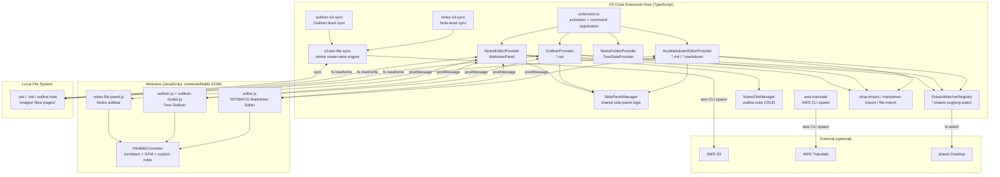
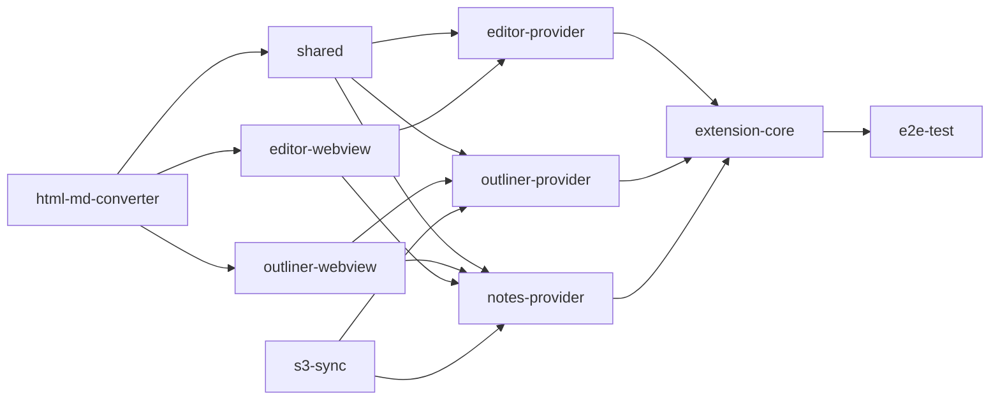

# Architecture

## Component placement



## Account / region / AZ topology

N/A — Fractal is a local VS Code extension. AWS is an optional external dependency only. The S3 bucket and region are user-supplied configuration.

## Trigger sources

| Trigger | Routes to |
|---|---|
| Open `.md` / `.markdown` file | [odk:component:host/any-markdown-editor-provider] |
| Open `.out` file | [odk:component:host/outliner-provider] |
| Activity Bar "Notes Folders" → folder selection | [odk:component:host/notes-editor-provider] (WebviewPanel) |
| Command palette / keybinding | `extension.ts` → dispatch to providers |
| `fractal://` link click | `extension.ts` `navigateInAppLink` → `parseFractalLink` |
| S3 Sync button | [odk:component:s3-sync/notes-s3-sync] / [odk:component:s3-sync/outliner-s3-sync] |
| drawio Desktop file save | [odk:component:host/drawio-watcher-registry] → notify provider |
| External process modifies `.md` | editorProvider fs watch → webview DOM diff |

## Components

| Component | Role | Deterministic? | Input | Output |
|---|---|---|---|---|
| [odk:component:host/any-markdown-editor-provider] | WYSIWYG MD editor webview lifecycle | No (effectful) | TextDocument (`.md`) + config | TextDocument edits, image / file save |
| [odk:component:host/outliner-provider] | Outliner webview lifecycle | No (effectful) | TextDocument (`.out` JSON) + config | JSON edits, page / image / file save |
| [odk:component:host/notes-editor-provider] | Notes workspace WebviewPanel | No (effectful) | Notes folder path + outline.note | WebviewPanel, file writes, S3 sync |
| [odk:component:host/notes-folder-provider] | Activity Bar tree (TreeDataProvider) | Yes (pure CRUD) | globalState | TreeItem[] |
| [odk:component:host/side-panel-manager] | Shared side-panel logic (watch / save / nav) | No (stateful) | SidePanelHost + config | File save, webview message |
| [odk:component:host/drawio-watcher-registry] | drawio external-change detection | Yes (bookkeeping) | drawio path references | onChange callback |
| [odk:component:host/notes-file-manager] | `outline.note` CRUD + search | No (fs) | outline.note path | File read / write |
| [odk:component:s3-sync/per-file-sync] | mtime newer-wins bidirectional engine | Yes (decision logic) / No (AWS CLI) | Local + S3 listings | File transfer commands |
| [odk:component:translate/aws-translate] | Markdown translation (segment-protection + chunking) | Yes (chunking) / No (API) | MD text + language settings | Translated text |
| [odk:component:webview/editor] | WYSIWYG contenteditable editor | No (DOM ops) | postMessage + user input | postMessage (sync, save) |
| [odk:component:webview/outliner] | Tree UI + data model | model: yes / UI: no | postMessage + user input | postMessage (sync, save) |
| [odk:component:webview/html-md-converter] | HTML → Markdown converter | Yes (pure) | HTML string | Markdown string |

## Deterministic terminals

| Component | Guarantee |
|---|---|
| `outliner-model.js` | Tree CRUD is pure: same input → same JSON output |
| HtmlMdConverter | Same HTML → same Markdown (turndown + custom rules) |
| `s3-per-file-sync.decideSyncDirection` | mtime comparison is pure; direction decision is deterministic |
| aws-translate segment splitting | preserve / translate classification is regex-based and deterministic |

## External dependencies

See manifests:
- [odk:ext:vscode/extension-api]
- [odk:ext:aws/cli]
- [odk:ext:aws/translate]
- [odk:ext:aws/s3]
- [odk:ext:drawio/desktop]
- [odk:ext:npm/marked]
- [odk:ext:npm/turndown]
- [odk:ext:vendor/katex]
- [odk:ext:vendor/mermaid]

## Repository structure

```
fractal/
├── src/                        # Extension Host (TypeScript)
│   ├── extension.ts            # Entry point
│   ├── editorProvider.ts       # MD Editor Provider
│   ├── outlinerProvider.ts     # Outliner Provider
│   ├── notesEditorProvider.ts  # Notes Provider
│   ├── notesFolderProvider.ts  # TreeDataProvider
│   ├── notes-s3-sync.ts        # Note-level S3 sync
│   ├── outliner-s3-sync.ts     # Outliner-level S3 sync
│   ├── s3-per-file-sync.ts     # Shared sync engine
│   ├── outliner-s3-sync-utils.ts
│   ├── sync-conflict-dialog.ts
│   ├── webviewContent.ts       # Editor webview HTML builder
│   ├── outlinerWebviewContent.ts
│   ├── notesWebviewContent.ts
│   ├── i18n/                   # Localization
│   ├── shared/                 # Shared logic (TS + JS)
│   │   ├── sidePanelManager.ts
│   │   ├── drawioWatcher.ts
│   │   ├── notes-file-manager.ts
│   │   ├── notes-file-panel.js
│   │   ├── aws-translate.ts
│   │   ├── drop-import.ts
│   │   ├── markdown-import.ts
│   │   ├── file-import.ts
│   │   ├── llms-txt-builder.ts
│   │   └── ...
│   └── webview/                # Webview assets (JavaScript)
│       ├── editor.js           # WYSIWYG Editor (~18,400 lines)
│       ├── outliner.js         # Outliner UI (~8,500 lines)
│       ├── outliner-model.js   # Tree data model
│       ├── outliner-cell.js    # Table View cell
│       ├── editor-utils.js
│       ├── styles.css / fr-base.css / tokens.css / outliner.css
│       └── ...
├── html-md-converter/          # Shared sub-package
│   ├── src/                    # turndown + custom rules
│   ├── dist/                   # Built artifact
│   └── test/
├── vendor/                     # Vendored browser libs (KaTeX, Mermaid)
├── test/                       # E2E tests (Playwright)
│   ├── specs/                  # ~178 spec files
│   ├── unit/                   # Unit tests
│   ├── fixtures/
│   └── html/                   # Standalone test harness
├── scripts/                    # Build helpers
├── docs/                       # Design docs, ADRs
├── patterns/                   # Implementation patterns
├── chrome-extension/           # (separate product)
├── ai_skills/              # (separate product)
└── electron/                   # (inactive)
```

## UNIT layout

| UNIT | Owns | Primary language | Depends on |
|---|---|---|---|
| editor-webview | `src/webview/editor*.js`, `src/webview/styles.css` | JS | html-md-converter |
| outliner-webview | `src/webview/outliner*.js`, `src/webview/outliner*.css` | JS | html-md-converter |
| html-md-converter | `html-md-converter/` | JS | (none — leaf) |
| editor-provider | `src/editorProvider.ts`, `src/webviewContent.ts` | TS | shared, editor-webview |
| outliner-provider | `src/outlinerProvider.ts`, `src/outlinerWebviewContent.ts` | TS | shared, outliner-webview |
| notes-provider | `src/notesEditorProvider.ts`, `src/notesWebviewContent.ts`, `src/notesFolderProvider.ts` | TS | shared, outliner-webview, editor-webview |
| shared | `src/shared/` | TS+JS | html-md-converter |
| s3-sync | `src/*s3*.ts`, `src/sync-conflict-dialog.ts` | TS | (none — leaf) |
| extension-core | `src/extension.ts`, `src/i18n/` | TS | editor-provider, outliner-provider, notes-provider |
| e2e-test | `test/` | TS | extension-core (full surface) |



Wave 1 (parallel-capable leaves): `html-md-converter`, `s3-sync`
Wave 2: `shared`, `editor-webview`, `outliner-webview`
Wave 3: `editor-provider`, `outliner-provider`, `notes-provider`
Wave 4: `extension-core`
Wave 5: `e2e-test`

## Classification axes

Inputs are routed via several independent classifiers.

### File extension → Provider routing

| Pattern | Provider |
|---|---|
| `*.md`, `*.markdown` | [odk:component:host/any-markdown-editor-provider] (priority: option) |
| `*.out` | [odk:component:host/outliner-provider] (priority: default) |
| `outline.note` | Consumed internally by [odk:component:host/notes-editor-provider] (not a Custom Editor) |

### Drop classification (three independent classifiers)

| Class | Editor (`editor.js`) | Outliner (`outliner.js`) | Backend (`drop-import.ts`) |
|---|---|---|---|
| `.drawio.svg` / `.drawio.png` | drawio-file → save image + insert | file → file attachment | image → save image |
| `.drawio` (XML) | drawio-xml → reject + notify | file → file attachment | file → file attachment |
| Image extensions (png/jpg/jpeg/gif/webp/svg/bmp) | image → save image + insert | image → image node | image → save image |
| `.md` | (no MD drop in editor) | md → MD import | md → MD import |
| Other | file → insert file link | file → file attachment node | file → file attachment |

### Drop source channel classification

| `dataTransfer.types` | Routing |
|---|---|
| `Files` (Finder / OS) | FileReader path, 50 MB cap |
| `application/vnd.code.uri-list` (VS Code Explorer) | Direct read of `file://` URI, no size cap |
| Neither (internal) | Node reorder D&D |

### Paste classification (Editor)

Priority order: image file (non-rich HTML) → internal cross-MD copy (`text/x-any-md-context`) → internal copy (`text/x-any-md`) → plain text that looks like an MD table → external HTML (HtmlMdConverter) → plain text.

### Paste classification (Outliner)

Priority order: clipboard image file → internal clipboard (same webview) → cross-outliner HTML metadata → metadata-tagged (page / image / file assets) → single-line text → multi-line text.

### Node type (mutually exclusive)

| Type | Predicate | `Cmd+Enter` action |
|---|---|---|
| Page | `isPage=true`, has `pageId` | Open MD in Side Panel |
| File | has `filePath` | Open with OS default app |
| Image | has `images[]` | — |
| Plain | none of the above | no-op |

### Link classification (`classifyLinkHref`)

| `href` pattern | Class | Click action |
|---|---|---|
| `fractal://note/.../page/{id}` | fractal-page | navigateInAppLink |
| `fractal://note/...` | fractal-node | navigateInAppLink |
| `http(s)://...` | external | `vscode.env.openExternal` |
| `#anchor` | anchor | scrollToAnchor |
| `.md` / `.markdown` (local) | internal-md | open with `fractal.editor` |
| Other local | local-file | OS default app |

### Mode routing (Hard MUST: 4-mode coverage)

| Mode | Host file | Directory resolution policy |
|---|---|---|
| Standalone MD Editor | `editorProvider.ts` | 3-tier (file > settings > default) |
| Standalone Outliner | `outlinerProvider.ts` | JSON field > `./basename/` convention > legacy |
| Notes mode | `notesEditorProvider.ts` + `notes-message-handler.ts` | NotesFileManager; under `<outlinerId>/` |

### Other axes

- Outliner column type (`outliner | text | multiselect | date | datetime`) → cell renderer dispatch.
- S3 Sync conflict mode (`auto | confirm`) → automatic overwrite vs user confirmation dialog.
- Toolbar mode (`full | simple`) → number of buttons displayed.
- EOL classification (CRLF / LF) → restored on save.
