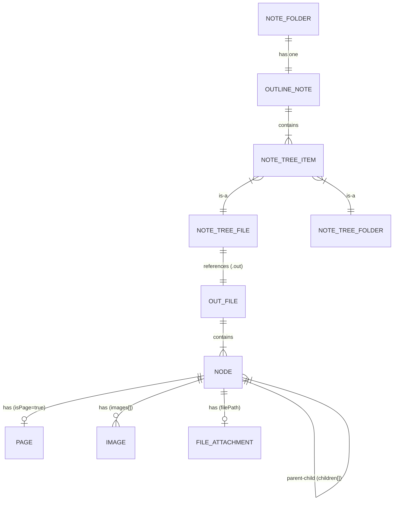

# Data Model & Schema Contract

## Schema-authoring policy

JSON files are the source of truth. Types are defined implicitly: TypeScript interfaces in `notes-file-manager.ts` and JavaScript constructors in `outliner-model.js`. There is no JSON Schema file. Validation happens ad-hoc on load (filling defaults for missing fields, converting legacy formats).

## Schema inventory

| Schema | Owner | Consumers | Persistence |
|---|---|---|---|
| `.out` ([odk:entity:outliner/OutFile]) | `outliner-model.js` | outlinerProvider, notesEditorProvider, NotesFileManager, chrome-extension | `<name>.out` file |
| `outline.note` ([odk:entity:notes/OutlineNote]) | NotesFileManager | notesEditorProvider, `notes-file-panel.js`, chrome-extension | Note folder root |
| Page `.md` ([odk:entity:editor/Page]) | `editor.js` (serialize) | editorProvider, SidePanelManager | `<pageDir>/<pageId>.md` |
| Note `.md` (raw Markdown) | `editor.js` (serialize) | notesEditorProvider, NotesFileManager | `<noteFolder>/<id>.md` (only when [odk:entity:notes/NoteTreeFile] has `ext: "md"`; see ADR-008) |

Field-level details for each schema live in the entity manifests:
- [odk:entity:outliner/OutFile]
- [odk:entity:outliner/Node]
- [odk:entity:notes/OutlineNote]
- [odk:entity:notes/NoteTreeFile]
- [odk:entity:notes/NoteTreeFolder]
- [odk:entity:editor/Page]

## ER diagram

## ID generation

| ID | Algorithm | Example |
|---|---|---|
| Node ID | `'n' + Date.now().toString(36) + random(6)` | `n1m2abc3de` |
| Page ID | `crypto.randomUUID()` (UUID v4) | `a1b2c3d4-...` |
| Outline ID | `Date.now().toString(36) + random(4)` | `1m2abcde` |
| Folder ID | `'f' + Date.now().toString(36) + random(4)` | `f1m2abcd` |

## Versioning policy

- The `version` field exists on both `.out` and `outline.note`, but is always `1`.
- There is **no** version-driven migration logic.
- Backward compatibility is handled ad-hoc:
  - `.out` `nodes` as legacy array → converted to object map at load time.
  - Missing `children` → defaulted to `[]` plus a `console.error`.
  - Missing `subtext` / `images` → defaulted.
  - `.note` → `outline.note` filename migration.
  - New optional fields (`color`, `favorites`) accept `undefined`.

## Cross-organisation contracts

N/A — Fractal is a personal product; there are no shared schemas with external teams.

## Backward-compatibility policy

- New fields are added as optional (existing files keep working).
- Legacy formats are auto-converted on load; writes always emit the latest format.
- S3 Sync runs without `--delete`, so old-format files cannot be deleted by a sync.

See [odk:req:correctness/exclusive-node-types] and [odk:req:safety/no-data-loss] for the related invariants.
