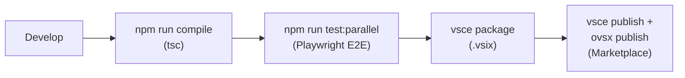

# Deployment / CI

## Environments

A single environment: local development → Marketplace publish. There is no staging / prod distinction.

## IaC choice

N/A — Fractal has no infrastructure. Only the VS Code Extension package and publish flow exist.

## Pipelines

- Build: `tsc` (TypeScript → `out/`) + `scripts/copy-vendor.js` + `scripts/copy-webview.js`.
- Test: `test/run-parallel-tests.sh` (Playwright in parallel).
- Package: `vsce package` → `.vsix`.
- Publish: VS Code Marketplace (`vsce publish`) and Open VSIX (`ovsx publish`).
- CI automation: no CI configuration is checked into the repository. Builds and publishes run locally.

## Branch / merge policy

Direct commits to `main` (personal development). No PR review or branch protection.

## PR-reviewable artefacts

N/A — the project does not use PR review.

## CI gates

- Playwright E2E green (manually invoked).
- Manual confirmation across the four modes (see [odk:req:safety/mode-coverage]).

## Migration / rollback

- Rollback: republish the previous `.vsix` via `vsce publish`.
- Migration: see [docs/specs/migration.md](migration.md). There is no schema-version-driven migration; legacy formats are converted ad-hoc on load.
