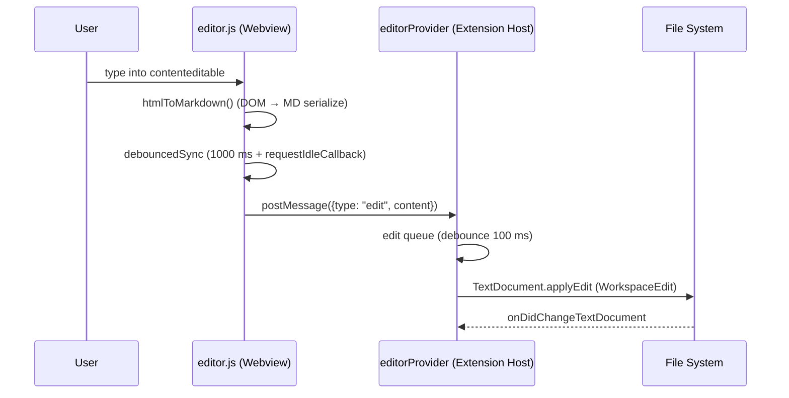
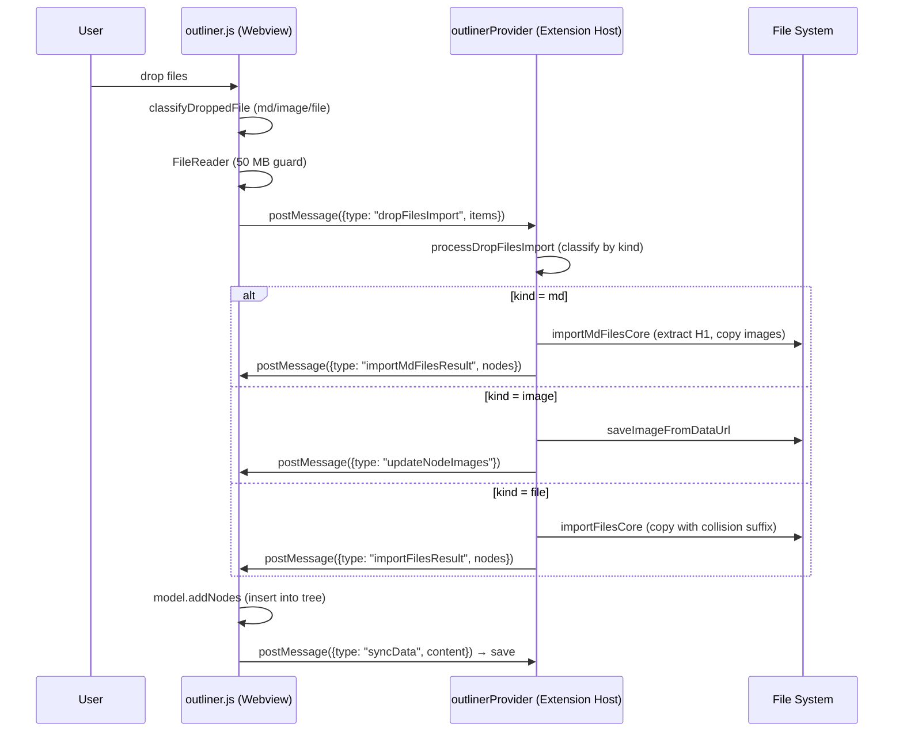
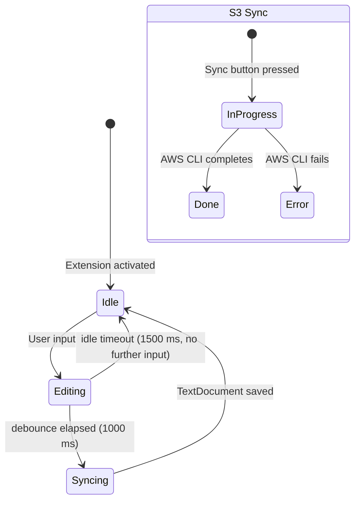

# Flows / Control Flow

Fractal is event-driven: there is no pipeline DAG, only user-action → event → handler response flows.

## Branching rules

The branching/dispatching rules live in [docs/specs/architecture.md](architecture.md#classification-axes). Major axes:

- File extension → Provider routing
- Drop classification → md / image / file / drawio handler
- Mode (Single / Note / SidePanel) → directory-resolution policy

## Sequence diagrams

### Flow 1 — Markdown Editor edit → save



### Flow 2 — External Change Sync (AI tool rewrites file)

```mermaid
sequenceDiagram
    participant AI as External Process (Claude/Cursor)
    participant FS as File System
    participant EH as editorProvider (Extension Host)
    participant WV as editor.js (Webview)

    AI->>FS: write .md file
    FS-->>EH: onDidChangeTextDocument (fs watch)
    EH->>EH: filter out our own edits
    EH->>WV: postMessage({type: "externalChange", markdown})
    WV->>WV: block-level DOM diff
    WV->>WV: keep cursor position; update only changed blocks
```

### Flow 3 — Outliner D&D file import



## Retry strategy

N/A — local operations have no retry. S3 Sync delegates retries to the AWS CLI's internal logic. Translate fails the request immediately when a 10 KB chunk fails.

## State schema

There is no `GraphState` / `RunState`; each component carries its own state — see [docs/specs/state.md](state.md).

## Run lifecycle



## Idempotency keys

N/A — there are no external writes that need idempotency. S3 Sync is idempotent via mtime comparison. File imports avoid duplicates via collision-suffix naming.
