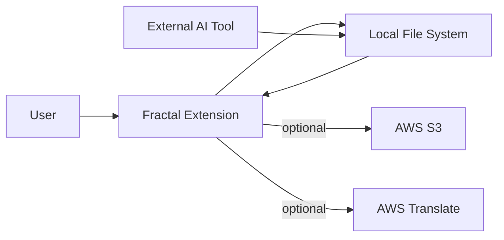

# Observability

Fractal is a local VS Code extension. There is no telemetry, no CloudWatch, and no X-Ray.

## Three-pillar overview

| Pillar | Implementation | Use |
|---|---|---|
| Logs | `console.log` / `console.error` (webview); no VS Code Output Channel | Developer debugging only |
| Metrics | None | — |
| Traces | None | — |

## Data-flow overview (DFD L0)

## Log levels

- Webview (`editor.js`, `outliner.js`): `console.log` for debug, `console.error` for legacy data detection and unexpected state.
- Extension Host: VS Code's standard error stream (`console.error` for unexpected failures).
- No production log infrastructure exists (this is a personal tool).
